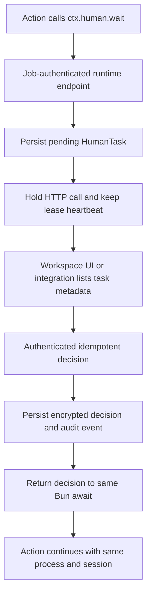

# ADR 0026: HumanTask hold preserves the live Action process

## Status

Accepted (2026-08-03). Supersedes the canonical HITL direction in ADR 0002; its PostgreSQL and Job-polling decisions remain historical context. Tracking: issues #191 and #192.

## Context

An Action may need a person to provide a value while a browser, mobile session, in-memory object graph, and the current call stack are still valuable. Restarting the Action from an application-defined checkpoint can scale to very long waits, but it forces every application SDK to invent checkpoint and replay semantics. Windforce Core also needs one generic control surface that does not embed a company's Interaction form, action code, RabbitMQ topology, or scraping SDK vocabulary.

## Decision

Phase 1 implements `HumanTask` as a **hold**:

- a TypeScript Action calls `await ctx.human.wait(request)`;
- the original Bun process, call stack, browser session, Job, Run, lease heartbeat, and worker slot remain alive;
- Core persists the task before waiting and identifies retries by `(workspace, job, attempt, key)` plus a request fingerprint;
- an authenticated workspace operator or scoped service principal writes one idempotent decision;
- the decision is returned to the same `await` in the same process;
- no second Run or Job is created.

The runtime endpoint is `POST /api/w/{workspace}/human-tasks/wait` and accepts only the current Job token and attempt. Control endpoints list, read, and decide tasks under `/api/w/{workspace}/human-tasks`. A decision requires `Idempotency-Key`. Service principals require `human_tasks:read` or `human_tasks:decide`; `allowed_targets` is enforced for both collection and item access.

Task schema, presentation hints, and ordinary metadata are inspectable. `private_context` and decision values are encrypted at rest and never returned by list or detail APIs. Only the waiting Job-authenticated call receives the decrypted decision. Audit events contain identifiers and outcomes, not private values.

The first terminal writer wins. A repeated decision with the same idempotency key and fingerprint replays safely. A different decision, expiry, cancellation, or worker-loss race cannot overwrite the terminal state. The task records a stable terminal cause. Action timeout, Run cancellation, lost lease, worker shutdown, and HumanTask deadline are distinguished. An interrupted client may reconnect from the same live Action with the same key; Core returns the existing durable task rather than creating another one.

## Capacity consequence

Hold consumes one worker slot and keeps the application process alive. It is appropriate for bounded interaction waits where retaining live state matters. Operators must size concurrency and task deadlines accordingly. A future Phase 2 may add suspend/checkpoint/re-entry for long waits, but it is a separate contract and must not silently replace hold. Existing `WAITING_HUMAN`/resume store methods are legacy suspend scaffolding, not the Phase 1 Author API.

## Boundary

Core defines only a generic form task and decision. An application SDK may translate company-specific Interaction forms or channels into this contract inside the App process or an external integration. Core does not understand Interaction, `ACTION`, `U0001`, RabbitMQ RPC, Playwright, Puppeteer, or scraping context versions.

## Consequences

- Authors can pause at an ordinary `await` without checkpoint code and retain browser or mobile state.
- Local JSON and PostgreSQL backends provide the same task, encryption, idempotency, and audit semantics.
- Server restart does not lose the durable task, while worker/process loss terminates hold because live state cannot be reconstructed.
- Hold is intentionally not horizontally free: every pending task retains a worker slot.
- Suspend/re-entry, Python and Go author helpers, attachments, and company-specific Interaction rendering remain follow-up work.
