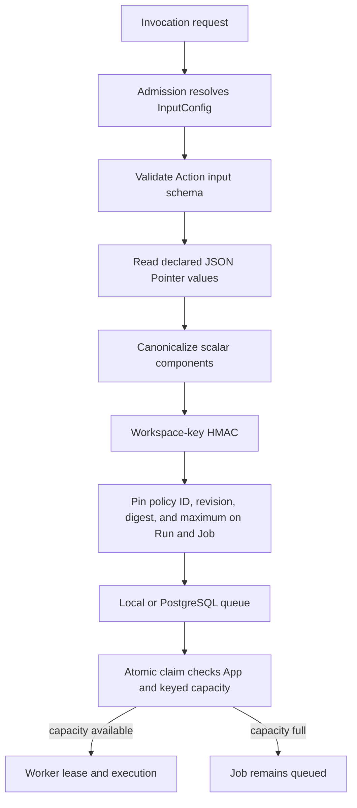

Windforce Core has two concurrency layers:

- `maxConcurrent` caps all running Jobs for one workspace and App.
- `executionLimits.concurrency` caps running Jobs that resolve to the same
  App-defined opaque key.

Both are enforced when a Worker claims a Job. A blocked Job remains queued; no
Worker slot is consumed while it waits.

## Declare a keyed limit

Place `executionLimits` at App scope to share capacity across the App's Actions:

```json
{
  "app": "orders",
  "entrypoint": "main.ts",
  "executionLimits": {
    "concurrency": [
      {
        "id": "account-egress",
        "maxConcurrent": 2,
        "inputPointers": ["/account_id", "/egress/id"]
      }
    ]
  },
  "actions": {
    "collect": {}
  }
}
```

Place the same shape inside an Action to limit only that Action. App and Action
limits are cumulative, and `maxConcurrent` still applies when present.

`inputPointers` are RFC 6901 JSON Pointers into the effective input after Core
has merged workspace, App, Action, and client InputConfig. Every selected value
must be a string, number, or boolean. Missing, null, object, or array values
reject Admission so Jobs never fall into an accidental shared bucket.

## Request and claim flow



Core stores and indexes only the HMAC digest. It does not persist the selected
raw values in the limiter pin. The effective Run input follows the normal
encrypted-at-rest input contract.

Authorized Job status responses expose the safe `execution_limits` pins with
policy ID, revision, scope, digest, and maximum for diagnosis. They never expose
the selected raw key components.

## Choosing the key

Use a stable field that identifies the resource whose simultaneous use must be
bounded, for example an account ID plus an egress identity. The policy ID is a
namespace, so keep it stable across Releases when old and new Jobs must share
capacity.

The HMAC hides low-entropy values in persisted limiter state, but it does not
stop a caller from changing a caller-controlled field. When the limit is also a
quota or abuse boundary, supply the field from trusted Admission context or
lock it through operator InputConfig.

## Lifecycle behavior

- A running lease consumes capacity.
- Completion or lease-expiry recovery releases capacity.
- A HumanTask hold continues to consume capacity because the process and lease
  stay alive.
- Suspend and retry reuse the safe pins stored on the Run.
- Queue-demand observation excludes Jobs currently blocked by these limits.

## Boundaries

The atomic boundary is one Core Cell and its database. A hosted control plane
owns cross-Cell global quotas and WorkerPool operations. Domain services own
success-rate and target-health decisions.

Rate limits are deliberately not simulated with concurrency counters. The
separate rate contract remains tracked by
[#212](https://github.com/imprun/windforce-core/issues/212).

See [ADR 0033](../adr/0033-pin-and-enforce-opaque-key-concurrency.md) for the
full decision and failure semantics.
