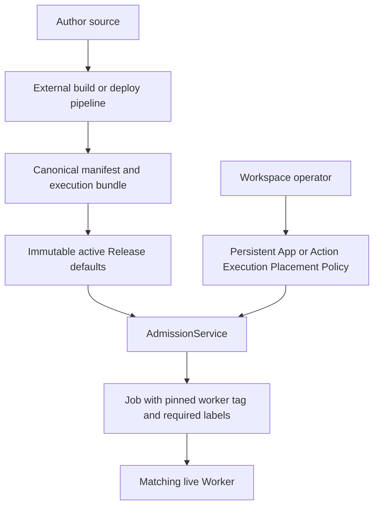

# Execution placement

Execution placement has two owners that must remain separate:

- the **release author** supplies defaults in the canonical App manifest;
- the **workspace operator** may override those defaults in Windforce Core.

The configured manifest may be a committed `windforce.json`, a generated
`scraping.json`, or another file selected with `--manifest-file`. Generation is
owned by the external authoring/deploy pipeline. Core consumes the completed
canonical manifest and never executes an App's `--describe` command.



## Resolution rules

For a worker tag, Core uses the first configured value:

1. Action operator override
2. App operator override
3. Action manifest tag
4. App manifest tag
5. `default`

For required labels, Core uses the first configured override:

1. Action operator override
2. App operator override
3. union of the App and Action manifest `runsOn` values

`null` clears an override and resumes inheritance. `[]` is different: it is an
explicit override requiring no labels.

## Registration

The Register App dialog probes the configured canonical manifest before it
saves a Git source. The probe returns the App key and release placement defaults;
only then does the dialog offer an optional initial operator policy. When
present, registration sends it as `placement_policy` and Core stores it against
the probed App identity before the first Release. A later Release supplies new
defaults but does not replace this policy.

The new probe preview calls the manifest value `worker_tag`. Existing App and
Action endpoints retain `tag`, `tag_override`, and `effective_route_tag` as wire
names for compatibility. The Console presents all of these values as **Worker
tag** under **Execution placement**; they do not configure an HTTP or gateway
route.

## Operator API

App placement policy:

```http
PATCH /api/w/{workspace}/apps/{app}
Content-Type: application/json

{
  "tag_override": "browser",
  "required_labels_override": ["linux", "kr"]
}
```

Action policy uses the same body at
`/api/w/{workspace}/apps/{app}/actions/{action}`. Either field may be omitted in
a partial update. Set a field to `null` to inherit. The App detail GET response
returns manifest, override, and effective fields so operators do not need to
reconstruct precedence themselves.

## Headless operation

The Web Console is an optional client of these APIs, not an operational
dependency. A self-hosted installation may expose only the API and reconcile
placement without serving `/ui` through its ingress or gateway:

1. Deploy or update Workers with the intended group, tags, and labels through
   the installation's Helm, Kubernetes, or GitOps owner.
2. Read `GET /api/w/{workspace}/workers` to observe registered Workers and the
   selectors they currently advertise.
3. Read `GET /api/w/{workspace}/apps/{app}` to compare release defaults,
   operator overrides, and effective App/Action placement.
4. Apply App or Action policy with the PATCH requests above, then read the App
   again to verify the effective values.

An operations repository may keep declarative desired state and run a
reconciler that calls these APIs. The persisted Core policy remains the runtime
source of truth used by Admission; the external file is desired state, not a
second execution-time lookup. This also keeps operator policy out of the App
manifest and immutable Release history.

WorkerGroup creation, credentials, draining, scaling, and selector vocabulary
belong to a hosted operations portal or the self-hosted deployment owner. Core
provides the neutral [Worker management API](../api/worker-management.md),
registry observations, and placement APIs, but its Web Console does not attempt
to reproduce a hosted WorkerGroup control plane. Selector values and aggregate
match counts may be shown to authorized operators; worker endpoints,
credentials, and host identity remain outside placement views.

## Release and Job behavior

Execution Placement Policy survives release publication, rollback, and Core restart. A
policy update affects only Runs admitted after the update. Admission pins the
effective values into the Run and Job; a queued Job never follows later policy
changes.

The Console warns when no live Worker currently matches the effective tag and
labels. This warning does not reject the policy because workers may be deployed
after configuration.
