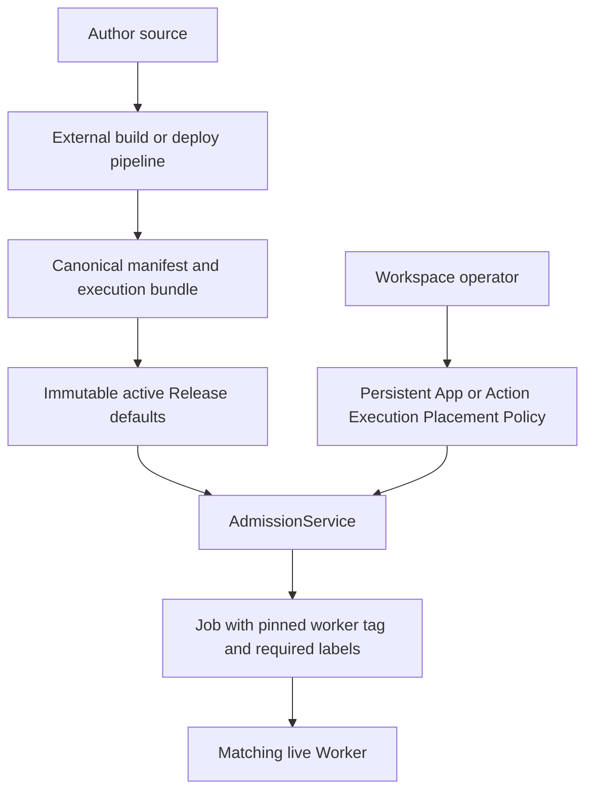

# Execution placement

Execution placement has two owners that must remain separate:

- the **release author** supplies defaults in the canonical App manifest;
- the **workspace operator** may override those defaults in Windforce Core.

The configured manifest may be a committed `windforce.json`, a generated
`scraping.json`, or another file selected with `--manifest-file`. Generation is
owned by the external authoring/deploy pipeline. Core consumes the completed
canonical manifest and never executes an App's `--describe` command.



## Resolution rules

For a worker tag, Core uses the first configured value:

1. Action operator override
2. App operator override
3. Action manifest tag
4. App manifest tag
5. `default`

For required labels, Core uses the first configured override:

1. Action operator override
2. App operator override
3. union of the App and Action manifest `runsOn` values

`null` clears an override and resumes inheritance. `[]` is different: it is an
explicit override requiring no labels.

## Registration

The Register App dialog probes the configured canonical manifest before it
saves a Git source. The probe returns the App key and release placement defaults;
only then does the dialog offer an optional initial operator policy. When
present, registration sends it as `placement_policy` and Core stores it against
the probed App identity before the first Release. A later Release supplies new
defaults but does not replace this policy.

The new probe preview calls the manifest value `worker_tag`. Existing App and
Action endpoints retain `tag`, `tag_override`, and `effective_route_tag` as wire
names for compatibility. The Console presents all of these values as **Worker
tag** under **Execution placement**; they do not configure an HTTP or gateway
route.

## Operator API

App placement policy:

```http
PATCH /api/w/{workspace}/apps/{app}
Content-Type: application/json

{
  "tag_override": "browser",
  "required_labels_override": ["linux", "kr"]
}
```

Action policy uses the same body at
`/api/w/{workspace}/apps/{app}/actions/{action}`. Either field may be omitted in
a partial update. Set a field to `null` to inherit. The App detail GET response
returns manifest, override, and effective fields so operators do not need to
reconstruct precedence themselves.

The App detail response also returns `placement_policy_revision`. The revision covers the complete App policy object, including every Action override, and advances on every App or Action placement mutation.

### Optional fail-closed capacity precondition

The default PATCH remains warning-allow for compatibility: it may save policy before Workers are deployed. Headless reconcilers can opt into a transaction-snapshot capacity gate by adding `precondition` to the same patch body:

```http
PATCH /api/w/{workspace}/apps/{app}
Content-Type: application/json

{
  "tag_override": "browser",
  "required_labels_override": ["linux", "kr"],
  "precondition": {
    "operation_id": "placement-20260814-01",
    "expected_policy_revision": 3,
    "minimum_matching_slots": 1
  }
}
```

An App patch checks the candidate App selector and every active Action after inheritance. An Action patch checks only that Action. Every target must have at least `minimum_matching_slots` across live, active Workers that can accept new work. Matching uses the same tag, required-label, and engine-owned execution-profile label contract as Job claim. Managed Workers must also have an active workspace-scoped credential and a WorkerGroup in `running` state.

Success returns the applied revision, one database/store `checked_at`, and redacted effective selector plus matching Worker/slot counts for each target. An exact retry of the latest `operation_id` and request fingerprint returns the original result without another audit. A stale revision or conflicting operation reuse returns 409. Insufficient capacity returns 422. Rejected requests do not change policy, revision, replay state, or audit.

`matching_slots` is compatible advertised capacity, not currently idle slots. This precondition does not reserve a Worker or promise future availability. If capacity disappears after the mutation, Core keeps the policy and later Jobs remain queued until compatible capacity returns.

## Headless operation

The Web Console is an optional client of these APIs, not an operational
dependency. A self-hosted installation may expose only the API and reconcile
placement without serving `/ui` through its ingress or gateway:

1. Deploy or update Workers with the intended group, tags, and labels through
   the installation's Helm, Kubernetes, or GitOps owner.
2. Read `GET /api/w/{workspace}/worker-groups` to observe the redacted execution
   pools and selectors usable by the workspace. Physical Worker records remain
   instance-admin-only.
3. Read `GET /api/w/{workspace}/apps/{app}` to compare release defaults,
   operator overrides, and effective App/Action placement, then read its
   `/placement-candidates` endpoint for the authoritative group breakdown.
4. Apply App or Action policy with the PATCH requests above. Automation that must fail closed sends the current `placement_policy_revision`, a unique operation ID, and a positive minimum matching slot count in `precondition`.
5. Read the App again to verify the effective values and applied revision.

An operations repository may keep declarative desired state and run a
reconciler that calls these APIs. The persisted Core policy remains the runtime
source of truth used by Admission; the external file is desired state, not a
second execution-time lookup. This also keeps operator policy out of the App
manifest and immutable Release history.

WorkerGroup creation, credentials, draining, scaling, and selector vocabulary
belong to a hosted operations portal or the self-hosted deployment owner. Core
provides the neutral [Worker management API](../api/worker-management.md),
registry observations, and placement APIs, but its Web Console does not attempt
to reproduce a hosted WorkerGroup control plane. Selector values, group-level
capacity, and exclusion reasons may be shown to authorized operators; physical
Worker IDs, credentials, and host identity remain outside workspace placement
views.

## Release and Job behavior

Execution Placement Policy survives release publication, rollback, and Core restart. A
policy update affects only Runs admitted after the update. Admission pins the
effective values into the Run and Job; a queued Job never follows later policy
changes.

The Console shows the server-projected matching Workers, advertised slots,
eligible groups, and stable exclusion reasons for the App and each Action. A
warning does not reject the policy because Workers may be deployed after
configuration.

Operator required-label overrides never remove the engine-owned execution-profile label pinned by the active Release. The profile constraint is appended after operator override resolution and is evaluated by both the capacity precondition and the actual claim matcher.

## Worker-local capability labels

A worker-local capability gateway participates in placement only through the same required-label contract. The worker is configured with ordinary, label-valid values such as `document.pdf.v1` and advertises them only after the loopback gateway reports at least one ready provider. A Job whose effective labels do not intersect those configured values receives no gateway run.

Provider identifiers returned at runtime are a separate opaque namespace and may contain characters that worker labels do not allow. The external authoring pipeline or Application SDK owns the stable mapping from a provider identifier such as `document.pdf/v1` to the canonical manifest label `document.pdf.v1`. Core does not derive the mapping, inspect SDK requirements, or treat discovery as an execution-time placement override. See [ADR 0034](../adr/0034-bind-worker-local-capability-gateways.md).
