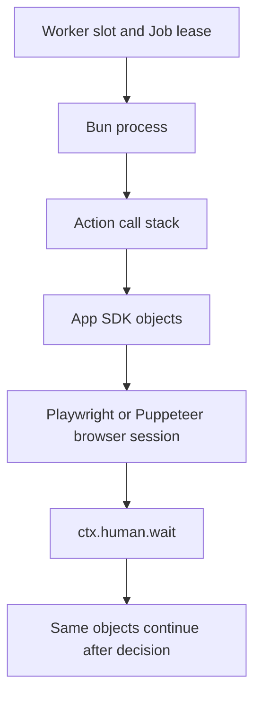

`HumanTask` hold is Windforce Core's bounded human-decision primitive. It keeps the original Action process alive and returns a decision to the same `await`. It is not a workflow checkpoint and it does not re-run the Action.

## Author flow

TypeScript is the Phase 1 Author API:

```ts
export async function main(ctx) {
  const page = await openAuthenticatedPage()

  const decision = await ctx.human.wait<{ otp: string }>({
    key: "login-otp",
    kind: "form",
    title: "Enter the verification code",
    description: "Use the code sent to the account owner.",
    inputSchema: {
      type: "object",
      required: ["otp"],
      properties: {
        otp: { type: "string", title: "Verification code" },
      },
    },
    privateContext: { accountRef: "opaque-reference" },
    timeoutMs: 120_000,
  })

  if (decision.outcome === "cancel") throw new Error("operator canceled")
  await page.getByLabel("Verification code").fill(decision.value.otp)
  return await continueScraping(page)
}
```

`key` must be stable for the logical wait inside one Job attempt. The wrapper generates one when omitted, but an explicit domain-neutral key is easier to diagnose. A transient server or network failure is retried with that same key. Changing the request under a reused key is rejected as a conflict.

## Request and decision

The request contains a generic `form` kind, title, optional description, JSON Schema, optional presentation hints, optional private context, and a bounded timeout. Core validates the submitted value against the JSON Schema. Phase 1's built-in console renders common object fields (`string`, string enum, `number`, `integer`, and `boolean`) and refuses to display private context.

The result contains `taskId`, `outcome` (`submit` or `cancel`), and an optional typed `value`. A cancel is a deliberate HumanTask decision. Run cancellation, action timeout, task deadline, worker shutdown, and lease loss are different terminal causes and reject the wait with a structured runtime error.

## Control API

| Operation | Endpoint | Authority |
| --- | --- | --- |
| Wait from Action | `POST /api/w/{workspace}/human-tasks/wait` | Current Job token only |
| List | `GET /api/w/{workspace}/human-tasks?state=pending` | Workspace operator or `human_tasks:read` |
| Detail | `GET /api/w/{workspace}/human-tasks/{id}` | Workspace operator or `human_tasks:read` |
| Decide | `POST /api/w/{workspace}/human-tasks/{id}/decision` | Workspace operator or `human_tasks:decide` |

Every decision request supplies `Idempotency-Key`. A service principal's `allowed_targets` restricts both list results and item operations to matching App/Action targets.

## Storage and secrecy

Core persists the pending task before the Action waits. Metadata and JSON Schema are readable by authorized operators. `privateContext` and the decision value are encrypted with the workspace-capable Core encryption root and are absent from API projections, logs, and audit payloads. Only the Job-authenticated wait receives the decrypted decision.

LocalStore offers equivalent behavior for development and smoke tests. PostgreSQL is the production backend and uses row locking plus a unique hold key to serialize decisions and terminal races.

## What remains alive



Hold retains capacity. Use a finite timeout and do not use it for days-long workflow pauses. Suspend/checkpoint/re-entry is a future phase with different replay and application-state requirements.

## SDK boundary

Core does not inspect the App SDK. A scraping SDK or company Interaction library may wrap `ctx.human.wait`, own form vocabulary, and connect external notification channels. It must not receive Worker Plane credentials or make Core depend on that vocabulary. See [App runtime interface and SDK boundaries](app-runtime-interface.md) and [ADR 0026](../adr/0026-human-task-hold.md).
