The opaque HTTP ingress conformance component is an internal `http.Handler` that turns one trusted private-gateway envelope into one normal AdmissionService call. It is provider-neutral and is not a Webhook Trigger, public Invocation endpoint, listener, or route manager.

The component is inactive by default. Core does not mount it on the primary listener and does not open another port.

```mermaid
flowchart LR
    GW["Trusted private gateway"] --> ENV["OpaqueHTTPInvocationV1"]
    ENV --> VALIDATE["Strict envelope and byte validation"]
    VALIDATE --> RESOLVE["Atomic publication, route generation, and credential snapshot Resolver"]
    RESOLVE --> ADMISSION["AdmissionService with active Release precondition"]
    ADMISSION --> APP["App receives opaque HTTP App input"]
    APP --> WIRE["Application wire response"]
    WIRE --> BYTES["Exact status, content type, and decoded bytes"]
```

## Trusted request boundary

The outer request must be `POST` with an `application/json` media type. The JSON body is `windforce.opaque-http-ingress-request/v1` and has exactly these top-level fields:

- `kind`
- `trustedIngress`
- `http`
- `body`
- `receivedAt`
- `deadlineAt`

`trustedIngress` carries only immutable references and routing identity: issuer, audience, publication reference, route generation, and credential reference. It never carries a raw API key, token, password, encryption key, or decrypted provider payload.

`body.data` is canonical RFC 4648 Base64. `body.byteLength` is the decoded byte count. `body.digest` is lowercase `sha256:` plus the digest of the decoded bytes. The handler checks all three values before resolution or Admission.

`http.exactEscapedPath` is an ASCII canonical escaped path. It starts with exactly one slash and rejects empty segments, trailing slashes except `/`, dot segments, wildcards, query or fragment delimiters, backslashes, lowercase or malformed escapes, encoded dot/slash/backslash/percent, and unnecessary percent encoding.

## Atomic resolution and Release fencing

The Resolver owns one atomic read of route publication and credential state. For the supplied issuer, audience, publication reference, route generation, and credential reference, it either returns a fully pinned Admission request or returns a generic platform failure.

The Resolver result contains only:

- workspace, App, and Action;
- an exact Service Principal with `runs:create`, `runs:read:own`, and one allowed App/Action target;
- the expected active Deployment ID when available, commit, and bundle digest.

The handler supplies the input and adapter itself. AdmissionService rechecks the active Release precondition before it validates the Action input or creates a Run. Route, credential, or Release mismatches therefore create zero Runs.

## App input and result

The App always receives `windforce.opaque-http-app-input/v1`. It contains only the validated `http` and `body` values from the trusted request. An Action used by this boundary must publish the matching schema from `contracts/opaque-http/v1/opaque-http-app-input.schema.json` as its materialized `inputSchema`.

Admission validates this wire wrapper, not a decoded domain object. Decoding, decryption, defaults, and domain input validation belong inside the App or its Application SDK.

The App returns `windforce.application-wire-response/v1`. The handler accepts only one optional `content-type` header, a status from 200 through 599, and the same strict Base64/length/digest body metadata. Status 204 or 304 cannot carry a non-empty body. The handler writes the decoded bytes exactly; it does not parse or re-encode them.

If execution has no valid application wire response, the handler returns a stable JSON `windforce.execution-outcome/v1` `platformFailed` envelope. Failure categories are provider-neutral and do not expose Resolver or App details.

## Current activation state

The package is a conformance building block only. It has no server wiring, configuration flag, public route, DNS, gateway reconciliation, or credential store implementation.

Production activation is gated on:

1. A separate private listener protected by mutually authenticated TLS, with issuer and audience derived from the authenticated peer rather than accepted from an untrusted public caller.
2. A durable atomic Resolver and route-management lifecycle with immutable publication revisions, monotonic generation, credential snapshot status, audit, rollback, and stale-reference rejection.
3. A retry and idempotency design. The current handler admits at most once per request and does not synthesize an idempotency key.
4. A deadline and cancellation policy. A wait timeout or disconnected caller does not cancel a Run that Admission already created.
5. Deployment-specific byte limits, overload control, metrics, traces, and failure-rate alerts.

Public gateway authentication, TLS termination, route publication, provider request/response codecs, and secrets remain outside Core's opaque handler.

## Contracts

The JSON Schemas and synthetic byte fixtures are in [`contracts/opaque-http/v1`](../../contracts/opaque-http/v1/README.md). [ADR 0055](../adr/0055-add-default-unmounted-opaque-http-ingress-conformance.md) records the decision and production gates. [Run admission architecture](run-admission.md) defines the shared AdmissionService boundary.
