The opaque HTTP ingress conformance component is an internal `http.Handler` that turns one trusted private-gateway envelope into one normal AdmissionService call. It is provider-neutral and is not a Webhook Trigger, public Invocation endpoint, listener, or route manager.

The component is inactive by default. Core does not mount it on the primary listener and does not open another port.

```mermaid
flowchart LR
    GW["Trusted private gateway"] --> ENV["OpaqueHTTPInvocationV1"]
    ENV --> VALIDATE["Strict envelope and byte validation"]
    VALIDATE --> RESOLVE["Atomic publication, route generation, and credential snapshot Resolver"]
    RESOLVE --> ADMISSION["AdmissionService with active Release precondition"]
    ADMISSION --> APP["App receives opaque HTTP App input"]
    APP --> WIRE["Application wire response"]
    WIRE --> BYTES["Exact status, content type, and decoded bytes"]
```

## Trusted request boundary

The outer request must be `POST` with an `application/json` media type. The JSON body is `windforce.opaque-http-ingress-request/v1` and has exactly these top-level fields:

- `kind`
- `trustedIngress`
- `http`
- `body`
- `receivedAt`
- `deadlineAt`

`trustedIngress` carries only immutable references, routing identity, and the delivery identity: issuer, audience, publication reference, route generation, credential reference, and `deliveryId`. It never carries a raw API key, token, password, encryption key, or decrypted provider payload.

`deliveryId` is the identity the isolated ingress boundary assigns to one delivery. It is trusted boundary input: an external caller cannot supply or influence it, because the handler reads it from the trusted envelope the boundary itself constructs and never from a caller header, path, or body.

`body.data` is canonical RFC 4648 Base64. `body.byteLength` is the decoded byte count. `body.digest` is lowercase `sha256:` plus the digest of the decoded bytes. The handler checks all three values before resolution or Admission.

`http.exactEscapedPath` is an ASCII canonical escaped path. It starts with exactly one slash and rejects empty segments, trailing slashes except `/`, dot segments, wildcards, query or fragment delimiters, backslashes, lowercase or malformed escapes, encoded dot/slash/backslash/percent, and unnecessary percent encoding.

## Atomic resolution and Release fencing

The Resolver owns one atomic read of route publication and credential state. It receives a body-blind view containing trusted ingress references, HTTP method/path/content type, and decoded body length. Base64 data, decoded bytes, body digest, and caller-controlled timestamps remain outside the Resolver boundary. The Resolver context hides the envelope deadline value while retaining cancellation. For the supplied issuer, audience, publication reference, route generation, and credential reference, it either returns a fully pinned Admission request or returns a generic platform failure.

The Resolver result contains only:

- workspace, App, and Action;
- an exact Service Principal with `runs:create`, `runs:read:own`, and one allowed App/Action target;
- the expected active Deployment ID when available, commit, and bundle digest;
- provider-neutral immutable invocation pins for the publication, route generation, operation, credential, and other resolved control-plane references;
- the publication-specific response content types and maximum response bytes.

The handler supplies the input and adapter itself and marks the exact wrapper as already resolved. AdmissionService permits this mode only for a Service Principal, bypasses App/Action/client InputConfig overlays, rechecks the active Release precondition, and validates the Action input before it creates a Run. The immutable invocation pins and resolved response policy are preserved as Job metadata for worker and audit use. They are not copied into the App input. `InvocationPins` are unsigned metadata, not a capability or downstream authorization proof. Route, credential, or Release mismatches therefore create zero Runs.

## App input and result

The App always receives `windforce.opaque-http-app-input/v1`. It contains only the validated `http` and `body` values from the trusted request. An Action used by this boundary must publish the matching schema from `contracts/opaque-http/v1/opaque-http-app-input.schema.json` as its materialized `inputSchema`.

Admission validates this wire wrapper, not a decoded domain object. Decoding, decryption, defaults, and domain input validation belong inside the App or its Application SDK.

The App returns `windforce.application-wire-response/v1`. The handler accepts only one optional `content-type` header, a status from 200 through 599, and the same strict Base64/length/digest body metadata. A supplied content type must be in the resolved publication policy, a missing content type is accepted only when that policy permits it, and the decoded body must fit the resolved route limit and the 7 MiB handler-wide response ceiling. This ceiling leaves room for padded Base64 and the completion envelope under the Worker Plane's 10 MiB request limit. Status 204 or 304 cannot carry a non-empty body. The handler writes the decoded bytes exactly; it does not parse or re-encode them.

The trusted request deadline is applied to Resolver, Admission, and Run polling calls. Deadline expiry stops the synchronous wait but does not cancel a Run that Admission already created.

For every terminal Run, the handler first attempts to validate and restore an application wire response, including an App error status. Only when execution has no valid application wire response does it return a stable JSON `windforce.execution-outcome/v1` `platformFailed` envelope. An expired Run or lease-loss/Worker-shutdown interruption is then classified as `workerLost`; other terminal failures and post-Admission consistency faults stay generic. Post-Admission failures are reported as non-retryable: the Run already exists, so the boundary reconciles it by redelivering the same delivery identity rather than by retrying blindly. Failure categories are provider-neutral and do not expose Resolver or App details.

## Delivery identity and replay

Admission on this path is idempotent per delivery. The handler derives the Admission idempotency key from `deliveryId` bound to the exact trusted tuple — issuer, audience, publication reference, route generation, and credential snapshot — so the same identity presented for another route or credential is a different admission identity. AdmissionService then adds the principal scope. The raw identity is never stored, echoed in a response, written to a log, or copied into the App input; durable state keeps only a digest.

- The same delivery with the same payload resolves to the same Run. Concurrent identical deliveries converge on one Run and one first Job; the losers of the creation race read the committed Run back and replay it.
- The same delivery identity with a different payload is a conflict. The handler answers `409` with an `applicationProtocolViolation` platform failure and creates no second Run.
- Core does not retry a delivery on its own, and an intermediary must not automatically retry this `POST`. A missing response is not evidence that Admission did not commit. The boundary reconciles by redelivering the same delivery identity, which replays the committed Run instead of creating another one.
- A wait timeout or a disconnected caller does not cancel an admitted Run. The Run stays queryable, and redelivering the same identity returns it.

## Current activation state

The package is a conformance building block only. It has no server wiring, configuration flag, public route, DNS, gateway reconciliation, or credential store implementation.

Production activation is gated on:

1. A separate private listener protected by mutually authenticated TLS, with issuer and audience derived from the authenticated peer rather than accepted from an untrusted public caller.
2. [Issue #283](https://github.com/imprun/windforce-core/issues/283): a durable publication/projection lifecycle and atomic Resolver with immutable revisions, monotonic generation, credential snapshot status, audit, rollback, and stale-reference rejection.
3. [Issue #286](https://github.com/imprun/windforce-core/issues/286): an audience-bound signed execution attestation minted only after Admission for any downstream capability authorization. Unsigned `InvocationPins` must not be used for that purpose.
4. A deadline and cancellation policy. A wait timeout or disconnected caller does not cancel a Run that Admission already created.
5. Deployment-specific byte limits, overload control, metrics, traces, and failure-rate alerts.

Public gateway authentication, TLS termination, route publication, provider request/response codecs, and secrets remain outside Core's opaque handler.

## Contracts

The JSON Schemas and synthetic byte fixtures are in [`contracts/opaque-http/v1`](../../contracts/opaque-http/v1/README.md). [ADR 0055](../adr/0055-add-default-unmounted-opaque-http-ingress-conformance.md) records the decision and production gates. [Run admission architecture](run-admission.md) defines the shared AdmissionService boundary.
