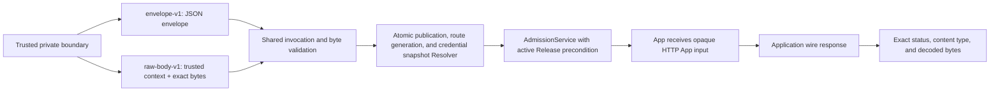

The opaque HTTP ingress conformance component is an internal `http.Handler` that turns one trusted private-boundary delivery into one normal AdmissionService call. Core can serve it on a separately configured isolated listener. It is provider-neutral and is not a Webhook Trigger, public Invocation endpoint, or route manager.

The component is inactive by default. Core does not mount it on the primary listener and does not open another port.

```mermaid
flowchart LR
    GW["Trusted private boundary"] --> ENV["envelope-v1: JSON envelope"]
    GW --> RAW["raw-body-v1: trusted context + exact bytes"]
    ENV --> VALIDATE["Shared invocation and byte validation"]
    RAW --> VALIDATE
    VALIDATE --> RESOLVE["Atomic publication, route generation, and credential snapshot Resolver"]
    RESOLVE --> ADMISSION["AdmissionService with active Release precondition"]
    ADMISSION --> APP["App receives opaque HTTP App input"]
    APP --> WIRE["Application wire response"]
    WIRE --> BYTES["Exact status, content type, and decoded bytes"]
```

## Trusted request boundary

The listener's startup `--opaque-ingress-transport` flag, or `WINDFORCE_CORE_OPAQUE_INGRESS_TRANSPORT`, selects `envelope-v1` (default) or `raw-body-v1`. Unsupported values fail startup when an ingress address enables the listener; settings for an unmounted listener are ignored. The selected transport is fixed for that listener; there is no body sniffing or fallback. Both use `POST /ingress/opaque-http/v1`, and neither is mounted on Core's primary listener. [ADR 0063](../adr/0063-accept-raw-body-transport-on-the-isolated-opaque-ingress.md) records this transport extension.

In `envelope-v1`, the outer request has an `application/json` media type. The JSON body is `windforce.opaque-http-ingress-request/v1` and has exactly these top-level fields:

- `kind`
- `trustedIngress`
- `http`
- `body`
- `receivedAt`
- `deadlineAt`

`trustedIngress` carries only immutable references, routing identity, and the delivery identity: issuer, audience, publication reference, route generation, credential reference, and `deliveryId`. It never carries a raw API key, token, password, encryption key, or decrypted provider payload.

`deliveryId` is the identity the isolated ingress boundary assigns to one delivery. It is trusted boundary input: the boundary must not accept an arbitrary caller value as an authorized delivery identity. The handler reads it only from the trusted envelope, or the trusted context in raw mode, and never from an independent caller header, path, or application body.

`issuer` and `audience` are stable deployment-chosen labels; URL or OIDC syntax is not required. With Core's store-backed Resolver each must be 1–160 printable ASCII characters without surrounding whitespace and must match the publication and credential projections exactly. The labels do not authenticate the caller: authenticated peer reachability and the boundary's assertions supply that trust. `credentialRef` remains required even for a synthetic delivery; raw transport adds no credential-less bypass.

`body.data` is canonical RFC 4648 Base64. `body.byteLength` is the decoded byte count. `body.digest` is lowercase `sha256:` plus the digest of the decoded bytes. The handler checks all three values before resolution or Admission.

### Raw-body transport

`raw-body-v1` uses exactly one outer `Content-Type: application/octet-stream` without parameters. Exactly one `X-Windforce-Opaque-Context` header carries single-line printable-ASCII JSON, at most 16 KiB, with exactly `kind`, `trustedIngress`, `http`, `receivedAt`, and `deadlineAt`. Its kind is `windforce.opaque-http-ingress-context/v1`; the other fields use the same constraints as the envelope. It has no `body` member. Use JSON escapes for values that need them; do not put line breaks, tabs, or raw non-ASCII bytes in the header. The [context schema and synthetic fixture](../../contracts/opaque-http/v1/README.md#raw-body-v1-wire-format) define this wire shape.

The original application bytes are the outer request body. Core performs no decompression, UTF-8 conversion, JSON parsing, or application-body transformation. It reads only up to the configured body limit, computes the Base64/length/digest metadata, and constructs the same invocation used by envelope mode. The byte-preservation claim starts at the bytes Core receives; it does not prove which bytes reached the public boundary before upstream transformations. In either transport the SHA-256 value is an unkeyed consistency check, not authentication or an upstream signature.

`http` must describe the original method, canonical escaped path, and content type. It does not inherit the outer transport's fixed method, path, or media type. A boundary therefore still has to capture original metadata and generate trusted context even when it forwards the body unchanged. Envelope construction is a boundary role, not a requirement to run a separate service. Raw mode removes the need for a body-transform hop; Core does not ship or promise a general-purpose gateway envelope builder.

Unknown or duplicate JSON members, duplicate context headers, unknown `X-Windforce-Opaque-*` headers, `Content-Encoding`, and trailers are rejected before resolution. Envelope mode rejects the reserved context header rather than silently accepting two possible sources of trust. Ordinary transport headers are not interpreted as trusted context. The authenticated boundary must remove all caller-supplied reserved headers and assert its own context; joining or forwarding those values is unsafe. Keep trusted context out of gateway access logs as well as App input and public responses.

The raw context is checked before reading the body, and its deadline bounds that read as well as the remaining synchronous execution wait. A deadline exhausted during the read creates no Run. The raw handler requires request read-deadline support; a custom response-writer wrapper must expose its underlying writer with `Unwrap`, or raw delivery fails closed. Empty and binary bodies are supported subject to the same App wrapper validation and configured byte limits.

`http.exactEscapedPath` is an ASCII canonical escaped path. It starts with exactly one slash and rejects empty segments, trailing slashes except `/`, dot segments, wildcards, query or fragment delimiters, backslashes, lowercase or malformed escapes, encoded dot/slash/backslash/percent, and unnecessary percent encoding.

## Atomic resolution and Release fencing

The Resolver owns one atomic read of route publication and credential state. It receives a body-blind view containing trusted ingress references, HTTP method/path/content type, and decoded body length. Base64 data, decoded bytes, body digest, and caller-controlled timestamps remain outside the Resolver boundary. The Resolver context hides the envelope deadline value while retaining cancellation. For the supplied issuer, audience, publication reference, route generation, and credential reference, it either returns a fully pinned Admission request or returns a generic platform failure.

The Resolver result contains only:

- workspace, App, and Action;
- an exact Service Principal with `runs:create`, `runs:read:own`, and one allowed App/Action target;
- the expected active Deployment ID when available, commit, and bundle digest;
- provider-neutral immutable invocation pins for the publication, route generation, operation, credential, and other resolved control-plane references;
- the publication-specific response content types and maximum response bytes.

The handler supplies the input and adapter itself and marks the exact wrapper as already resolved. AdmissionService permits this mode only for a Service Principal, bypasses App/Action/client InputConfig overlays, rechecks the active Release precondition, and validates the Action input before it creates a Run. The immutable invocation pins and resolved response policy are preserved as Job metadata for worker and audit use. They are not copied into the App input. `InvocationPins` are unsigned metadata, not a capability or downstream authorization proof. Route, credential, or Release mismatches therefore create zero Runs.

## App input and result

The App always receives `windforce.opaque-http-app-input/v1`. It contains only the validated `http` and `body` values, whether the boundary supplied body metadata in an envelope or Core constructed it from raw bytes. Transport selection does not change this App contract. An Action used by this boundary must publish the matching schema from `contracts/opaque-http/v1/opaque-http-app-input.schema.json` as its materialized `inputSchema`.

Admission validates this wire wrapper, not a decoded domain object. Decoding, decryption, defaults, and domain input validation belong inside the App or its Application SDK.

The App returns `windforce.application-wire-response/v1`. The handler accepts only one optional `content-type` header, a status from 200 through 599, and the same strict Base64/length/digest body metadata. A supplied content type must be in the resolved publication policy, a missing content type is accepted only when that policy permits it, and the decoded body must fit the resolved route limit and the 7 MiB handler-wide response ceiling. This ceiling leaves room for padded Base64 and the completion envelope under the Worker Plane's 10 MiB request limit. Status 204 or 304 cannot carry a non-empty body. The handler writes the decoded bytes exactly; it does not parse or re-encode them.

The trusted request deadline is applied to Resolver, Admission, and Run polling calls, and to raw body reading when that transport is selected. Deadline expiry stops the synchronous wait but does not cancel a Run that Admission already created.

For every terminal Run, the handler first attempts to validate and restore an application wire response, including an App error status. Only when execution has no valid application wire response does it return a stable JSON `windforce.execution-outcome/v1` `platformFailed` envelope. An expired Run or lease-loss/Worker-shutdown interruption is then classified as `workerLost`; other terminal failures and post-Admission consistency faults stay generic. Post-Admission failures are reported as non-retryable: the Run already exists, so the boundary reconciles it by redelivering the same delivery identity rather than by retrying blindly. Failure categories are provider-neutral and do not expose Resolver or App details.

## Delivery identity and replay

Admission on this path is idempotent per delivery. The handler derives the Admission idempotency key from `deliveryId` bound to the exact trusted tuple — issuer, audience, publication reference, route generation, and credential snapshot — so the same identity presented for another route or credential is a different admission identity. AdmissionService then adds the principal scope. The raw identity is never stored, echoed in a response, written to a log, or copied into the App input; durable state keeps only a digest.

Both transports normalize to the existing invocation kind before key derivation. Equivalent trusted context, original HTTP metadata, and bytes therefore retain the same admission identity and fingerprint across transport migration; changing the transport alone does not create another Run. Timestamps are not part of that identity or payload fingerprint, so a deliberate replay may carry a new usable wait deadline. Current route, credential, and Release checks still apply.

- The same delivery with the same payload resolves to the same Run. Concurrent identical deliveries converge on one Run and one first Job; the losers of the creation race read the committed Run back and replay it.
- The same delivery identity with a different payload is a conflict. The handler answers `409` with an `applicationProtocolViolation` platform failure and creates no second Run.
- Core does not retry a delivery on its own, and an intermediary must not automatically retry this `POST`. A missing response is not evidence that Admission did not commit. The boundary reconciles by redelivering the same delivery identity, which replays the committed Run instead of creating another one.
- A wait timeout or a disconnected caller does not cancel an admitted Run. The Run stays queryable, and redelivering the same identity returns it.

Classify a conflict by the `windforce.execution-outcome/v1` platform-failure envelope, not the HTTP status alone: an App can return `409` as an ordinary application wire response.

## Execution attestation

An App admitted through this boundary may need to call a private downstream capability service that holds material the App must not hold itself. The invocation pins cannot authorize that call: they are unsigned Job metadata, so they identify an execution without proving one.

When a deployment configures an issuer, Admission mints a signed execution attestation for every Run it admits from resolved invocation pins and stores it in the Job payload beside them. It binds exactly what Core pinned — Run reference, workspace, App and Action, publication reference and route generation, operation reference, credential snapshot reference, and the pinned Release — plus the issuer's audience, key id, and expiry. Values Core does not interpret travel in `references` as named immutable pins, verbatim from the projection.

The attestation is host-private: it never becomes an HTTP header, a public API response, a Run outcome, or an event payload, and the public job status omits it exactly as it omits the pins. Without a configured issuer nothing is minted and Runs are admitted unchanged.

The worker hands it to the capability gateway when it opens the run that serves the App, as an opaque document Core does not read. It lives only for that run and goes with it when the run closes. A Run whose Action requires no capability opens no gateway run, and a deployment that mints no attestation opens one exactly as it did before.

[ADR 0060](../adr/0060-mint-audience-bound-execution-attestations-after-admission.md) records the decision; [`contracts/execution-attestation/v1`](../../contracts/execution-attestation/v1/README.md) holds the schemas, the canonical byte rules, and the synthetic fixture.

## Isolated listener

The handler is served on its own listener, separate from Core's primary API ([ADR 0062](../adr/0062-serve-the-opaque-ingress-on-its-own-listener.md)). `-opaque-ingress-addr`, or `WINDFORCE_CORE_OPAQUE_INGRESS_ADDR`, mounts it; with no address Core does not open it.

That listener serves exactly two paths:

| Path | Method | Purpose |
| --- | --- | --- |
| `/ingress/opaque-http/v1` | POST | admits one trusted delivery in the configured transport |
| `/readyz` | GET, HEAD | reports whether this boundary is serving |

Every other path answers 404 with an `applicationProtocolViolation` platform failure, and Core's primary listener does not serve the ingress path at all.

Readiness reports ready once the listener is bound with its resolver and Admission wired, and unready from the moment a drain starts, so a gateway stops delivering into a listener that is going away. It does not probe the projection store: storage faults surface as platform failures on the delivery itself.

The listener admits a bounded number of concurrent deliveries, 64 by default with a ceiling of 4096, because each one holds a synchronous wait on a Run. A delivery waits at most 50 milliseconds for a slot, with a ceiling of one second, before the listener answers 503 with a retryable `capacityUnavailable`. Both bounds are flags: `-opaque-ingress-max-concurrent` and `-opaque-ingress-acquire-wait`. Byte limits, the synchronous wait and the poll interval are configured alongside them.

The HTTP server allows at most five seconds to read request headers and configures a 32 KiB total header budget (`MaxHeaderBytes`), separate from the raw context's exact 16 KiB value limit. Its initial complete-request read timeout is the configured `--opaque-ingress-max-wait` (30 seconds by default). Once a raw context is valid, its trusted deadline bounds body reading more precisely. These server limits also bound incomplete or rejected requests that never reach the Resolver; they apply before an App runs. There is no server write timeout that could truncate a valid terminal application response.

For example, add `--opaque-ingress-transport raw-body-v1` when starting a server with an explicit private `--opaque-ingress-addr`. `WINDFORCE_CORE_OPAQUE_INGRESS_TRANSPORT=raw-body-v1` selects the same mode through the environment. Leaving the transport unset preserves envelope clients, and selecting a mode without an address does not open a listener. Gateway header limits must permit the bounded context without truncation or header joining. This startup option does not prove or configure the external network boundary.

Core fails closed on this path. An unbindable address, an unusable limit, or an unusable execution attestation key stops the process before it serves anything, and a listener that dies while the process runs drains the primary listener and exits non-zero.

The listener terminates no TLS and verifies no certificate. Which mechanism proves the peer is a deployment property ([ADR 0061](../adr/0061-accept-any-authenticated-peer-boundary-for-opaque-ingress.md)), and Core neither implements nor detects it.

## Remaining activation gates

Mounting the listener does not by itself make the path production-ready. Activation is gated on:

1. A boundary in front of that listener which only authenticated allowed peers can reach, with issuer and audience asserted by the boundary rather than accepted from an untrusted caller. The mechanism is a deployment choice: mutually authenticated TLS with the peer identity taken from the verified client certificate, or a network boundary whose listener carries no other traffic and whose bidirectional policy allowlists the calling namespace, pod, and port. A network-boundary deployment has no per-request cryptographic peer proof, so its activation evidence must show that the network layer actually enforces the allowlist and that the listener is unreachable from anywhere else ([ADR 0061](../adr/0061-accept-any-authenticated-peer-boundary-for-opaque-ingress.md)).
2. [Issue #283](https://github.com/imprun/windforce-core/issues/283): a durable publication/projection lifecycle and atomic Resolver with immutable revisions, monotonic generation, credential snapshot status, audit, rollback, and stale-reference rejection.
3. A configured execution attestation issuer, if an App on this boundary calls a private downstream capability service. Unsigned `InvocationPins` must not be used for that purpose. The key file, key id, audience and lifetime are configured with the listener, and a partial configuration stops the process rather than falling back to unsigned pins.
4. A deadline and cancellation policy. A wait timeout or disconnected caller does not cancel a Run that Admission already created.
5. Deployment-specific byte limits, concurrency bounds, metrics, traces, and failure-rate alerts. The defaults are a starting point, not a capacity model.

Public gateway authentication, TLS termination, route publication, provider request/response codecs, and secrets remain outside Core's opaque handler.

## Contracts

The JSON Schemas and synthetic byte fixtures are in [`contracts/opaque-http/v1`](../../contracts/opaque-http/v1/README.md). [ADR 0055](../adr/0055-add-default-unmounted-opaque-http-ingress-conformance.md) records the original envelope and production gates; [ADR 0063](../adr/0063-accept-raw-body-transport-on-the-isolated-opaque-ingress.md) records the optional raw transport. [Run admission architecture](run-admission.md) defines the shared AdmissionService boundary.
