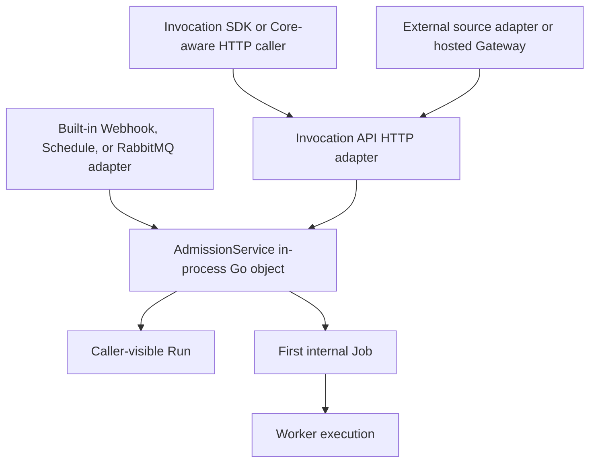
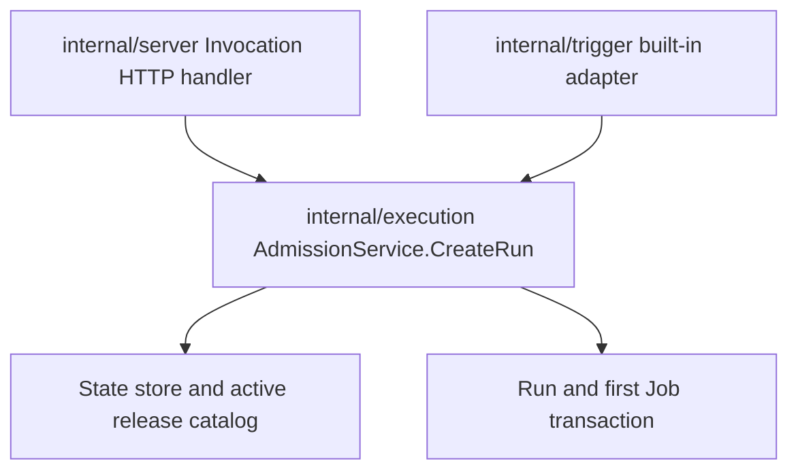
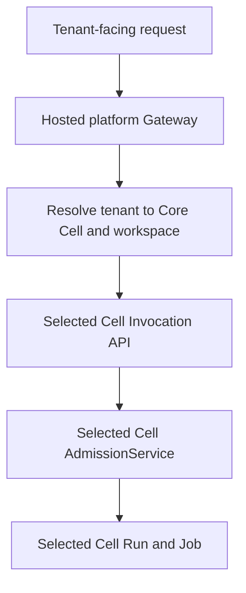
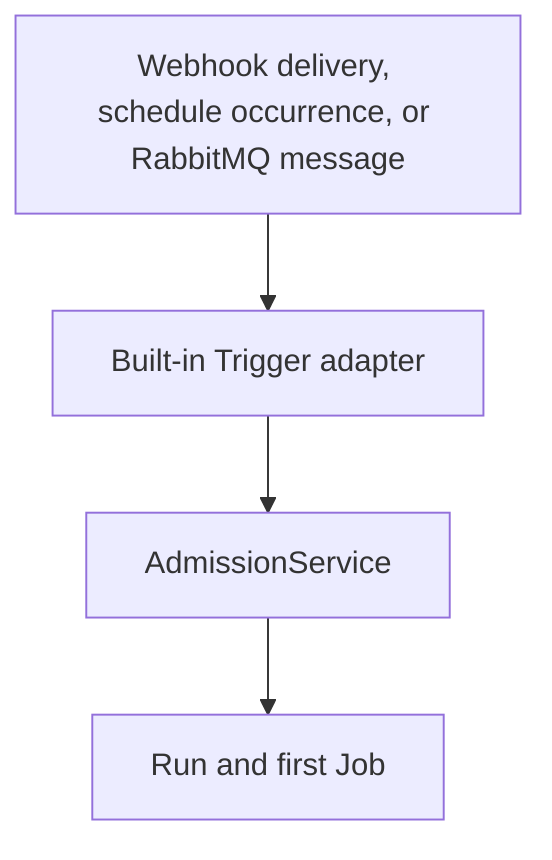
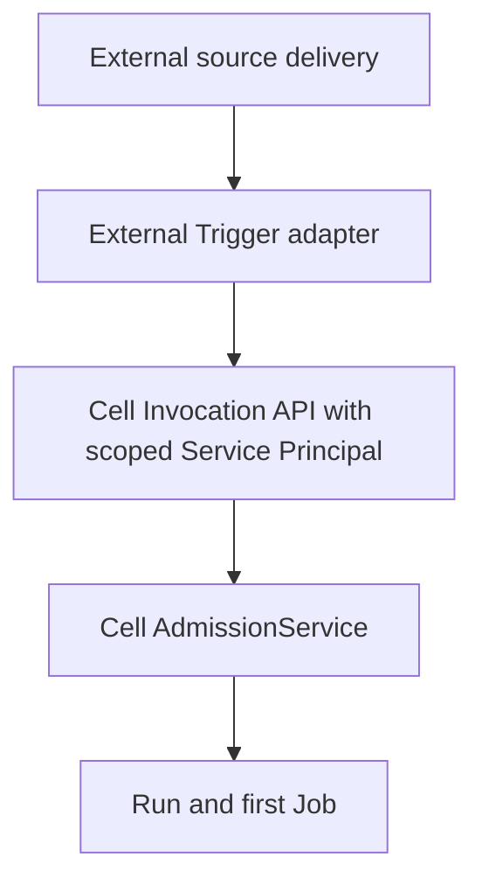
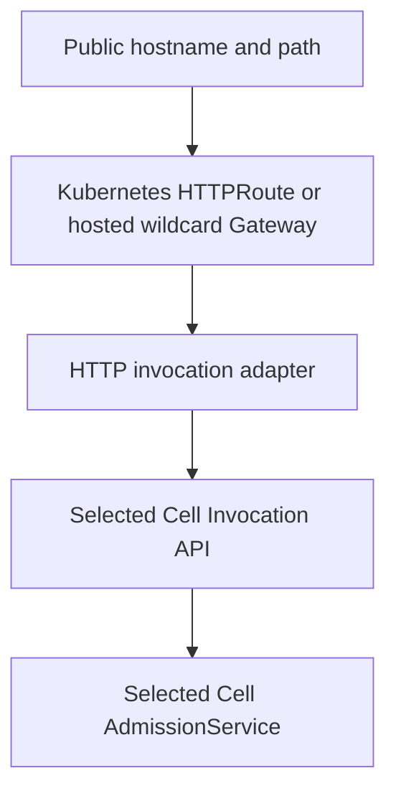

This document is the human-readable current architecture for accepting a Run. The OpenAPI document served at `/api/v1/openapi.json` is the machine-readable system-to-system specification. ADRs preserve why earlier decisions were made and how they changed; they are historical decision records rather than the primary description of the current architecture.

[한국어](../ko/concepts/run-admission.md)

## The short version

Windforce Core has one Run admission use case and several adapters that can reach it.



The Invocation API and AdmissionService intentionally converge on the same operation, but they are not the same component:

- The **Invocation API** is the versioned HTTP adapter at `/api/v1`.
- **AdmissionService** is a private in-process Go application service inside the Core binary.
- An **Invocation SDK** is an external HTTP client for the Invocation API.
- A **Trigger** is a stored source definition plus a protocol adapter that turns a delivery or occurrence into a normalized Run admission.

## Component boundaries

| Component | Runs where | Owns | Does not own |
| --- | --- | --- | --- |
| Invocation SDK | Caller process | HTTP request construction, response decoding, retries and convenience methods | Core state, release selection, admission decisions or queue records |
| Invocation API | Core `server` or `standalone` HTTP listener | HTTP authentication transport, headers, JSON, route versioning and HTTP response mapping | Source protocol lifecycle, worker execution or a second admission implementation |
| AdmissionService | Core process | Principal authorization, release resolution and pinning, InputConfig merge, schema validation, idempotency, and atomic Run-plus-first-Job creation | HTTP routing, JSON serialization, public URL management or source protocol listeners |
| Built-in Trigger adapter | Core `server` or `standalone` process | Source lifecycle, source authentication, delivery identity, input mapping, response policy and completion policy | A separate Run creation implementation |
| External Trigger or Gateway adapter | Separate process or hosted platform | External protocol, public route, source authentication, input mapping and policy before calling Core | Direct database, catalog, queue or AdmissionService access |

## AdmissionService is not an SDK or an HTTP service

`AdmissionService` is implemented in `internal/execution/service.go`. The Core process constructs it with the state store, release catalog and bundle store, then injects it into HTTP handlers and built-in Trigger runtimes.

The Invocation API handler in `internal/server/invocation_api.go` parses an HTTP request into an `execution.CreateRunRequest` and directly calls `AdmissionService.CreateRun`. There is no network hop between the handler and AdmissionService.

Built-in Trigger code depends on the narrow `AdmissionService` interface in `internal/trigger/trigger.go` and calls the same `CreateRun` operation directly. It does not loop back through Core's HTTP listener.

Go's `internal/` import rule prevents another repository from importing this implementation as a library. A separate process, including a Go process, must use the Invocation API or an Invocation SDK.



The word `Service` here means an application service or use-case object, not a separately deployed network service.

## Why Invocation API and AdmissionService look like one component

The Invocation API is the remote HTTP representation of the Run admission use case. Its request fields deliberately map closely to the normalized admission command, and its result is the caller-visible Run created by AdmissionService.

They remain separate because the HTTP adapter owns transport concerns:

- URL and API version
- Bearer credential parsing
- `Idempotency-Key` and correlation headers
- JSON request and response representation
- HTTP status, `Location`, and `X-WF-Run-Id`

AdmissionService owns engine decisions:

- whether the principal may invoke the target
- which active Release is pinned
- how InputConfig and caller input are merged
- whether the effective input matches the Action schema
- whether an idempotency key is a replay or conflict
- creation of the Run and first Job in one transaction

Replacing HTTP with another transport must not create another admission implementation. Moving an adapter between in-process and out-of-process deployment must not change admission semantics.

## Generic contract, Cell-scoped execution

The Invocation API is a generic contract implemented by every Core instance. Each request is nevertheless handled by the specific Core instance, or Cell, whose host received it.

```text
POST https://cell-a.example/api/v1/workspaces/default/runs
POST https://cell-b.example/api/v1/workspaces/default/runs
```

The path does not select a Cell. The network destination selects the Cell, and `{workspace}` selects an organizational and authorization scope inside that Cell.

AdmissionService is also generic implementation code but operates only on its owning Cell's store, catalog, queue, encryption root and workers. It is never a global multi-Cell admission service.

A hosted platform may expose a global tenant-facing API, but that API is a platform Gateway facade rather than the Core Invocation API. The platform resolves the tenant to a Cell, selects a Cell-scoped credential, and then calls that Cell's Invocation API.



Core workspaces are not tenant-isolation boundaries. Mutually untrusting tenants require separate Core instances.

## Invocation API versus HTTP Trigger

Both can start a Run from an HTTP request, so the difference is not the transport. The difference is who knows the Core invocation contract and where source-specific configuration lives.

Use the Invocation API directly when the caller:

- knows the workspace, App and Action
- can send the canonical invocation JSON body
- holds an operator, Client Registry or Service Principal credential
- can preserve a stable `Idempotency-Key`
- wants the canonical Run lifecycle and result contract

```http
POST /api/v1/workspaces/default/runs
Authorization: Bearer wfs_example
Idempotency-Key: order-123
Content-Type: application/json

{
  "app": "orders",
  "action": "ingest",
  "input": {
    "order_id": "123"
  },
  "correlation_id": "partner-request-456"
}
```

Use an HTTP Trigger or external HTTP source adapter when the sender:

- sends a provider-specific payload rather than the canonical invocation body
- authenticates with HMAC, a provider signature or another source protocol
- does not know the target App or Action
- needs source headers mapped to correlation or idempotency data
- needs a configured immediate, synchronous or asynchronous completion policy

The adapter verifies the source request, resolves its stored target and policy, normalizes the payload, and then reaches the same admission use case.

In the broad sense, the Invocation API is an HTTP entry point that triggers execution. In Windforce vocabulary, however, a `Trigger` is a stored source resource with lifecycle and protocol policy; the stateless Invocation API is not itself a Trigger resource.

## Built-in and external Trigger paths

A built-in Trigger runs in the same Core process:



An external Trigger runs in another process:



The external adapter uses the source delivery identifier as `Idempotency-Key`, acknowledges its source only after durable admission, and never imports Core internal packages or writes Core storage directly.

## Gateway and Router responsibilities

A network router and a semantic HTTP adapter are different components.

A transparent router can forward a request only when the caller already sends the canonical Invocation API body and credential. In that case no Trigger resource is required.

An arbitrary public Webhook cannot normally be routed straight to the Invocation API by a Kubernetes Gateway API `HTTPRoute`. The route cannot generally synthesize the canonical JSON body, choose an App and Action, inject a Cell-scoped Service Principal safely, derive idempotency, or map the Run response.

The environment therefore needs an HTTP invocation adapter:



In self-hosted Kubernetes, `HTTPRoute` should target an adapter Service when semantic conversion is required. In a hosted platform, the existing Gateway may implement the adapter responsibilities itself after resolving the tenant and Cell.

The Gateway and adapter may own public hostname policy, TLS, rate limits, body limits, source authentication and tenant-to-Cell resolution. They must not become a global AdmissionService or write a Cell's queue directly.

## Built-in Webhook ingress and public Invocation routing are separate

Core currently exposes `/api/v1/workspaces/{workspace}/triggers/{trigger}/events` for a configured built-in Webhook Trigger. That endpoint uses the Trigger's stored HMAC, input, response and completion policy before calling AdmissionService in-process.

The current HTTP Route Binding resource attaches a friendly public URL to that built-in Webhook ingress. This is **built-in Webhook exposure**, not the generic external Gateway-to-Invocation path described above.

An external Gateway acting as an HTTP Trigger adapter instead calls `/api/v1/workspaces/{workspace}/runs` or `/runs/wait` with a scoped Service Principal. It does not call the built-in Trigger ingress and it does not call AdmissionService directly.

These two capabilities must not be represented by the same diagram:

```text
Built-in Webhook exposure:
public route -> built-in Webhook ingress -> Trigger adapter -> AdmissionService

External HTTP invocation:
public route -> HTTP invocation adapter -> Invocation API -> AdmissionService
```

Provider implementation work must choose one mode explicitly. A provider that exposes a built-in Webhook Trigger may reconcile the existing Trigger Route Binding. A provider that offers generic hosted invocation needs an adapter and Invocation API contract; a network rewrite to the built-in Trigger ingress is not equivalent.

## Run and Job ownership

AdmissionService creates two related records:

- A **Run** is the stable caller-visible invocation. It owns idempotency, status, result, cancel and retention.
- A **Job** is an internal execution attempt. It owns queue state, lease, priority, worker claim and attempt data.

Invocation APIs and SDKs expose Run identity and never expose Job identity as the stable execution contract. Workers claim and complete Jobs through the Worker Plane, not through the Invocation API.

## Rules to preserve

1. There is one Run admission implementation per Core process boundary.
2. Invocation API handlers and built-in Triggers converge on that implementation.
3. Separate processes call the Invocation API; they do not import `internal/execution`.
4. SDKs are HTTP clients and contain no admission or storage logic.
5. A Gateway resolves a Cell but does not provide global admission.
6. A Trigger adapts a configured source; the Invocation API remains the generic Core-aware entry point.
7. Adapters never write the catalog, Run table, Job queue or worker API directly.
8. ADRs explain decision history; this document and the current OpenAPI describe the architecture operators and integrators should use now.

## Related current specifications

- [Architecture](../architecture.md) describes all Core planes and process roles.
- [Invocation API](public-api.md) defines the caller-visible HTTP behavior.
- [Triggers](triggers.md) defines built-in and external source lifecycles.
- [Release and execution lifecycle](release-lifecycle.md) explains how admission pins a Release and creates execution work.
- `GET /api/v1/openapi.json` is the machine-readable Invocation API specification served by a running Core.
