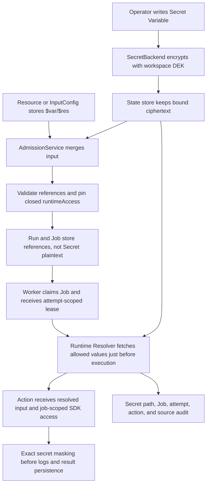

This document is the human-readable current-state reference for runtime configuration as of 2026-08-19. The control-plane OpenAPI at `/api/w/{workspace}/openapi.json` and the released `windforce.json` schema are the machine-readable system-to-system contracts. ADRs record why decisions changed; they are not the primary operating guide.

For a runnable App-author walkthrough, see [Use runtime secrets from a TypeScript App](../guides/runtime-secrets-typescript.md).

## The five objects are different

| Object | Purpose | Scope | Stored value |
| --- | --- | --- | --- |
| Variable | Reusable scalar runtime value | Workspace, optionally shadowed by App | String |
| Secret Variable | Reusable sensitive scalar | Workspace, optionally shadowed by App | Record-bound ciphertext; reads return metadata only |
| ResourceType | Versioned validation contract for a Resource | Workspace | JSON Schema |
| Resource | Reusable structured configuration | Workspace | JSON containing literals and exact `$var:` or `$res:` references |
| InputConfig | App/action/client-specific defaults and locked input fields | Workspace and App | Encrypted JSON containing literals and references |

Encryption is a storage implementation, not a method exposed by Variable or
Resource. An operator writes plaintext once when creating or replacing a Secret
Variable. Core encrypts it through `SecretBackend`; callers store only the
reference in Resource or InputConfig.

## References

A reference replaces the complete JSON value at its location:

```json
{
  "region": "$var:deployment/region",
  "credentials": "$res:partners/acme"
}
```

- `$var:path/to/value` resolves a Variable using App scope first and then the
  workspace-shared value.
- `$res:path/to/resource` resolves a workspace Resource recursively.
- References must be the entire string. String interpolation such as
  `Bearer $var:token` is deliberately unsupported.
- Paths are normalized, slash separated, portable ASCII paths. Empty segments,
  `.` and `..`, backslashes, and traversal are rejected.
- Cycles, excessive nesting, too many references, missing values, and deleted
  values fail closed.

## Actor-scoped App configuration

An Action may declare an exact `actor` Variable or Resource target when the value belongs to the authenticated invocation subject rather than to every invocation of the App. Core binds the logical target to `permissionedAs`, derives an opaque App-owned physical path from a subject hash, and applies the same storage-class, Job-attempt, lease, revision, idempotency, masking, lifecycle, and audit checks used by App scope. The App never selects the physical namespace and cannot use actor scope without an authenticated subject.

Actor scope is intended for small per-user connection metadata and Secret session state. It does not support wildcard grants, collection queries, cross-actor lookup, or `$var`/`$res` references in invocation input. Admission pins the declared logical path without enumerating actor data; the runtime resolves only the current subject after a Worker owns the Job.

Because a reference is a JSON string before execution, an Action input schema
must explicitly allow that string representation when the resolved value has a
different type. A Resource-backed object can use a schema such as:

```json
{
  "oneOf": [
    { "type": "object", "required": ["endpoint"] },
    { "type": "string", "pattern": "^\\$res:" }
  ]
}
```

The Resource itself is validated against its registered ResourceType when it is
written. ResourceType deletion is rejected while any Resource uses that exact
name and version.

## Declaring runtime access

An App declares the maximum configuration it may read in `windforce.json`:

```json
{
  "app": "orders",
  "entrypoint": "main.py",
  "scriptLang": "python",
  "actions": {
    "deliver": {
      "inputSchema": "deliver.input.schema.json",
      "operatorSettingsSchema": "deliver.settings.schema.json",
      "runtimeAccess": {
        "variables": ["deployment/region", "secrets/partner-token"],
        "resources": ["partners/acme"]
      }
    }
  }
}
```

Admission adds references actually present in the merged input and recursively
adds references contained by admitted Resources. It then pins the closed,
sorted allowlist into the selected action and Job. A retry inherits the same
allowlist; a later release or InputConfig edit cannot expand an existing Run.

For release-owned operator settings, `writeOnly: true` or
`x-windforce-secret: true` marks a field as sensitive. Saving InputConfig and
admitting a Run both require that field to be an exact `$var:` reference whose
effective Variable is Secret. Plaintext, a non-secret Variable, and `$res:` are
rejected for that field.

## Request-to-worker flow



Admission may decrypt the InputConfig document because that document is an
encrypted settings layer, but it does not resolve Secret Variable plaintext.
The persisted Run and Job input therefore contains `$var/$res` references. The
runtime Resolver reads Secret plaintext only after a worker owns the current
Job attempt.

Local workers resolve in-process immediately before invoking the Action. A
remote worker claim is prepared by the server at the same boundary; the remote
worker receives the resolved input in memory and never receives a workspace
data-encryption key. Job SDK reads use a job token containing the attempt and
are accepted only while the same attempt is running under a live lease. Paths
outside the pinned allowlist return forbidden.

## External Secret candidate cleanup

The built-in Database `SecretBackend` creates ciphertext in the Core state transaction boundary and has no external candidate object to collect. A side-effecting backend can optionally implement bounded runtime-candidate inventory and versioned conditional deletion. Core treats every current sealed App-owned Secret Variable reference as live, waits for the configured grace period, and reclaims only candidates that remain old and unreferenced. Exact retries refresh one deterministic candidate; tombstone and revoke preserve it; audited purge removes the live root and makes physical cleanup eventual. Metrics contain only outcome counts. See [ADR 0051](../adr/0051-collect-orphaned-runtime-secret-candidates.md).

## Encryption and key ownership

New managed workspaces receive a random data-encryption key (DEK). The DEK is
wrapped by an instance key-encryption key and stored with its version. Secret
Variable ciphertext is authenticated with the normalized workspace, record
kind, and path, so moving ciphertext to another record makes decryption fail.
Values written before record binding remain readable for compatibility.

Older workspaces without a workspace-key record continue to use the previous
deterministic per-workspace derivation. They are not silently moved to a random
DEK because every encrypted InputConfig, Job input, result, Webhook setting, and
Secret Variable would need one transactional re-encryption operation. New
workspaces do not use that fallback.

Hosted and standalone deployments use the same Core model. The deployment may
source its instance root key from Kubernetes, a cloud KMS integration, or local
configuration, but cloud identity and infrastructure do not enter the public
`windforce-core` contract.

## Audit, masking, and trust boundary

Every successful Secret Variable resolution records only metadata: workspace,
Job, attempt, App, Action, Variable path, source (`input`, `sdk`, or
`redaction`), and time. It appears in the canonical audit stream under
`runtime_configuration`. Failure to persist this record fails the secret read.

Core masks exact Secret plaintext and its JSON-escaped form before worker logs,
stored results, and optional diagnostic payload logs are written. This prevents
accidental echoing; it is not a data-loss-prevention system. An Action and its
worker are inside the trusted execution boundary and can deliberately transform
or transmit a secret. Use separate Core cells for mutually untrusted code.

## Control-plane API

- `GET|POST /api/w/{workspace}/variables`
- `GET /api/w/{workspace}/variables/get/p/{path}`
- `DELETE /api/w/{workspace}/variables/p/{path}`
- `GET|POST /api/w/{workspace}/resources`
- `GET /api/w/{workspace}/resources/get/p/{path}`
- `DELETE /api/w/{workspace}/resources/p/{path}`
- `GET|POST /api/w/{workspace}/resource-types`
- `GET|DELETE /api/w/{workspace}/resource-types/{name}/{version}`
- `GET /api/w/{workspace}/audit-events?category=runtime_configuration`

The Web Console exposes the same lifecycle at **Settings → Runtime
configuration**. Secret values are write-only: list and detail reads expose
only whether a value is configured.
