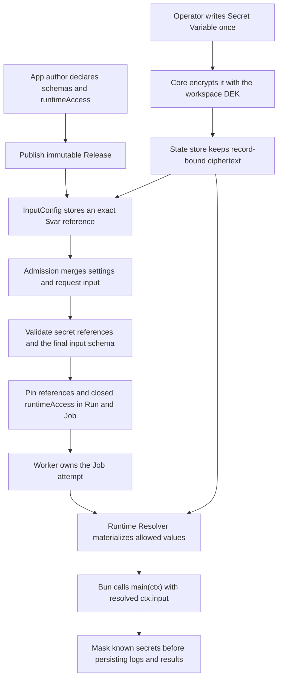

Application developers do not encrypt, decrypt, or transport ciphertext. An App declares which settings are sensitive and the maximum runtime paths it may access; an operator writes a Secret Variable once and stores only `$var:` or `$res:` references in Resources and InputConfig. Core owns encryption at rest, admission validation, job pinning, execution-time resolution, audit, and masking.

[한국어](../ko/guides/runtime-secrets-typescript.md)

The runnable source for this guide is [`examples/typescript-runtime-secrets`](https://github.com/imprun/windforce-core/tree/main/examples/typescript-runtime-secrets). `TestTypeScriptRuntimeSecretsGuideE2E` publishes that exact example and executes it through both a direct-store worker and a remote `/worker/v1` worker.



## 1. Declare the Action contract

The manifest fixes the ordinary input schema, the operator-owned settings schema, and the maximum runtime path allowlist in the Release:

```json
{
  "app": "runtime_secrets",
  "entrypoint": "main.ts",
  "scriptLang": "typescript",
  "actions": {
    "deliver": {
      "inputSchema": "deliver.input.schema.json",
      "outputSchema": "deliver.output.schema.json",
      "operatorSettingsSchema": "deliver.settings.schema.json",
      "runtimeAccess": {
        "variables": ["secrets/partner-token"]
      }
    }
  }
}
```

`inputSchema` validates the effective input after Admission merges InputConfig and the invocation body. `operatorSettingsSchema` identifies the subset that operators configure. `runtimeAccess` is the App-declared maximum; neither configuration nor application code may expand it at runtime.

## 2. Mark the operator setting as sensitive

Use `writeOnly: true` or `x-windforce-secret: true` in the operator settings schema:

```json
{
  "type": "object",
  "properties": {
    "partnerToken": {
      "type": "string",
      "writeOnly": true,
      "x-windforce-secret": true
    }
  }
}
```

An InputConfig value for this field must be an exact `$var:` reference whose effective Variable is Secret. Plaintext, a non-secret Variable, interpolation such as `Bearer $var:path`, and `$res:` are rejected.

## 3. Create the Secret Variable

In the Web Console, open **Settings → Variables & resources → Variables**, create `secrets/partner-token`, select the `runtime_secrets` App scope, enable Secret, and enter the plaintext once.

The equivalent Control Plane request is:

```http
POST /api/w/acme/variables
Content-Type: application/json
```

```json
{
  "path": "secrets/partner-token",
  "value": "the-plaintext-is-written-once",
  "is_secret": true,
  "app_key": "runtime_secrets",
  "description": "Partner API credential"
}
```

Core encrypts the value before persistence. Later list and detail reads expose metadata and Secret status, not the plaintext.

## 4. Bind the secret with InputConfig

Store the reference, not the value, in the App/action/client configuration:

```http
PUT /api/w/acme/apps/runtime_secrets/input-configs
Content-Type: application/json
```

```json
{
  "action_key": "deliver",
  "client_id": "<client-id>",
  "config": {
    "partnerToken": "$var:secrets/partner-token"
  },
  "locked_keys": ["partnerToken"]
}
```

The applicable shallow-merge order is App default, App/action, client/App, client/App/action, and finally unlocked request fields. A request that supplies a locked field is rejected instead of silently overwritten.

## 5. Invoke with business input only

```http
POST /api/v1/workspaces/acme/runs
Content-Type: application/json
Authorization: Bearer <client-token>
```

```json
{
  "app": "runtime_secrets",
  "action": "deliver",
  "input": {
    "orderId": "ORDER-1004"
  }
}
```

Admission merges the request with the applicable InputConfig, validates the exact Secret Variable reference, closes and pins `runtimeAccess`, validates the effective Action input, and atomically creates the Run and first Job. The persisted Job retains the reference and is itself encrypted at rest; it does not contain the Secret Variable plaintext.

## 6. Consume resolved input in Bun

Core's TypeScript wrapper calls the exported `main(ctx)`. By that point the current Job attempt owns a lease and the permitted reference has been resolved:

```ts
type DeliverInput = {
  orderId: string;
  partnerToken: string;
};

export async function main(ctx: { action: string; input: unknown }) {
  const input = ctx.input as DeliverInput;
  const response = await fetch(`https://partner.example/orders/${input.orderId}`, {
    headers: { Authorization: `Bearer ${input.partnerToken}` },
  });
  return { status: response.status };
}
```

Never log, return, persist, or place the resolved secret in an error message. Core masks exact known values as a defense against accidental output, but masking is not a DLP boundary and application code remains trusted.

## Resource composition

A Resource may contain exact references instead of plaintext:

```json
{
  "endpoint": "https://partner.example",
  "token": "$var:secrets/partner-token"
}
```

An input field that stores `$res:partners/acme` must allow the `$res:` string in its input schema and must not itself be marked `x-windforce-secret`. A field marked sensitive accepts only an exact Secret Variable `$var:` reference; the Runtime Resolver still resolves Secret Variables nested inside an allowed Resource recursively.

## Local and remote workers

- A direct-store worker uses the configured `SECRET_KEY` to unwrap the workspace DEK and resolves references in-process immediately before launching the Action.
- A remote `--api-url` worker never receives `SECRET_KEY`, a workspace DEK, or database access. The Core server prepares the claim by decrypting the Job input and resolving allowed references, then sends the prepared input over the authenticated Worker Plane. Production Worker Plane traffic must use TLS.

## Verification

Run the exact example contract test with Bun and Git available:

```powershell
go test ./internal/server -run TestTypeScriptRuntimeSecretsGuideE2E -count=1 -v
```

The test proves that plaintext is rejected for a sensitive operator field, the correct `$var:` reference is accepted, a locked secret cannot be overridden, state at rest does not contain the Secret Variable plaintext, and both local and remote workers execute the published TypeScript example with the resolved value.
