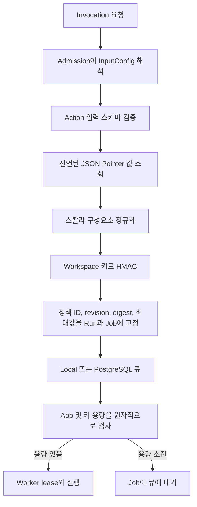

Windforce Core는 두 단계의 동시성 제한을 제공합니다.

- `maxConcurrent`는 한 workspace와 App에서 실행 중인 모든 Job 수를 제한합니다.
- `executionLimits.concurrency`는 App이 정의한 같은 불투명 키로 해석되는
  Job 수를 제한합니다.

두 제한은 Worker가 Job을 가져가는 시점에 적용됩니다. 제한에 걸린 Job은
큐에 남고 기다리는 동안 Worker 슬롯을 사용하지 않습니다.

## 키 제한 선언

App의 여러 Action이 용량을 공유해야 하면 App 수준에 `executionLimits`를
둡니다.

```json
{
  "app": "orders",
  "entrypoint": "main.ts",
  "executionLimits": {
    "concurrency": [
      {
        "id": "account-egress",
        "maxConcurrent": 2,
        "inputPointers": ["/account_id", "/egress/id"]
      }
    ]
  },
  "actions": {
    "collect": {}
  }
}
```

특정 Action만 제한하려면 같은 구조를 그 Action 안에 둡니다. App과 Action
제한은 함께 적용되며 기존 `maxConcurrent`도 계속 적용됩니다.

`inputPointers`는 Core가 workspace, App, Action, client InputConfig를 병합한
유효 입력을 가리키는 RFC 6901 JSON Pointer입니다. 선택된 값은 문자열,
숫자 또는 boolean이어야 합니다. 값이 없거나 null, object, array이면
Admission을 거부하므로 의도치 않게 모든 Job이 한 버킷에 들어가지 않습니다.

## 요청과 claim 흐름



Core는 제한 pin에 HMAC digest만 저장하고 인덱싱합니다. 선택한 원본 값은
제한 pin, 로그, 진단 정보에 저장하지 않습니다. 유효 Run 입력은 기존 입력
암호화 저장 규칙을 그대로 따릅니다.

권한이 있는 Job 상태 응답은 진단을 위해 정책 ID, revision, scope, digest,
최대값으로 구성된 안전한 `execution_limits` pin을 보여 줍니다. 선택된 원본
키 구성요소는 보여 주지 않습니다.

## 키 선택 방법

동시에 사용하면 안 되는 외부 자원을 식별하는 안정적인 필드를 사용합니다.
예를 들면 계정 ID와 egress 식별자의 조합입니다. 정책 ID는 namespace이므로
이전 Release와 새 Release의 Job이 용량을 공유해야 하면 ID를 유지합니다.

HMAC은 저장된 제한 상태에서 낮은 엔트로피 값을 추측하기 어렵게 하지만,
호출자가 자유롭게 바꿀 수 있는 필드에 권한을 부여하지는 않습니다. 이 제한을
보안 quota로도 사용할 때는 신뢰할 수 있는 Admission 문맥에서 값을 공급하거나
운영자 InputConfig로 해당 값을 잠가야 합니다.

## 생명주기 동작

- 실행 중인 lease가 용량을 사용합니다.
- 완료하거나 만료된 lease를 회수하면 용량이 반환됩니다.
- HumanTask hold는 프로세스와 lease를 유지하므로 용량을 계속 사용합니다.
- suspend와 retry는 Run에 저장된 안전한 pin을 다시 사용합니다.
- queue-demand 관측은 현재 키 제한에 막힌 Job을 증설 수요에서 제외합니다.

## 경계

원자성의 범위는 한 Core Cell과 그 데이터베이스입니다. Hosted control plane은
여러 Cell을 아우르는 전역 quota와 WorkerPool 운영을 소유합니다. 성공률과 대상
상태에 따른 제출 판단은 도메인 서비스가 소유합니다.

Rate 제한은 동시성 counter로 흉내 내지 않습니다. 별도 rate 계약은
[#212](https://github.com/imprun/windforce-core/issues/212)에서 계속 다룹니다.

전체 결정과 실패 의미는
[ADR 0033](../../adr/0033-pin-and-enforce-opaque-key-concurrency.md)을 참고하십시오.
