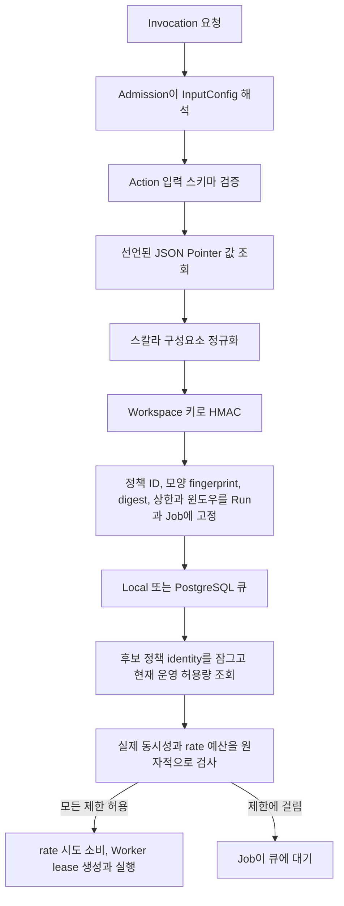

Windforce Core는 함께 적용되는 세 단계의 실행 제한을 제공합니다.

- `maxConcurrent`는 한 workspace와 App에서 실행 중인 모든 Job 수를 제한합니다.
- `executionLimits.concurrency`는 App이 정의한 같은 불투명 키로 해석되는
  Job 수를 제한합니다.
- `executionLimits.rate`는 App이 정의한 같은 불투명 키의 claim 시도 수를
  UTC epoch 기준 고정 윈도우 안에서 제한합니다.

모든 제한은 Worker가 Job을 가져가는 시점에 적용됩니다. 제한에 걸린 Job은
큐에 남고 기다리는 동안 Worker 슬롯을 사용하지 않습니다.

## 릴리스 상한과 운영 허용량

Release 선언은 변경할 수 없는 안전 상한입니다. Core는 새 Release를 게시하지
않고 한 Cell의 용량을 낮춰야 하는 운영자를 위해 변경 가능한
`ExecutionLimitPolicy`도 저장합니다. 콘솔에서는 이 값을 **운영 허용량**으로
표시합니다. claim은 호환되는 두 값 중 작은 값을 강제합니다.

```text
실제 적용값 = min(고정된 릴리스 상한, 현재 운영 허용량)
```

운영 허용량은 1 이상의 정수여야 하며 0은 일시 중지 명령이 아닙니다. 허용량을
삭제하면 Release 상한으로 돌아가며 Release 안전 제한을 끄지는 않습니다.
저장된 허용량보다 Release 상한이 낮아져도 운영 설정을 자동 수정하지 않고 낮은
Release 상한을 실제로 적용합니다.

v1에서 Release에 `maxConcurrent`가 없어도 운영 허용량을 둘 수 있는 예외는 App
전체 동시성뿐입니다. 키가 항상 workspace와 App이어서 Core가 안정적인 암시적
모양을 만들 수 있기 때문입니다. 키 기반 동시성과 rate 허용량은 정확히 일치하는
Release 모양이 있어야 합니다. 키 없는 App 전체 rate, Action 전체 무키 제한,
상용 청구 quota, 여러 Cell을 아우르는 전역 quota는 이 계약의 범위가 아닙니다.

정책 모양에는 workspace, App, 선택적 Action, scope, 정책 ID, 종류, 순서가 있는
입력 pointer, 고정 rate window가 포함됩니다. 숫자 상한은 포함하지 않습니다.
Core는 하나의 버전 있는 SHA-256 모양 fingerprint를 Release 사전 검사 오류,
저장 정책, Run/Job pin, read-back, 충돌 응답에 공통으로 사용합니다. 운영 API와
콘솔에는 원본 pointer 값을 노출하지 않습니다.

## 키 제한 선언

App의 여러 Action이 용량을 공유해야 하면 App 수준에 `executionLimits`를
둡니다.

```json
{
  "app": "orders",
  "entrypoint": "main.ts",
  "executionLimits": {
    "concurrency": [
      {
        "id": "account-egress",
        "maxConcurrent": 2,
        "inputPointers": ["/account_id", "/egress/id"]
      }
    ],
    "rate": [
      {
        "id": "account-egress",
        "maxAttempts": 120,
        "windowSeconds": 60,
        "inputPointers": ["/account_id", "/egress/id"]
      }
    ]
  },
  "actions": {
    "collect": {}
  }
}
```

특정 Action만 제한하려면 원하는 선언을 그 Action 안에 둡니다. App과 Action
제한은 함께 적용되며 기존 `maxConcurrent`도 계속 적용됩니다.

`inputPointers`는 Core가 workspace, App, Action, client InputConfig를 병합한
유효 입력을 가리키는 RFC 6901 JSON Pointer입니다. 선택된 값은 문자열,
숫자 또는 boolean이어야 합니다. 값이 없거나 null, object, array이면
Admission을 거부하므로 의도치 않게 모든 Job이 한 버킷에 들어가지 않습니다.

## 요청과 claim 흐름



Core는 제한 pin에 HMAC digest만 저장하고 인덱싱합니다. 선택한 원본 값은
제한 pin, 로그, 진단 정보에 저장하지 않습니다. 유효 Run 입력은 기존 입력
암호화 저장 규칙을 그대로 따릅니다.

권한이 있는 Job 상태 응답은 진단을 위해 정책 ID, revision, scope, digest,
최대값과 rate 윈도우로 구성된 안전한 `execution_limits` pin을 보여 줍니다.
선택된 원본 키 구성요소는 보여 주지 않습니다.

## 키 선택 방법

동시에 사용하면 안 되는 외부 자원을 식별하는 안정적인 필드를 사용합니다.
예를 들면 계정 ID와 egress 식별자의 조합입니다. 정책 ID는 namespace이므로
이전 Release와 새 Release의 Job이 용량을 공유해야 하면 ID를 유지합니다.

HMAC은 저장된 제한 상태에서 낮은 엔트로피 값을 추측하기 어렵게 하지만,
호출자가 자유롭게 바꿀 수 있는 필드에 권한을 부여하지는 않습니다. 이 제한을
보안 quota로도 사용할 때는 신뢰할 수 있는 Admission 문맥에서 값을 공급하거나
운영자 InputConfig로 해당 값을 잠가야 합니다.

## 생명주기 동작

- 실행 중인 lease가 용량을 사용합니다.
- 완료하거나 만료된 lease를 회수하면 용량이 반환됩니다.
- claim 성공 시 rate 시도 한 건을 소비합니다. 완료, 실패, 취소, lease 만료,
  retry, recovery는 소비한 시도를 반환하지 않습니다.
- retry 또는 복구된 Job은 다시 claim될 때 rate 시도를 하나 더 소비합니다.
- HumanTask hold는 프로세스와 lease를 유지하므로 용량을 계속 사용합니다.
- suspend와 retry는 Run에 저장된 안전한 pin을 다시 사용합니다.
- 대기 작업과 retry 또는 resume 뒤의 다음 claim은 현재 호환되는 운영 허용량을
  사용합니다. 제한을 낮춰도 이미 실행 중인 Job은 중단하지 않습니다.
- queue-demand 관측은 동시성 제한에 막힌 Job과 현재 윈도우의 남은 rate
  예산을 초과하는 시도를 증설 수요에서 제외합니다.

## Release 전환과 read-back

저장된 키 기반 운영 허용량의 모양을 제거하거나 바꾸는 forward publication은
거부합니다. 숫자 상한만 바뀌면 fingerprint가 같으므로 허용합니다. rollback은
차단하지 않습니다. 호환되지 않는 허용량은 활성 Release 기준으로 dormant인 파생
뷰가 되지만 삭제하지 않으며, 이전 모양에 고정된 대기 Job에는 계속 적용합니다.

Control API는 세 가지 뷰를 분리합니다.

- `desired`: revision, operation ID, 호환 상태, 감사 provenance가 있는 저장된
  운영 정책
- `observed`: 활성 Release의 모양과 상한
- `enforced`: 활성 Release의 실제 적용값과 이전 Release에서 남은 대기·실행
  Job의 fingerprint 및 고정 상한별 그룹

각 active 또는 residual 적용 그룹에는 `over_allowance_drain`이 있습니다. 같은
불투명 키에서 실행 중인 Job 수가 실제 동시성 제한보다 많을 때만 참입니다. 서로
다른 불투명 키를 합산해 잘못된 drain 상태로 표시하지 않습니다. 실행 중인 Job은
끝날 수 있고 같은 키의 새 claim은 그동안 대기합니다.

변경 요청은 optimistic revision과 `operation_id`를 사용합니다. 같은 operation과
payload를 다시 보내면 감사 기록을 중복 생성하지 않고 원래 revision을 반환합니다.
같은 ID를 다른 payload에 재사용하면 충돌입니다. Provisioning export에는 정책이
포함되며 정책 resource는 호환성 사전 검사를 거쳐 한 batch로 적용합니다. 삭제는
항상 명시해야 합니다.

Reconciler는 `/api/w/{workspace}/system/info`에서 이 계약을 탐색합니다.
`capabilities.execution_limit_policy`와
`capabilities.execution_limit_shape` 값은 모두 `v1`입니다. 이전 Core에서
capability가 없는 상태는 빈 정책 목록과 같지 않습니다.

## 고정 윈도우 동작

`windowSeconds: 60`이면 Core는 UTC epoch 경계에 맞춘 1분 윈도우로 시도를
묶습니다. 다음 경계에서 예산이 초기화되며 한 서버 프로세스의 타이머에
의존하지 않습니다. Local 모드는 Store에 주입된 시계를, PostgreSQL 모드는
claim transaction 안의 데이터베이스 시계를 사용합니다.

고정 윈도우는 경계 직전과 직후를 합쳐 설정값의 약 두 배에 가까운 burst를
허용할 수 있습니다. 이는 v1의 명시적인 절충입니다. 이 계약이 sliding window나
token bucket 의미를 암묵적으로 제공하지는 않습니다.

## 경계

원자성의 범위는 한 Core Cell과 그 데이터베이스입니다. Hosted control plane은
여러 Cell을 아우르는 전역 quota와 WorkerPool 운영을 소유합니다. 성공률과 대상
상태에 따른 제출 판단은 도메인 서비스가 소유합니다.

Rate 제한은 지속되는 시도 bucket을 사용하며 동시성 counter를 재사용하거나
반환하지 않습니다. Rate는 실행 안전 primitive이지 상용 청구나 여러 Cell을
아우르는 quota 시스템이 아닙니다.

`/metrics`의 `windforce_execution_rate_claims_total` counter는 Store
backend와 `consumed` 또는 `blocked` 결과만 보고합니다. workspace, App, 정책,
불투명 키 식별자는 label로 사용하지 않습니다.

키 동시성은 [ADR 0033](../../adr/0033-pin-and-enforce-opaque-key-concurrency.md),
고정 윈도우 rate 의미와 실패 동작은
[ADR 0041](../../adr/0041-pin-and-enforce-opaque-key-fixed-window-rate.md)을 참고하십시오.
운영 정책, rollback, fingerprint, read-back 결정은
[ADR 0042](../../adr/0042-enforce-operator-execution-limit-policies-at-claim.md)를
참고하십시오.
