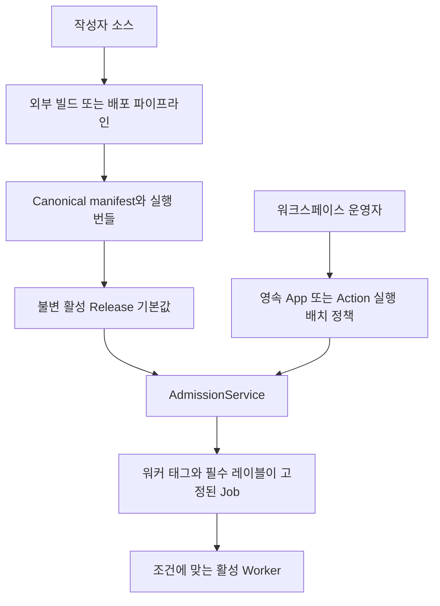

# 실행 배치

실행 배치에는 서로 분리해야 하는 두 소유자가 있습니다.

- **릴리스 작성자**는 canonical App manifest에 기본값을 제공합니다.
- **워크스페이스 운영자**는 Windforce Core에서 기본값을 재정의할 수 있습니다.

설정된 manifest는 저장소에 커밋한 `windforce.json`, 외부 배포 과정에서
생성한 `scraping.json`, 또는 `--manifest-file`로 선택한 다른 파일일 수
있습니다. 생성 책임은 외부 작성·배포 파이프라인에 있습니다. Core는 완성된
canonical manifest를 소비하며 App의 `--describe` 명령을 실행하지 않습니다.



## 결정 순서

워커 태그는 다음 순서에서 처음 설정된 값을 사용합니다.

1. Action 운영자 재정의
2. App 운영자 재정의
3. Action manifest 태그
4. App manifest 태그
5. `default`

필수 레이블은 다음 순서에서 처음 설정된 재정의를 사용합니다.

1. Action 운영자 재정의
2. App 운영자 재정의
3. App과 Action manifest `runsOn` 값의 합집합

`null`은 재정의를 지우고 다음 기본값을 상속한다는 뜻입니다. `[]`는 다릅니다.
레이블을 하나도 요구하지 않는다는 명시적 재정의입니다.

## 앱 등록

앱 등록 대화상자는 Git 소스를 저장하기 전에 구성된 canonical manifest를
검사합니다. 검사 응답에서 App 키와 릴리스 실행 배치 기본값이 확인된 뒤에만 최초
운영 정책을 선택할 수 있습니다. 선택한 값은 등록 요청의 `placement_policy`로
전달되며 Core는 첫 Release 전부터 확인된 App 식별자에 정책을 저장합니다. 이후
Release가 새 기본값을 제공해도 이 정책은 바뀌지 않습니다.

새 검사 미리보기에서는 manifest 값을 `worker_tag`라고 부릅니다. 기존 App·Action
API의 `tag`, `tag_override`, `effective_route_tag`는 호환성을 위해 wire name으로
유지합니다. Console에서는 이 값들을 모두 **실행 배치**의 **워커 태그**로 표시하며,
HTTP 또는 게이트웨이 경로를 설정하는 값이 아닙니다.

## 운영 API

App 정책:

```http
PATCH /api/w/{workspace}/apps/{app}
Content-Type: application/json

{
  "tag_override": "browser",
  "required_labels_override": ["linux", "kr"]
}
```

Action 정책도 `/api/w/{workspace}/apps/{app}/actions/{action}`에서 같은 요청
본문을 사용합니다. 부분 수정에서는 어느 한 필드만 보낼 수 있습니다. 상속하려면
필드를 `null`로 지정합니다. App 상세 조회 응답은 manifest 기본값, 운영자
재정의, 최종 적용값을 각각 반환합니다.

App 상세 조회 응답은 `placement_policy_revision`도 반환합니다. 이 revision은 모든 Action 재정의를 포함한 App 실행 배치 정책 전체에 적용되며 App 또는 Action 정책이 바뀔 때마다 증가합니다.

### 선택적 fail-closed 용량 전제조건

기존 PATCH는 호환성을 위해 기본적으로 경고 후 저장을 허용합니다. Worker를 나중에 배포할 수 있기 때문입니다. UI 없이 동작하는 reconciler는 같은 PATCH 본문에 `precondition`을 추가해 한 트랜잭션 snapshot의 용량 검사를 선택할 수 있습니다.

```http
PATCH /api/w/{workspace}/apps/{app}
Content-Type: application/json

{
  "tag_override": "browser",
  "required_labels_override": ["linux", "kr"],
  "precondition": {
    "operation_id": "placement-20260814-01",
    "expected_policy_revision": 3,
    "minimum_matching_slots": 1
  }
}
```

App PATCH는 상속을 적용한 후보 App 선택자와 모든 활성 Action을 검사합니다. Action PATCH는 해당 Action만 검사합니다. 모든 대상은 신규 작업을 받을 수 있는 live·active Worker의 slot이 `minimum_matching_slots` 이상이어야 합니다. 매칭은 실제 Job claim과 같은 태그, 필수 레이블, 엔진 소유 execution-profile 레이블 규칙을 사용합니다. 관리형 Worker는 workspace 범위의 활성 자격증명과 `running` 상태 WorkerGroup도 필요합니다.

성공 응답은 적용된 revision, 하나의 DB/store `checked_at`, 각 대상의 민감정보가 제거된 최종 선택자와 매칭 Worker·slot 수를 반환합니다. 최신 `operation_id`와 요청 fingerprint의 정확한 재시도는 감사 기록을 중복 생성하지 않고 최초 결과를 반환합니다. 오래된 revision 또는 다른 요청으로 operation ID를 재사용하면 409, 용량 부족이면 422입니다. 거부된 요청은 정책, revision, replay 상태와 감사를 변경하지 않습니다.

`matching_slots`는 현재 유휴 slot이 아니라 호환되는 광고 용량의 합입니다. 이 전제조건은 Worker를 예약하거나 미래 가용성을 보장하지 않습니다. 변경 직후 용량이 사라져도 Core는 정책을 rollback하지 않으며 이후 Job은 호환 용량이 돌아올 때까지 기존 의미대로 대기합니다.

Web Console의 **실행 배치** 탭에서는 App 전체 정책과 각 Action 정책을 따로
편집합니다. Action의 `앱 실행 배치 상속`은 App 운영자 정책을 따르고, 별도
재정의를 선택하면 해당 Action의 워커 태그와 필수 레이블만 바뀝니다. Action의
릴리스 레이블 기본값은 App과 Action manifest `runsOn` 값의 합집합으로 표시됩니다.

## UI 없는 운영

Web Console은 이 API를 사용하는 선택적 클라이언트이며 Core 운영의 필수 요소가
아닙니다. 자체 설치 환경은 ingress 또는 gateway에서 `/ui`를 노출하지 않고 다음
순서로 실행 배치를 관리할 수 있습니다.

1. 사내 Helm, Kubernetes 또는 GitOps 소유자가 원하는 그룹·태그·레이블로 Worker를
   배포하거나 갱신합니다.
2. `GET /api/w/{workspace}/workers`에서 등록된 Worker와 현재 광고하는 선택자를
   확인합니다.
3. `GET /api/w/{workspace}/apps/{app}`에서 릴리스 기본값, 운영자 재정의, 최종 App·Action
   실행 배치를 비교합니다.
4. 위 PATCH API로 App 또는 Action 정책을 반영합니다. fail-closed가 필요한 자동화는 현재 `placement_policy_revision`, 고유 operation ID, 양수인 최소 매칭 slot 수를 `precondition`에 보냅니다.
5. App을 다시 조회하여 최종값과 적용된 revision을 검증합니다.

운영 저장소에 선언적 희망 상태를 두고 이 API를 호출하는 reconciler를 실행할 수
있습니다. Admission이 실제로 사용하는 런타임 정본은 Core에 영속된 정책입니다.
외부 파일은 희망 상태이며 실행 시마다 조회하는 두 번째 정본이 아닙니다. 따라서
운영 정책은 App manifest와 불변 Release 이력에도 들어가지 않습니다.

WorkerGroup 생성, 자격증명, drain, scaling, 태그·레이블 어휘 관리는 Cloud 운영
포털이나 자체 설치 배포 소유자의 책임입니다. Core는 중립적인
[Worker 관리 API](../../api/worker-management.md), 등록 상태 관찰, 실행 배치 API를
제공하지만 Web Console에서 Hosted WorkerGroup 제어판을 복제하지 않습니다. 권한이
있는 운영자에게 선택자 값과 집계된 매칭 수는 보여줄 수 있지만, Worker endpoint,
자격증명, 호스트 식별정보는 실행 배치 화면에 노출하지 않습니다.

## Release와 Job 동작

실행 배치 정책은 새 릴리스 게시, 롤백, Core 재시작 후에도 유지됩니다. 정책 수정은
수정 이후 승인되는 Run에만 적용됩니다. Admission은 최종 값을 Run과 Job에
고정하므로 대기 중인 Job은 이후 정책 변경을 따라가지 않습니다.

Console은 현재 최종 태그와 레이블에 맞는 활성 Worker가 없으면 경고합니다.
정책을 저장한 뒤 Worker를 배치할 수도 있으므로 저장 자체를 막지는 않습니다.

운영자 필수 레이블 재정의는 활성 Release가 고정한 엔진 소유 execution-profile 레이블을 제거하지 않습니다. Core는 운영자 재정의를 계산한 뒤 profile 제약을 추가하며 용량 전제조건과 실제 claim matcher가 같은 결과를 사용합니다.
