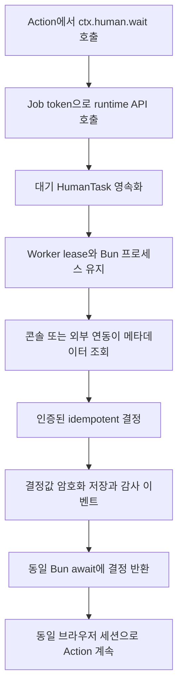

`HumanTask` hold는 Windforce Core의 범용 사람 결정 기능입니다. 원래 Action 프로세스를 종료하지 않고 같은 `await`에 결정값을 반환합니다. 워크플로 체크포인트도, Action 재실행도 아닙니다.

## 앱 개발 흐름

Phase 1은 TypeScript Author API를 제공합니다.

```ts
export async function main(ctx) {
  const page = await openAuthenticatedPage()

  const decision = await ctx.human.wait<{ otp: string }>({
    key: "login-otp",
    kind: "form",
    title: "인증번호 입력",
    inputSchema: {
      type: "object",
      required: ["otp"],
      properties: {
        otp: { type: "string", title: "인증번호" },
      },
    },
    privateContext: { accountRef: "opaque-reference" },
    timeoutMs: 120_000,
  })

  if (decision.outcome === "cancel") throw new Error("operator canceled")
  await page.getByLabel("인증번호").fill(decision.value.otp)
  return await continueScraping(page)
}
```

`key`는 한 Job attempt 안의 논리적 대기 지점을 안정적으로 식별합니다. 생략하면 wrapper가 한 번 생성하지만, 진단을 위해 명시하는 편이 좋습니다. 일시적인 서버·네트워크 장애는 같은 key로 재연결합니다. 같은 key에 다른 요청을 보내면 충돌로 거절합니다.

## 요청과 결정

요청에는 범용 `form`, 제목, 설명, JSON Schema, 선택적 표시 힌트, 비공개 컨텍스트와 제한 시간이 들어갑니다. Core는 제출값을 JSON Schema로 검증합니다. 내장 콘솔은 일반적인 object 필드(`string`, 문자열 enum, `number`, `integer`, `boolean`)를 표시하며 비공개 컨텍스트는 절대 보여주지 않습니다.

결과에는 `taskId`, `outcome`(`submit` 또는 `cancel`)과 선택적 `value`가 있습니다. HumanTask 취소 결정과 Run 취소, Action timeout, 작업 deadline, worker shutdown, lease loss는 서로 다른 종료 원인입니다.

## 요청·응답 흐름



| 작업 | 엔드포인트 | 권한 |
| --- | --- | --- |
| Action 대기 | `POST /api/w/{workspace}/human-tasks/wait` | 현재 Job token 전용 |
| 목록 | `GET /api/w/{workspace}/human-tasks?state=pending` | 워크스페이스 운영자 또는 `human_tasks:read` |
| 상세 | `GET /api/w/{workspace}/human-tasks/{id}` | 워크스페이스 운영자 또는 `human_tasks:read` |
| 결정 | `POST /api/w/{workspace}/human-tasks/{id}/decision` | 워크스페이스 운영자 또는 `human_tasks:decide` |

결정에는 항상 `Idempotency-Key`가 필요합니다. service principal의 `allowed_targets`는 목록과 개별 작업 모두에서 App/Action 범위를 제한합니다.

## 암호화와 생명 주기

Core는 Action을 기다리게 하기 전에 작업을 영속화합니다. 메타데이터와 JSON Schema는 권한 있는 운영자가 읽을 수 있습니다. `privateContext`와 결정값은 Core의 암호화 root로 암호화되며 API 목록·상세, 로그, 감사 payload에는 나오지 않습니다. 복호화한 결정은 해당 Job의 대기 호출에만 반환합니다.

## 깨우기와 deadline 책임

영속화된 HumanTask 행이 항상 정본입니다. LocalStore는 프로세스 내부 task
신호를 사용합니다. PostgreSQL 기반 Core 프로세스는
`LISTEN windforce_human_task` 연결 하나를 공유하고 commit된 task ID를 로컬
waiter에 전달합니다. 대기 task마다 DB 연결을 하나씩 점유하지 않습니다.
waiter는 행을 읽기 전에 먼저 구독하며, 알림 유실이나 연결 재수립을 복구하기
위해 저빈도 reconciliation도 수행합니다.

runtime HTTP 연결이 끊겨도 서버의 독립 deadline sweeper가 기한이 지난 pending
task를 만료시킵니다. 다음 시간 제한은 서로 다른 의미를 가집니다.

| 계층 | 의미 | 결과 |
| --- | --- | --- |
| HTTP transport session | runtime과 Core 사이의 한 연결 | 같은 key로 재연결하며 task를 취소하거나 연장하지 않음 |
| HumanTask deadline | 앱이 요청한 제한된 hold 시간 | `human_task_deadline` 원인으로 `expired` 저장 |
| Action timeout | Action 프로세스의 최대 생존 시간 | 프로세스와 task를 `action_timeout`으로 취소 |
| Run/운영자 취소 | 명시적 실행 취소 | task를 `run_canceled`로 취소 |
| lease loss/worker shutdown | live state를 더 유지할 수 없음 | 안정된 worker 종료 원인으로 task 취소 |

## 폴링 없는 외부 연동

Webhook은 외부 어댑터를 깨우는 선택적 알림 채널이지 Interaction의 주 배선이
아닙니다. `ctx.human.wait()`와 HumanTask Control API만으로 요청·결정 흐름이
완성되며 Webhook 구독 없이도 동작합니다.

기존 서명 Webhook outbox는 HumanTask 상태 변경과 같은 트랜잭션에서 다음 범용
CloudEvent를 생성합니다.

- `windforce.human_task.created`
- `windforce.human_task.decided`
- `windforce.human_task.expired`
- `windforce.human_task.canceled`

외부 Interaction·알림·RMQ 어댑터는 필요한 이벤트와 앱 범위를 구독하고,
Webhook 서명을 검증하고, event ID를 멱등성 키로 중복 제거합니다. 그 뒤
`human_tasks:read` 또는 `human_tasks:decide` service principal로 메타데이터를
읽거나 결정을 제출합니다. 이벤트에는 라우팅 식별자, 상태, outcome, actor,
종료 원인만 들어갑니다. 양식 값, private context, 결정값은 절대 들어가지
않습니다. 버전 계약은 [`contracts/webhooks/v1`](../../../contracts/webhooks/v1/README.md)에 있습니다.

hold 동안 worker slot, Job lease, Bun 프로세스, 호출 스택, 앱 SDK 객체, Playwright/Puppeteer 세션이 모두 살아 있습니다. 따라서 유한한 timeout을 사용해야 하며 며칠 동안의 장기 대기에 쓰면 안 됩니다. suspend/checkpoint/re-entry는 재생과 앱 상태 규칙이 필요한 별도 후속 단계입니다.

Core는 앱·도메인·벤더의 Interaction 양식, action code, RMQ, scraping SDK 문법을 알지 않습니다. 앱 SDK는 `ctx.human.wait`를 감싸 자체 표현을 제공하고 외부 알림 채널을 연결할 수 있습니다. [앱 런타임 인터페이스](app-runtime-interface.md), [ADR 0026](../../adr/0026-human-task-hold.md), [ADR 0027](../../adr/0027-operationalize-human-task-hold.md)을 함께 보십시오.
