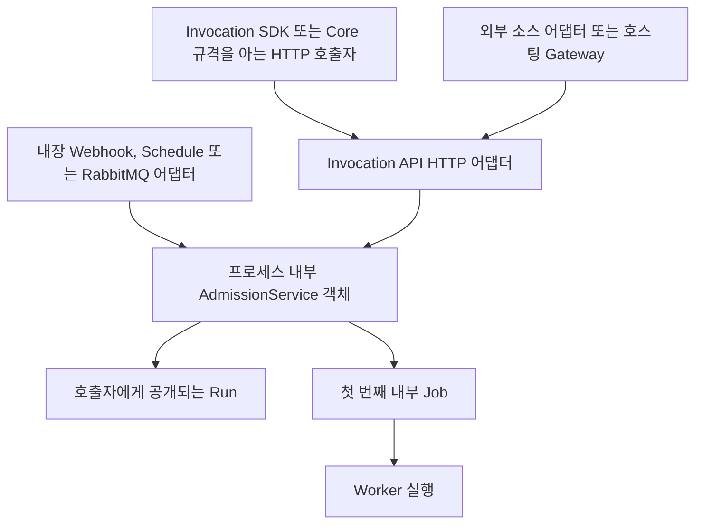
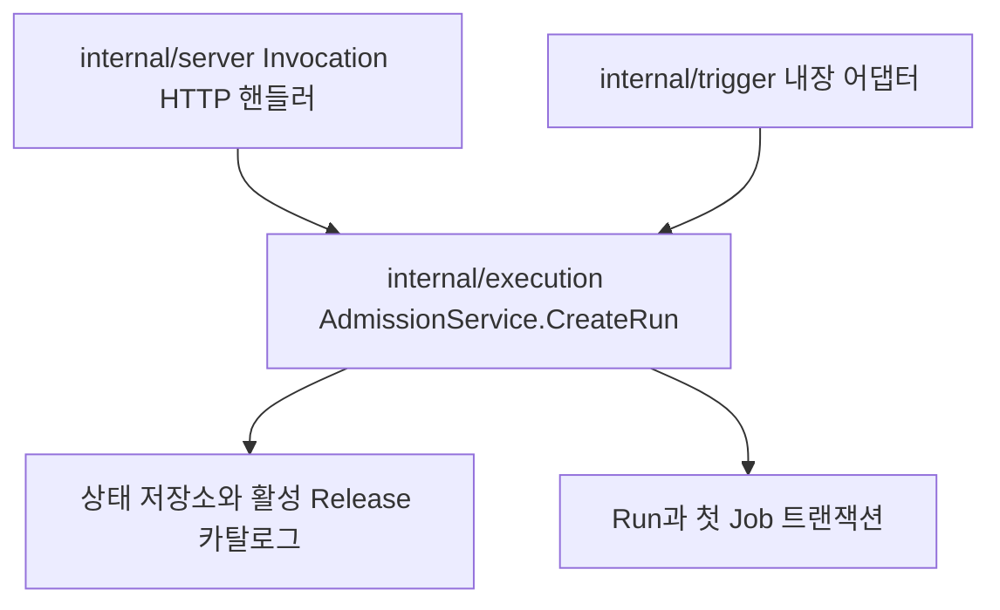
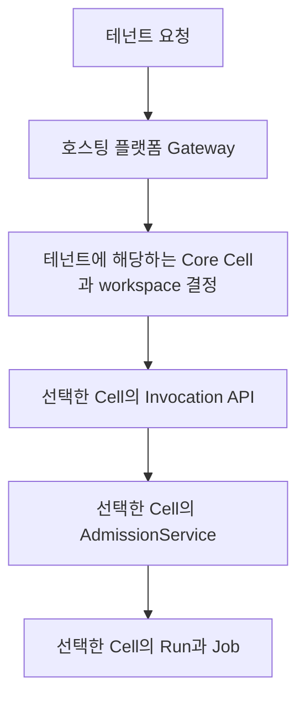
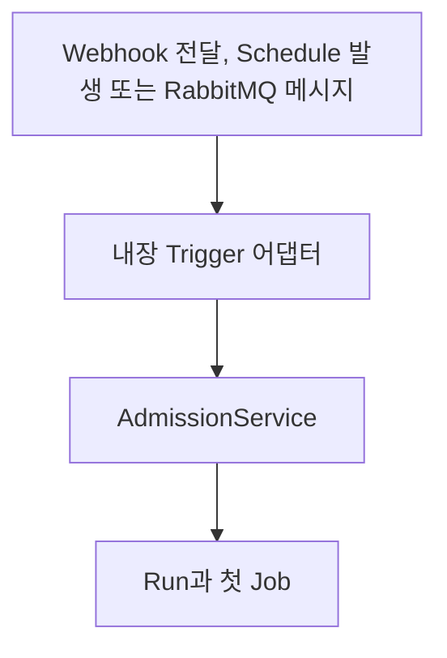
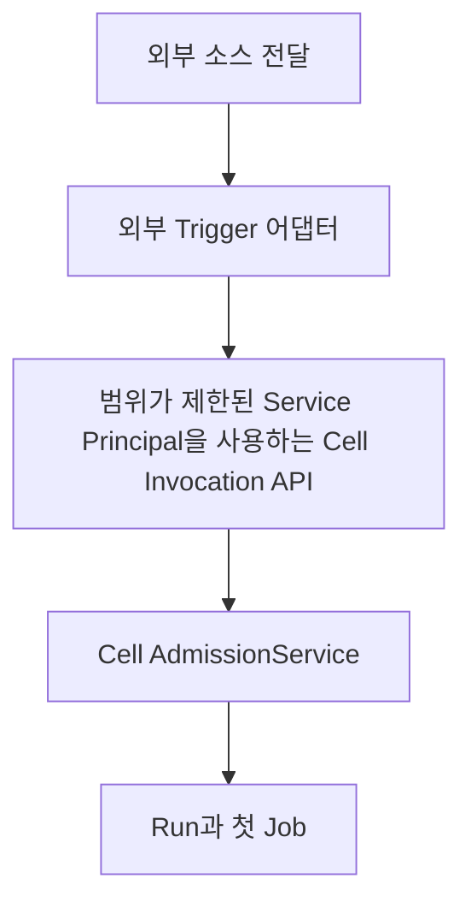
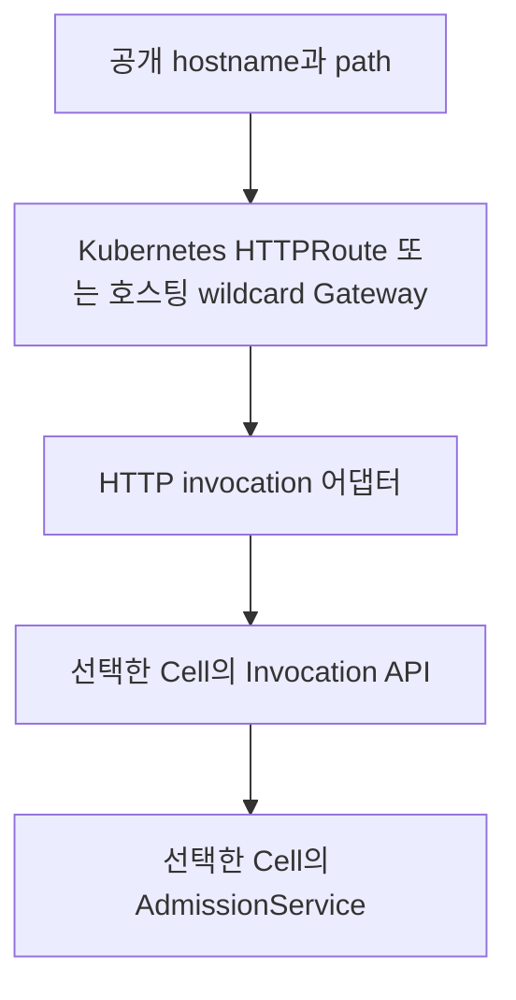

이 문서는 Run 요청을 받아들이는 현재 아키텍처를 사람이 이해하기 쉽게 설명한 정리본입니다. `/api/v1/openapi.json`으로 제공되는 OpenAPI 문서는 시스템 간 통신규격의 기계 판독 가능한 정본입니다. ADR은 이전 결정이 내려진 이유와 이후 변경 과정을 보존하는 기록이며, 현재 아키텍처를 설명하는 주 문서를 대신하지 않습니다.

[English](../../concepts/run-admission.md)

## 한눈에 보기

Windforce Core에는 하나의 Run 수용 유스케이스가 있고, 여러 어댑터가 이 유스케이스에 연결됩니다.



Invocation API와 AdmissionService는 의도적으로 같은 작업으로 모이지만 서로 다른 구성요소입니다.

- **Invocation API**는 `/api/v1`에 위치한 버전이 명시된 HTTP 어댑터입니다.
- **AdmissionService**는 Core 바이너리 안에서 동작하는 비공개 Go 애플리케이션 서비스입니다.
- **Invocation SDK**는 Invocation API를 호출하는 외부 HTTP 클라이언트입니다.
- **Trigger**는 전달된 이벤트나 발생한 사건을 정규화된 Run 요청으로 변환하는 프로토콜 어댑터와 저장된 소스 설정의 조합입니다.

## 구성요소 경계

| 구성요소 | 실행 위치 | 담당하는 것 | 담당하지 않는 것 |
| --- | --- | --- | --- |
| Invocation SDK | 호출자 프로세스 | HTTP 요청 구성, 응답 해석, 재시도, 편의 메서드 | Core 상태, Release 선택, 수용 판단, 큐 레코드 |
| Invocation API | Core `server` 또는 `standalone` HTTP 리스너 | HTTP 인증 전달, 헤더, JSON, 경로 버전, HTTP 응답 변환 | 소스 프로토콜 생명주기, Worker 실행, 별도의 수용 구현 |
| AdmissionService | Core 프로세스 | 주체 권한 확인, Release 결정과 고정, InputConfig 병합, 스키마 검증, 멱등성, Run과 첫 Job의 원자적 생성 | HTTP 라우팅, JSON 직렬화, 공개 URL 관리, 소스 프로토콜 리스너 |
| 내장 Trigger 어댑터 | Core `server` 또는 `standalone` 프로세스 | 소스 생명주기, 소스 인증, 전달 식별자, 입력 변환, 응답 정책, 완료 전달 정책 | 별도의 Run 생성 구현 |
| 외부 Trigger 또는 Gateway 어댑터 | 별도 프로세스 또는 호스팅 플랫폼 | 외부 프로토콜, 공개 경로, 소스 인증, 입력 변환, Core 호출 전 정책 처리 | Core 데이터베이스, 카탈로그, 큐, AdmissionService 직접 접근 |

## AdmissionService는 SDK도 HTTP 서비스도 아니다

`AdmissionService`는 `internal/execution/service.go`에 구현되어 있습니다. Core 프로세스는 상태 저장소, Release 카탈로그, 번들 저장소를 사용해 이 객체를 만들고 HTTP 핸들러와 내장 Trigger 런타임에 주입합니다.

`internal/server/invocation_api.go`의 Invocation API 핸들러는 HTTP 요청을 `execution.CreateRunRequest`로 해석한 다음 `AdmissionService.CreateRun`을 직접 호출합니다. 핸들러와 AdmissionService 사이에는 네트워크 통신이 없습니다.

내장 Trigger 코드는 `internal/trigger/trigger.go`의 좁은 `AdmissionService` 인터페이스에 의존하며 같은 `CreateRun` 작업을 직접 호출합니다. Core의 HTTP 리스너를 다시 호출하지 않습니다.

Go의 `internal/` import 규칙 때문에 다른 저장소는 이 구현을 라이브러리처럼 가져올 수 없습니다. Go로 작성된 프로세스라도 별도 프로세스라면 Invocation API 또는 Invocation SDK를 사용해야 합니다.



여기서 `Service`는 별도로 배포되는 네트워크 서비스가 아니라 애플리케이션 서비스 또는 유스케이스 객체를 의미합니다.

## Invocation API와 AdmissionService가 하나처럼 보이는 이유

Invocation API는 Run 수용 유스케이스를 원격 HTTP로 표현한 것입니다. 요청 필드는 정규화된 수용 명령과 거의 일치하도록 설계되어 있고, 결과는 AdmissionService가 생성한 호출자 공개용 Run입니다.

두 구성요소를 분리하는 이유는 HTTP 어댑터가 다음과 같은 전송 계층 책임을 담당하기 때문입니다.

- URL과 API 버전
- Bearer 자격 증명 해석
- `Idempotency-Key`와 상관관계 헤더
- JSON 요청과 응답 표현
- HTTP 상태, `Location`, `X-WF-Run-Id`

AdmissionService는 다음과 같은 엔진 결정을 담당합니다.

- 요청 주체가 대상을 호출할 권한이 있는지
- 어떤 활성 Release를 고정할지
- InputConfig와 호출자 입력을 어떻게 병합할지
- 최종 입력이 Action 스키마와 일치하는지
- 멱등성 키가 재전송인지 충돌인지
- Run과 첫 Job을 하나의 트랜잭션으로 생성하는 일

HTTP가 아닌 다른 전송 방식을 추가하더라도 별도의 수용 구현을 만들면 안 됩니다. 어댑터를 프로세스 내부에서 외부로 옮기거나 반대로 옮겨도 수용 의미는 바뀌지 않아야 합니다.

## 범용 통신규격과 Cell 범위 실행

Invocation API는 모든 Core 인스턴스가 구현하는 범용 통신규격입니다. 하지만 각 요청은 요청을 받은 호스트의 특정 Core 인스턴스, 즉 Cell에서 처리됩니다.

```text
POST https://cell-a.example/api/v1/workspaces/default/runs
POST https://cell-b.example/api/v1/workspaces/default/runs
```

경로는 Cell을 선택하지 않습니다. 네트워크 목적지가 Cell을 선택하고 `{workspace}`는 그 Cell 내부의 조직 및 권한 범위를 선택합니다.

AdmissionService 역시 범용 구현 코드이지만 자신이 속한 Cell의 저장소, 카탈로그, 큐, 암호화 루트, Worker만 사용합니다. 전역 다중 Cell AdmissionService로 동작하지 않습니다.

호스팅 플랫폼은 테넌트용 전역 API를 제공할 수 있지만, 그 API는 Core Invocation API 자체가 아니라 플랫폼 Gateway facade입니다. 플랫폼은 테넌트에 해당하는 Cell을 찾고 Cell 범위 자격 증명을 선택한 다음 해당 Cell의 Invocation API를 호출합니다.



Core workspace는 테넌트 격리 경계가 아닙니다. 서로 신뢰하지 않는 테넌트는 별도의 Core 인스턴스를 사용해야 합니다.

## Invocation API와 HTTP Trigger의 차이

둘 다 HTTP 요청에서 Run을 시작할 수 있으므로 차이는 전송 방식이 아닙니다. 차이는 호출자가 Core 호출 통신규격을 알고 있는지, 소스별 설정이 어디에 저장되는지에 있습니다.

호출자가 다음 조건을 만족하면 Invocation API를 직접 사용합니다.

- workspace, App, Action을 알고 있음
- 표준 Invocation JSON 본문을 전송할 수 있음
- Operator, Client Registry 또는 Service Principal 자격 증명을 보유함
- 안정적인 `Idempotency-Key`를 유지할 수 있음
- 표준 Run 생명주기와 결과 통신규격을 사용하려고 함

```http
POST /api/v1/workspaces/default/runs
Authorization: Bearer wfs_example
Idempotency-Key: order-123
Content-Type: application/json

{
  "app": "orders",
  "action": "ingest",
  "input": {
    "order_id": "123"
  },
  "correlation_id": "partner-request-456"
}
```

전송자가 다음 조건에 해당하면 HTTP Trigger 또는 외부 HTTP 소스 어댑터를 사용합니다.

- 표준 Invocation 본문이 아닌 공급자 고유 payload를 전송함
- HMAC, 공급자 서명 또는 다른 소스 프로토콜로 인증함
- 대상 App 또는 Action을 모름
- 소스 헤더를 상관관계 정보나 멱등성 정보로 변환해야 함
- 즉시 응답, 동기 또는 비동기 완료 정책을 설정해야 함

어댑터는 소스 요청을 검증하고, 저장된 대상과 정책을 찾고, payload를 정규화한 다음 동일한 수용 유스케이스로 전달합니다.

넓은 의미에서는 Invocation API도 HTTP를 통해 실행을 일으키는 진입점입니다. 하지만 Windforce 용어에서 `Trigger`는 생명주기와 프로토콜 정책을 가진 저장된 소스 리소스이며, 상태가 없는 Invocation API 자체는 Trigger 리소스가 아닙니다.

## 내장 Trigger와 외부 Trigger 경로

내장 Trigger는 같은 Core 프로세스에서 실행됩니다.



외부 Trigger는 다른 프로세스에서 실행됩니다.



외부 어댑터는 소스의 전달 식별자를 `Idempotency-Key`로 사용하고, 영속적인 수용이 완료된 후에만 소스에 ACK를 보냅니다. Core 내부 패키지를 import하거나 Core 저장소에 직접 쓰지 않습니다.

## Gateway와 Router의 책임

네트워크 Router와 의미 변환을 수행하는 HTTP 어댑터는 서로 다른 구성요소입니다.

호출자가 이미 표준 Invocation API 본문과 자격 증명을 전송한다면 투명 Router는 요청을 그대로 전달할 수 있습니다. 이 경우에는 Trigger 리소스가 필요하지 않습니다.

일반적인 공개 Webhook을 Kubernetes Gateway API `HTTPRoute`만으로 Invocation API에 바로 연결할 수는 없습니다. 일반적으로 `HTTPRoute`는 표준 JSON 본문 생성, App과 Action 선택, Cell 범위 Service Principal의 안전한 주입, 멱등성 정보 생성, Run 응답 변환을 수행할 수 없기 때문입니다.

따라서 환경에는 HTTP invocation 어댑터가 필요합니다.



자체 호스팅 Kubernetes에서는 의미 변환이 필요할 때 `HTTPRoute`가 어댑터 Service를 대상으로 해야 합니다. 호스팅 플랫폼에서는 기존 Gateway가 테넌트와 Cell을 결정한 후 어댑터 책임까지 직접 수행할 수 있습니다.

Gateway와 어댑터는 공개 hostname 정책, TLS, 요청 속도 제한, 본문 크기 제한, 소스 인증, 테넌트와 Cell 연결을 담당할 수 있습니다. 하지만 전역 AdmissionService가 되거나 Cell의 큐에 직접 쓰면 안 됩니다.

## 내장 Webhook 진입과 공개 Invocation 라우팅은 서로 다르다

현재 Core는 설정된 내장 Webhook Trigger를 위해 `/api/v1/workspaces/{workspace}/triggers/{trigger}/events`를 제공합니다. 이 진입점은 Trigger에 저장된 HMAC, 입력, 응답, 완료 정책을 적용한 후 프로세스 내부에서 AdmissionService를 호출합니다.

현재 HTTP Route Binding 리소스는 이 내장 Webhook 진입점에 사용하기 쉬운 공개 URL을 연결합니다. 이것은 **내장 Webhook 공개**이며, 위에서 설명한 범용 외부 Gateway에서 Invocation으로 이어지는 경로가 아닙니다.

HTTP Trigger 어댑터로 동작하는 외부 Gateway는 범위가 제한된 Service Principal을 사용해 `/api/v1/workspaces/{workspace}/runs` 또는 `/runs/wait`를 호출합니다. 내장 Trigger 진입점을 호출하지 않고 AdmissionService를 직접 호출하지도 않습니다.

두 기능을 같은 다이어그램으로 표현하면 안 됩니다.

```text
내장 Webhook 공개:
공개 경로 -> 내장 Webhook 진입점 -> Trigger 어댑터 -> AdmissionService

외부 HTTP invocation:
공개 경로 -> HTTP invocation 어댑터 -> Invocation API -> AdmissionService
```

Provider 구현에서는 두 모드 중 하나를 명확히 선택해야 합니다. 내장 Webhook Trigger를 공개하는 Provider는 기존 Trigger Route Binding을 조정할 수 있습니다. 범용 호스팅 Invocation을 제공하는 Provider에는 어댑터와 Invocation API 통신규격이 필요하며, 내장 Trigger 진입점으로 단순 네트워크 rewrite하는 것은 같은 기능이 아닙니다.

## Run과 Job의 소유권

AdmissionService는 서로 연관된 두 종류의 레코드를 만듭니다.

- **Run**은 호출자에게 공개되는 안정적인 호출 단위입니다. 멱등성, 상태, 결과, 취소, 보존을 담당합니다.
- **Job**은 Run을 위해 생성하는 영속 내부 작업입니다. 큐 상태, 우선순위, Worker claim, 시도 데이터를 담당합니다. **Attempt**는 해당 Job을 Worker가 lease로 fence하여 실행하는 한 번의 시도이며, lease 복구는 새 Job을 만들지 않고 attempt를 증가시킵니다.

Invocation API와 SDK는 Run 식별자를 공개하며 Job 식별자를 안정적인 실행 통신규격으로 공개하지 않습니다. Worker는 Invocation API가 아닌 Worker Plane을 통해 Job을 claim하고 완료합니다.

## 유지해야 할 원칙

1. Core 프로세스 경계마다 Run 수용 구현은 하나만 존재합니다.
2. Invocation API 핸들러와 내장 Trigger는 같은 구현으로 모입니다.
3. 별도 프로세스는 Invocation API를 호출하며 `internal/execution`을 import하지 않습니다.
4. SDK는 HTTP 클라이언트이며 수용 또는 저장소 로직을 포함하지 않습니다.
5. Gateway는 Cell을 결정하지만 전역 수용 기능을 제공하지 않습니다.
6. Trigger는 설정된 소스를 변환하고, Invocation API는 Core 규격을 아는 호출자를 위한 범용 진입점으로 유지됩니다.
7. 어댑터는 카탈로그, Run 테이블, Job 큐, Worker API에 직접 쓰지 않습니다.
8. ADR은 결정의 역사를 설명합니다. 이 문서와 현재 OpenAPI는 운영자와 통합 개발자가 지금 사용해야 할 아키텍처와 통신규격을 설명합니다.

## 관련 현재 문서

- [Architecture](../../architecture.md)는 Core의 전체 Plane과 프로세스 역할을 설명합니다.
- [Invocation API](../../concepts/public-api.md)는 호출자에게 보이는 HTTP 동작을 정의합니다.
- [Triggers](../../concepts/triggers.md)는 내장 및 외부 소스의 생명주기를 정의합니다.
- [Release and execution lifecycle](../../concepts/release-lifecycle.md)은 수용 과정에서 Release를 고정하고 실행 작업을 만드는 방법을 설명합니다.
- 실행 중인 Core가 제공하는 `GET /api/v1/openapi.json`은 Invocation API의 기계 판독 가능한 통신규격입니다.
