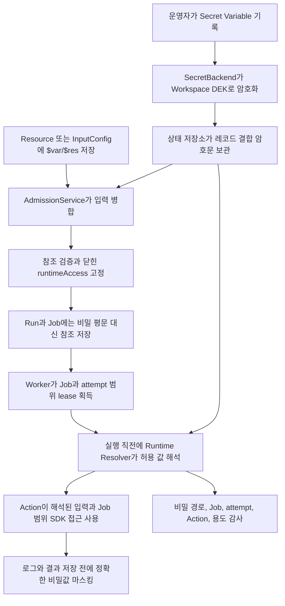

이 문서는 2026-08-01 현재 런타임 구성 아키텍처를 사람이 이해하기
쉽게 설명한 정리본입니다. `/api/w/{workspace}/openapi.json`의 Control Plane
OpenAPI와 Release에 포함된 `windforce.json` 스키마가 시스템 간 통신규격의
기계 판독 가능한 정본입니다. ADR은 결정이 바뀐 이유를 기록하며 현재 운영
안내서를 대신하지 않습니다.

[English](../../concepts/runtime-configuration.md)

## 다섯 객체의 역할은 서로 다르다

| 객체 | 용도 | 범위 | 저장 값 |
| --- | --- | --- | --- |
| Variable | 재사용할 스칼라 런타임 값 | Workspace, 선택적으로 App 값이 우선함 | 문자열 |
| Secret Variable | 재사용할 민감한 스칼라 값 | Workspace, 선택적으로 App 값이 우선함 | 레코드에 결합된 암호문. 조회는 메타데이터만 반환 |
| ResourceType | Resource의 버전 있는 검증 규격 | Workspace | JSON Schema |
| Resource | 재사용할 구조화 구성 | Workspace | 리터럴과 정확한 `$var:` 또는 `$res:` 참조를 가진 JSON |
| InputConfig | App·Action·Client별 기본 입력과 잠긴 필드 | Workspace와 App | 리터럴과 참조를 가진 암호화 JSON |

암호화는 Variable이나 Resource가 제공하는 사용자 기능이 아니라 저장 구현입니다.
운영자는 Secret Variable을 생성하거나 교체할 때 평문을 한 번 씁니다. Core의
`SecretBackend`가 이를 암호화하고, Resource와 InputConfig에는 그 값의 참조만
저장합니다.

## 참조

참조는 놓인 위치의 JSON 값 전체를 대체합니다.

```json
{
  "region": "$var:deployment/region",
  "credentials": "$res:partners/acme"
}
```

- `$var:path/to/value`는 App 범위 Variable을 먼저 찾고 없으면 Workspace 공용
  Variable을 찾습니다.
- `$res:path/to/resource`는 Workspace Resource를 재귀적으로 해석합니다.
- 참조는 문자열 전체여야 합니다. `Bearer $var:token` 같은 문자열 보간은
  지원하지 않습니다.
- 경로는 슬래시로 구분한 이식 가능한 ASCII 경로입니다. 빈 구간, `.`과 `..`,
  역슬래시와 경로 이탈은 거부합니다.
- 순환, 과도한 깊이, 너무 많은 참조, 없거나 삭제된 값은 안전하게 실패합니다.

실행 전 참조는 JSON 문자열이므로, 해석 결과가 다른 자료형이면 Action 입력
스키마가 참조 문자열도 명시적으로 허용해야 합니다. Resource로 객체를 주입하는
필드는 다음처럼 작성할 수 있습니다.

```json
{
  "oneOf": [
    { "type": "object", "required": ["endpoint"] },
    { "type": "string", "pattern": "^\\$res:" }
  ]
}
```

Resource 자체는 저장할 때 등록된 ResourceType으로 검증합니다. 해당 이름과
버전의 Resource가 하나라도 사용 중이면 ResourceType 삭제를 거부합니다.

## 런타임 접근 선언

App은 `windforce.json`에서 읽을 수 있는 구성의 최대 범위를 선언합니다.

```json
{
  "app": "orders",
  "entrypoint": "main.py",
  "scriptLang": "python",
  "actions": {
    "deliver": {
      "inputSchema": "deliver.input.schema.json",
      "operatorSettingsSchema": "deliver.settings.schema.json",
      "runtimeAccess": {
        "variables": ["deployment/region", "secrets/partner-token"],
        "resources": ["partners/acme"]
      }
    }
  }
}
```

Admission은 병합된 입력에 실제로 들어 있는 참조와 해당 Resource 내부의 참조를
재귀적으로 더합니다. 닫히고 정렬된 허용 목록을 선택된 Action과 Job에 고정합니다.
재시도는 같은 허용 목록을 물려받으므로 이후 Release나 InputConfig 변경이 기존
Run의 권한을 넓히지 못합니다.

Release가 소유하는 운영자 설정에서 `writeOnly: true` 또는
`x-windforce-secret: true`는 민감 필드를 뜻합니다. InputConfig를 저장할 때와
Run을 수용할 때 모두, 이 필드는 유효한 Secret Variable을 가리키는 정확한
`$var:` 참조여야 합니다. 평문, 일반 Variable, `$res:`는 거부합니다.

## 요청에서 Worker까지



Admission은 암호화된 설정 레이어인 InputConfig 문서를 열 수 있지만 Secret
Variable 평문은 해석하지 않습니다. 따라서 영속화된 Run과 Job 입력에는
`$var/$res` 참조가 남습니다. Runtime Resolver는 Worker가 현재 Job attempt의
소유권을 얻은 뒤에만 비밀 평문을 읽습니다.

로컬 Worker는 Action 호출 직전에 프로세스 내부에서 해석합니다. 원격 Worker는
서버가 같은 경계에서 claim 응답을 준비하며, 해석된 입력은 원격 Worker 메모리에만
전달되고 Workspace 데이터 암호화 키는 전달하지 않습니다. Job SDK 읽기는 attempt가
포함된 Job token을 사용하며, 같은 attempt가 유효한 lease로 실행 중일 때만
허용합니다. Job에 고정되지 않은 경로는 forbidden입니다.

## 암호화와 키 소유권

새로 생성한 관리형 Workspace에는 무작위 데이터 암호화 키(DEK)를 발급합니다.
DEK는 인스턴스 키 암호화 키로 감싸 버전과 함께 저장합니다. Secret Variable
암호문은 정규화한 Workspace, 레코드 종류와 경로를 인증하므로 다른 레코드로 옮긴
암호문은 복호화되지 않습니다. 레코드 결합을 도입하기 전에 저장된 값은 호환성을
위해 계속 읽을 수 있습니다.

Workspace key 레코드가 없는 이전 Workspace는 기존의 결정적 Workspace별 키
파생을 계속 사용합니다. 모든 InputConfig, Job 입력, 결과, Webhook 설정과 Secret
Variable을 한 트랜잭션에서 다시 암호화하지 않고 무작위 DEK로 조용히 바꾸면 기존
데이터가 손상되기 때문입니다. 새 Workspace에는 이 fallback을 사용하지 않습니다.

Hosted와 standalone 배포는 같은 Core 모델을 사용합니다. 배포 환경은 인스턴스
루트 키를 Kubernetes, Cloud KMS 연동 또는 로컬 설정에서 공급할 수 있지만 Cloud
전용 인증과 인프라는 공개 `windforce-core` 통신규격에 들어오지 않습니다.

## 감사, 마스킹, 신뢰 경계

Secret Variable을 성공적으로 해석할 때 Workspace, Job, attempt, App, Action,
Variable 경로, 용도(`input`, `sdk`, `redaction`)와 시각만 기록합니다. 값은 기록하지
않습니다. 이 기록은 통합 감사 스트림의 `runtime_configuration` 범주에 나타나며,
감사 기록 저장에 실패하면 비밀 읽기도 실패합니다.

Core는 Worker 로그, 저장 결과와 선택적 진단 payload 로그를 기록하기 전에 정확한
비밀 평문과 JSON escape 형태를 마스킹합니다. 이는 실수로 그대로 출력하는 경우를
막지만 DLP 시스템은 아닙니다. Action과 Worker는 신뢰 실행 경계 안에 있으므로
비밀을 변형하거나 외부로 전송할 수 있습니다. 서로 신뢰하지 않는 코드는 별도 Core
Cell에서 실행해야 합니다.

## Control Plane API

- `GET|POST /api/w/{workspace}/variables`
- `GET /api/w/{workspace}/variables/get/p/{path}`
- `DELETE /api/w/{workspace}/variables/p/{path}`
- `GET|POST /api/w/{workspace}/resources`
- `GET /api/w/{workspace}/resources/get/p/{path}`
- `DELETE /api/w/{workspace}/resources/p/{path}`
- `GET|POST /api/w/{workspace}/resource-types`
- `GET|DELETE /api/w/{workspace}/resource-types/{name}/{version}`
- `GET /api/w/{workspace}/audit-events?category=runtime_configuration`

Web Console에서는 **설정 → 런타임 구성**에서 같은 생명주기를 관리합니다. Secret
값은 쓰기 전용이며 목록과 상세 조회는 설정되어 있는지만 보여 줍니다.
