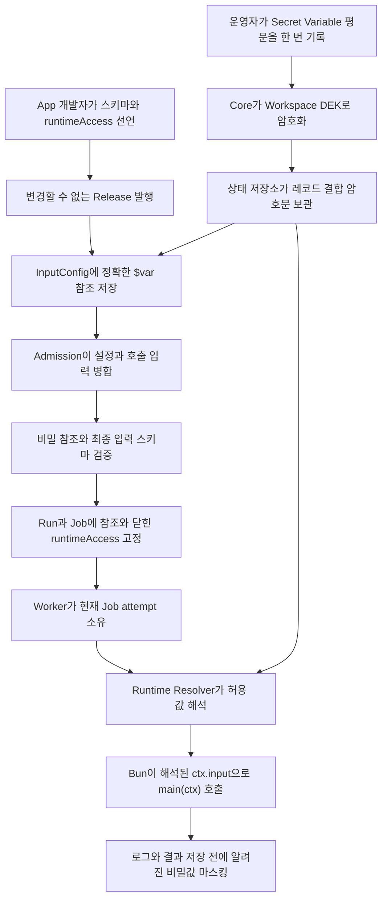

App 개발자는 암호화, 복호화 또는 암호문 전달을 구현하지 않습니다. App은 어떤 설정이 민감한지와 접근 가능한 런타임 경로의 최대 범위를 선언하고, 운영자는 Secret Variable 평문을 한 번 기록한 뒤 Resource와 InputConfig에는 `$var:` 또는 `$res:` 참조만 저장합니다. 저장 암호화, Admission 검증, Job 고정, 실행 시점 해석, 감사와 마스킹은 Core의 책임입니다.

[English](../../guides/runtime-secrets-typescript.md)

이 가이드의 실행 가능한 소스는 [`examples/typescript-runtime-secrets`](https://github.com/imprun/windforce-core/tree/main/examples/typescript-runtime-secrets)입니다. `TestTypeScriptRuntimeSecretsGuideE2E`는 바로 이 예제를 Release로 발행하고 direct-store Worker와 원격 `/worker/v1` Worker에서 모두 실행합니다.



## 1. Action 통신규격 선언

Manifest는 일반 입력 스키마, 운영자 설정 스키마와 런타임 경로 허용 범위의 최대값을 Release에 고정합니다.

```json
{
  "app": "runtime_secrets",
  "entrypoint": "main.ts",
  "scriptLang": "typescript",
  "actions": {
    "deliver": {
      "inputSchema": "deliver.input.schema.json",
      "outputSchema": "deliver.output.schema.json",
      "operatorSettingsSchema": "deliver.settings.schema.json",
      "runtimeAccess": {
        "variables": ["secrets/partner-token"]
      }
    }
  }
}
```

`inputSchema`는 Admission이 InputConfig와 호출 body를 병합한 최종 입력을 검증합니다. `operatorSettingsSchema`는 운영자가 설정할 부분을 식별합니다. `runtimeAccess`는 App이 선언한 최대 범위이며 설정이나 App 코드가 실행 중에 넓힐 수 없습니다.

## 2. 운영자 설정의 민감 필드 표시

운영자 설정 스키마에 `writeOnly: true` 또는 `x-windforce-secret: true`를 사용합니다.

```json
{
  "type": "object",
  "properties": {
    "partnerToken": {
      "type": "string",
      "writeOnly": true,
      "x-windforce-secret": true
    }
  }
}
```

이 필드의 InputConfig 값은 실제로 적용되는 Variable이 Secret인 정확한 `$var:` 참조여야 합니다. 평문, 일반 Variable, `Bearer $var:path` 같은 문자열 보간과 `$res:`는 거부됩니다.

## 3. Secret Variable 생성

Web Console에서 **설정 → 변수 및 리소스 → 변수**로 이동하고 `secrets/partner-token`을 생성합니다. App 범위는 `runtime_secrets`, 비밀값은 활성화하고 평문은 한 번만 입력합니다.

동일한 Control Plane 요청은 다음과 같습니다.

```http
POST /api/w/acme/variables
Content-Type: application/json
```

```json
{
  "path": "secrets/partner-token",
  "value": "평문은-한-번만-기록",
  "is_secret": true,
  "app_key": "runtime_secrets",
  "description": "Partner API credential"
}
```

Core는 값을 영속화하기 전에 암호화합니다. 이후 목록과 상세 조회는 메타데이터와 Secret 설정 여부만 반환하고 평문은 반환하지 않습니다.

## 4. InputConfig에 비밀값 연결

App, Action, Client 범위의 설정에는 값이 아니라 참조를 저장합니다.

```http
PUT /api/w/acme/apps/runtime_secrets/input-configs
Content-Type: application/json
```

```json
{
  "action_key": "deliver",
  "client_id": "<client-id>",
  "config": {
    "partnerToken": "$var:secrets/partner-token"
  },
  "locked_keys": ["partnerToken"]
}
```

적용되는 shallow merge 순서는 App 기본, App/Action, Client/App, Client/App/Action, 마지막으로 잠기지 않은 호출 입력입니다. 호출자가 잠긴 필드를 보내면 조용히 덮어쓰지 않고 요청을 거부합니다.

## 5. 호출자는 업무 입력만 전송

```http
POST /api/v1/workspaces/acme/runs
Content-Type: application/json
Authorization: Bearer <client-token>
```

```json
{
  "app": "runtime_secrets",
  "action": "deliver",
  "input": {
    "orderId": "ORDER-1004"
  }
}
```

Admission은 호출 입력과 적용할 InputConfig를 병합하고, 정확한 Secret Variable 참조를 검증하고, `runtimeAccess`를 닫아 고정하고, 최종 Action 입력을 검증한 뒤 Run과 첫 Job을 원자적으로 생성합니다. 영속화된 Job에는 참조가 남고 Job 자체도 저장 시 암호화되므로 Secret Variable 평문은 들어가지 않습니다.

## 6. Bun Action에서 해석된 입력 사용

Core의 TypeScript wrapper는 내보낸 `main(ctx)`를 호출합니다. 이 시점에는 현재 Job attempt가 lease를 소유하고 허용된 참조가 해석된 상태입니다.

```ts
type DeliverInput = {
  orderId: string;
  partnerToken: string;
};

export async function main(ctx: { action: string; input: unknown }) {
  const input = ctx.input as DeliverInput;
  const response = await fetch(`https://partner.example/orders/${input.orderId}`, {
    headers: { Authorization: `Bearer ${input.partnerToken}` },
  });
  return { status: response.status };
}
```

해석된 비밀값을 로그, 결과, 상태 또는 오류 메시지에 기록하면 안 됩니다. Core는 실수로 출력한 정확한 값을 마스킹하지만 이는 DLP 경계가 아니며 App 코드는 신뢰 실행 경계 안에 있습니다.

## Resource 조합

Resource에는 평문 대신 정확한 참조를 넣을 수 있습니다.

```json
{
  "endpoint": "https://partner.example",
  "token": "$var:secrets/partner-token"
}
```

`$res:partners/acme`를 저장하는 입력 필드는 input schema에서 `$res:` 문자열을 허용해야 하며, 그 필드 자체를 `x-windforce-secret`으로 표시하면 안 됩니다. 민감 필드는 정확한 Secret Variable `$var:` 참조만 허용합니다. 허용된 Resource 내부의 Secret Variable은 Runtime Resolver가 재귀적으로 해석합니다.

## 로컬 Worker와 원격 Worker

- Direct-store Worker는 설정된 `SECRET_KEY`로 Workspace DEK를 풀고 Action을 시작하기 직전에 프로세스 안에서 참조를 해석합니다.
- 원격 `--api-url` Worker는 `SECRET_KEY`, Workspace DEK 또는 DB 접근 권한을 받지 않습니다. Core 서버가 claim을 준비하면서 Job 입력과 허용 참조를 해석한 뒤 인증된 Worker Plane을 통해 준비된 입력을 전달합니다. 운영 환경의 Worker Plane 통신에는 TLS가 필요합니다.

## 실제 검증

Bun과 Git을 사용할 수 있는 환경에서 저장소의 정확한 예제를 다음 명령으로 검증합니다.

```powershell
go test ./internal/server -run TestTypeScriptRuntimeSecretsGuideE2E -count=1 -v
```

이 테스트는 민감한 운영자 필드에 평문을 넣으면 거부되는지, 올바른 `$var:` 참조가 허용되는지, 잠긴 비밀 필드를 호출자가 덮어쓸 수 없는지, 저장 상태에 Secret Variable 평문이 없는지, 로컬과 원격 Worker가 발행된 TypeScript 예제를 해석된 값으로 실행하는지를 검증합니다.
