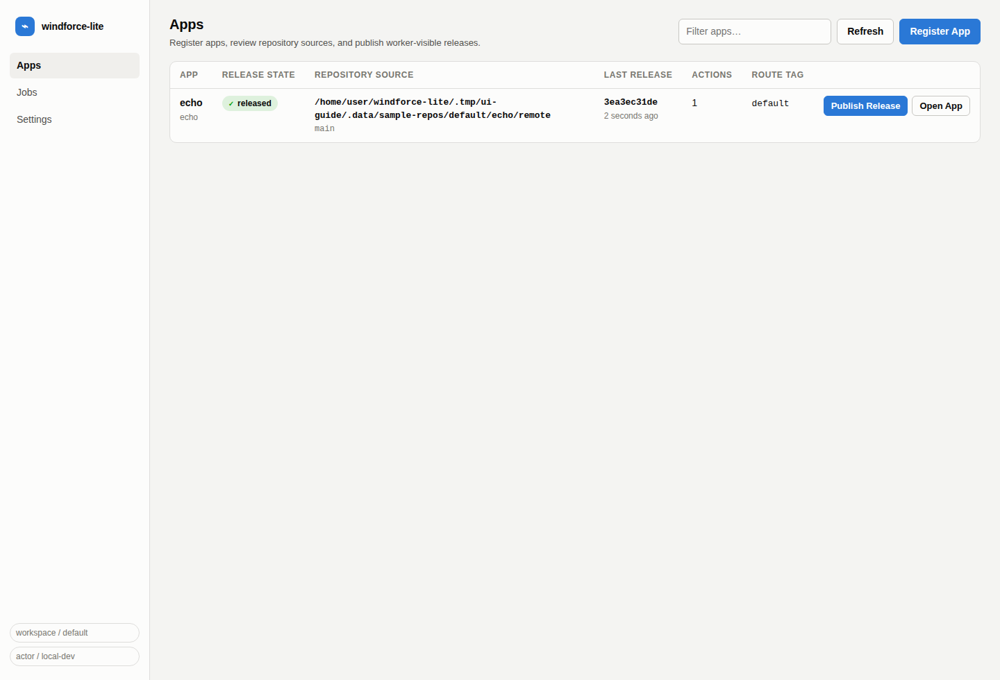
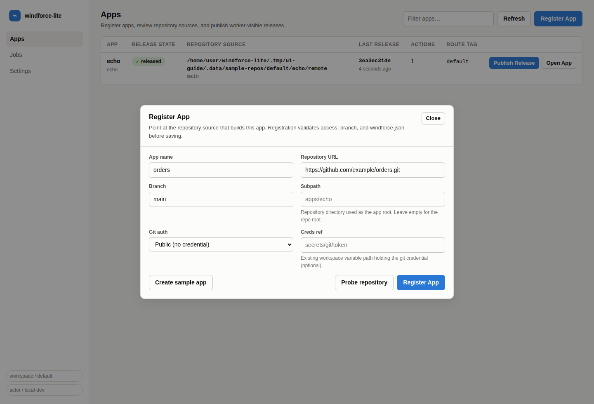
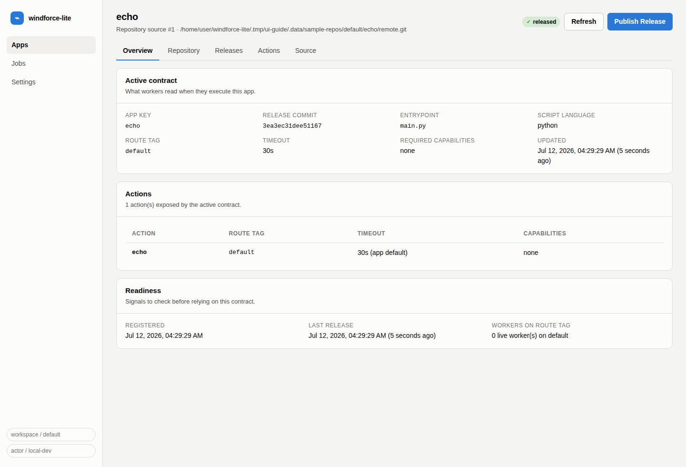
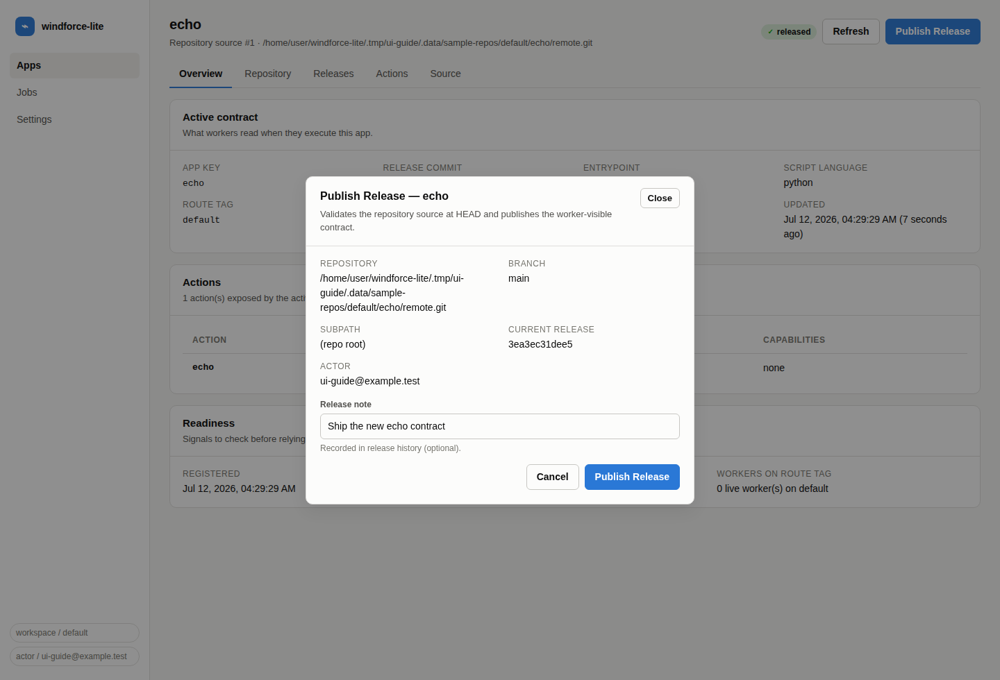
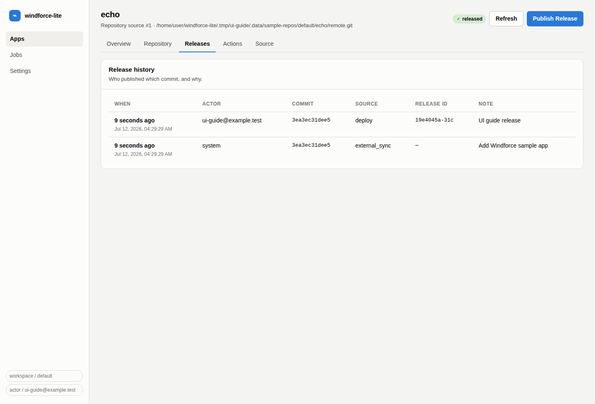
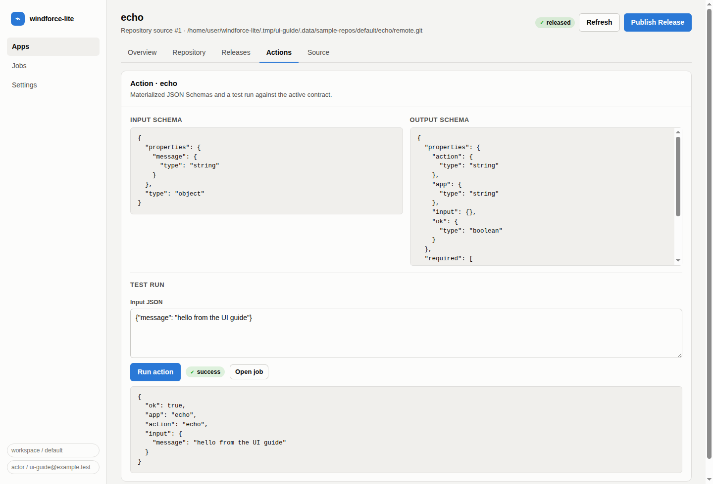
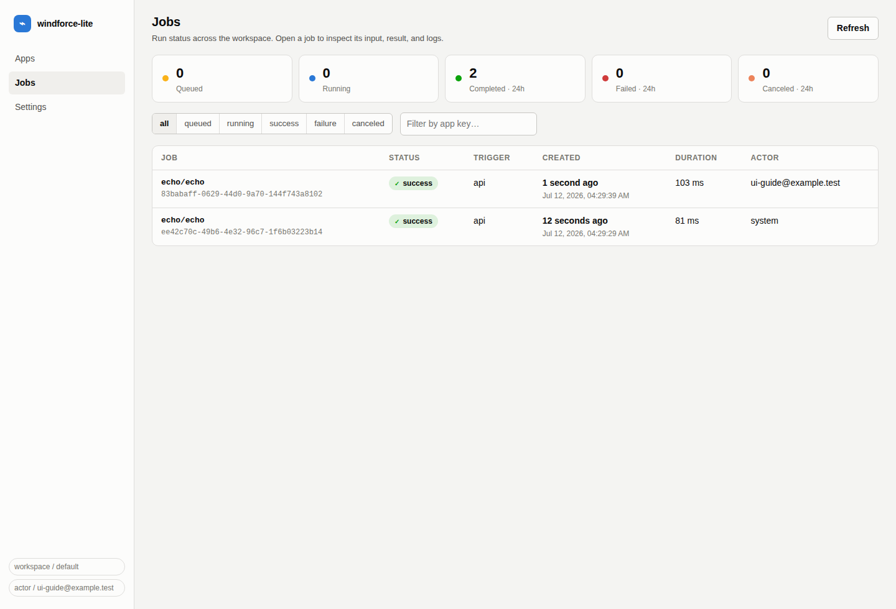
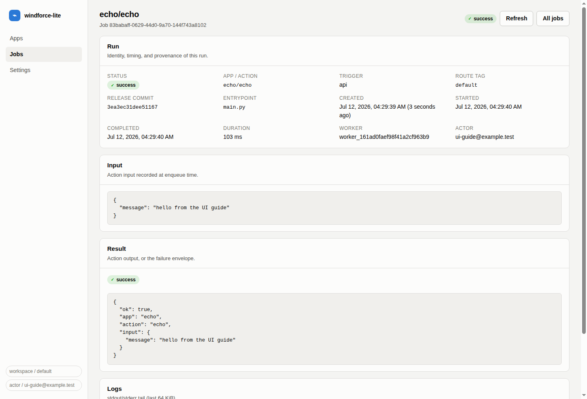
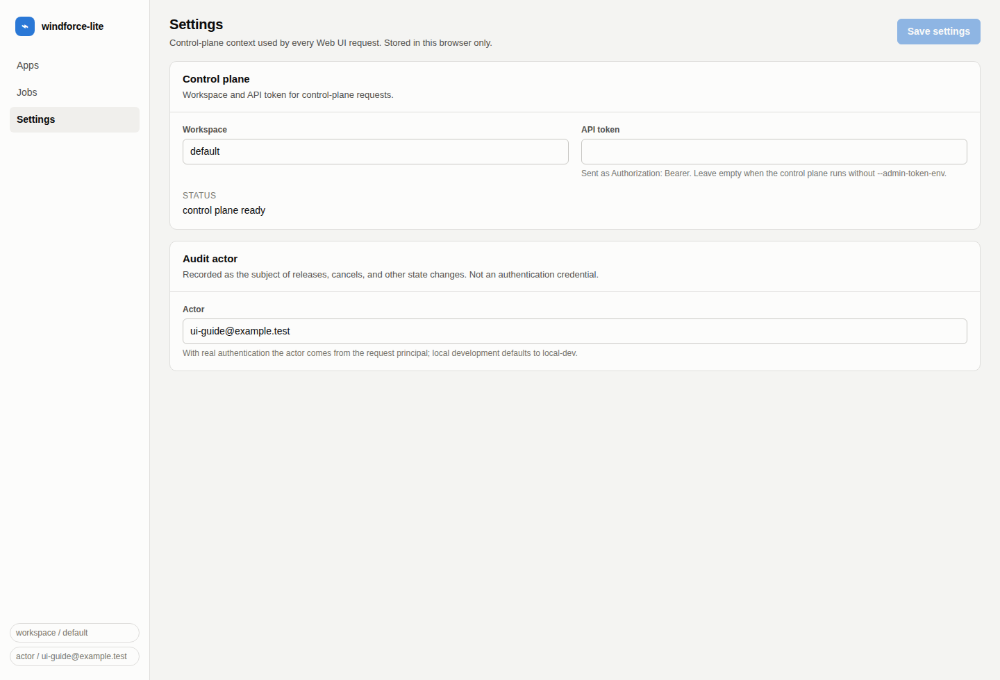

# windforce-lite Web UI User Guide

<!-- Generated by `node tools/ui-guide/capture.mjs`. Edit `docs/ui-scenarios/*.mjs` instead. -->

This guide is generated from executable UI scenarios. Screenshots are captured from the local windforce-lite devstack.

## Review registered apps

The Apps view is the home screen. Every row is one app: its release state, repository source, last release, and route tag.

1. Open the Web UI; the Apps view lists every registered app.
2. Check the release state badge: released apps have a worker-visible contract, registered apps do not yet.
3. Compare repository source, last release commit, action count, and route tag per app.
4. Use Publish Release directly from a row, or Open App for the full detail view.

## Register an app

Register App points the control plane at a repository source. Registration validates repository access, branch, and windforce.json before saving.

1. Click Register App in the Apps view.
2. Enter the app name, repository URL, branch, and optional subpath.
3. Pick a git auth method or reference an existing credential variable path.
4. Use Probe repository to confirm reachability and branch existence before registering.

## Inspect an app

The app detail Overview tab shows the active worker contract, the exposed actions, and readiness signals for the release.

1. Open an app from the Apps view.
2. Review the active contract: app key, release commit, entrypoint, route tag, and timeout.
3. Check the action list workers can execute.
4. Use the tabs for repository settings, release history, action schemas, and the source snapshot.

## Publish a release

Publish Release validates the repository source at HEAD and publishes it as the worker-visible contract, recorded with the audit actor.

1. Open an app and click Publish Release.
2. Confirm the repository, branch, subpath, and current release commit.
3. Add a release note for the audit trail.
4. Publish; the release history records the actor, commit, and note.

## Audit release history

The Releases tab is the audit trail: every record shows who published which commit, from which source, and why.

1. Open an app and switch to the Releases tab.
2. Each record shows the actor, commit, source, release id, and note.
3. Use the record to answer who changed the worker-visible contract, and when.

## Test run an action

The Actions tab shows each action's materialized JSON Schemas and lets you run the action against the active contract.

1. Open an app and switch to the Actions tab.
2. Review the input and output JSON Schemas materialized from the release.
3. Edit the input JSON and click Run action.
4. The run result appears inline with a link to the full job record.

## Monitor jobs

The Jobs view summarizes run activity across the workspace and lists every job with its status, trigger, and actor.

1. Open Jobs from the sidebar.
2. Read the summary tiles: queued, running, and the last 24 hours of completed, failed, and canceled runs.
3. Filter the list by status or app key.
4. Open a job to inspect its input, result, and logs.

## Inspect a job

The job detail view shows one run end to end: identity and timing, the recorded input, the result envelope, and the log tail.

1. Open a job from the Jobs view.
2. Check status, timing, worker, release commit, and audit actor.
3. Inspect the recorded input and the action result, or the failure envelope on errors.
4. Read the stdout/stderr tail; unsettled jobs refresh automatically and can be canceled.

## Set the control-plane context

Settings holds the workspace, API token, and audit actor that every Web UI request uses. Values are stored in the browser.

1. Open Settings from the sidebar.
2. Set the workspace and, when the control plane requires one, the API token.
3. Set the audit actor recorded on releases and cancels; local development defaults to local-dev.
