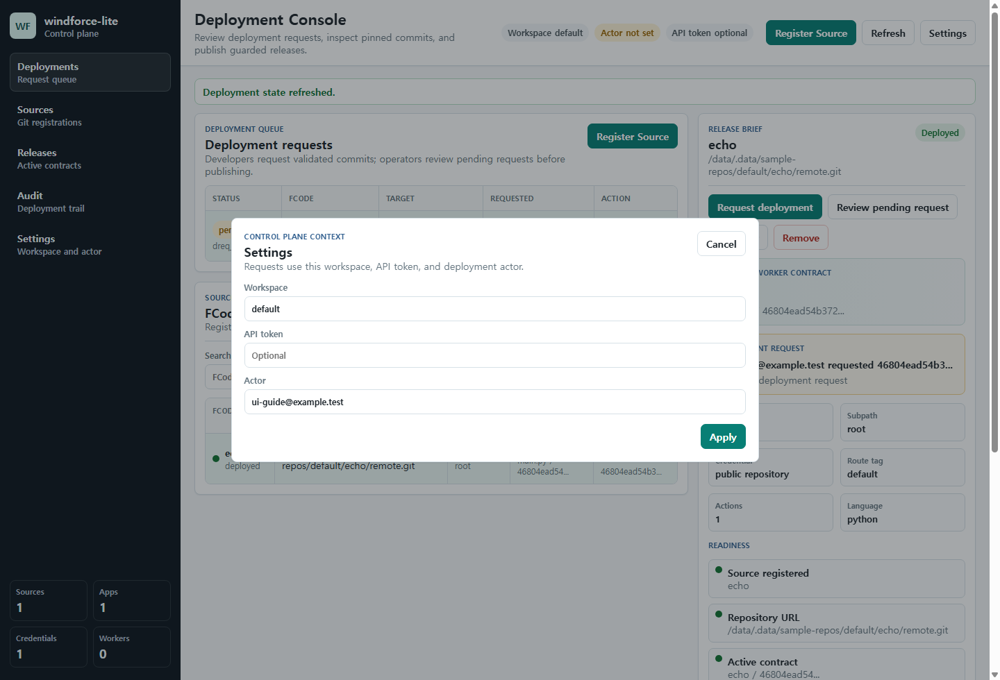
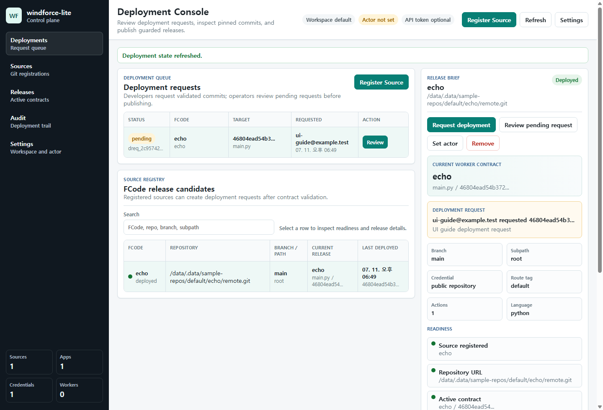
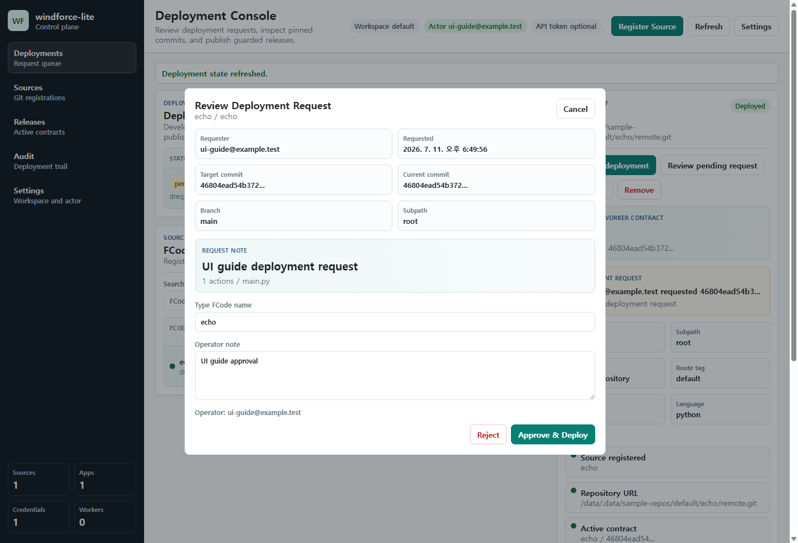
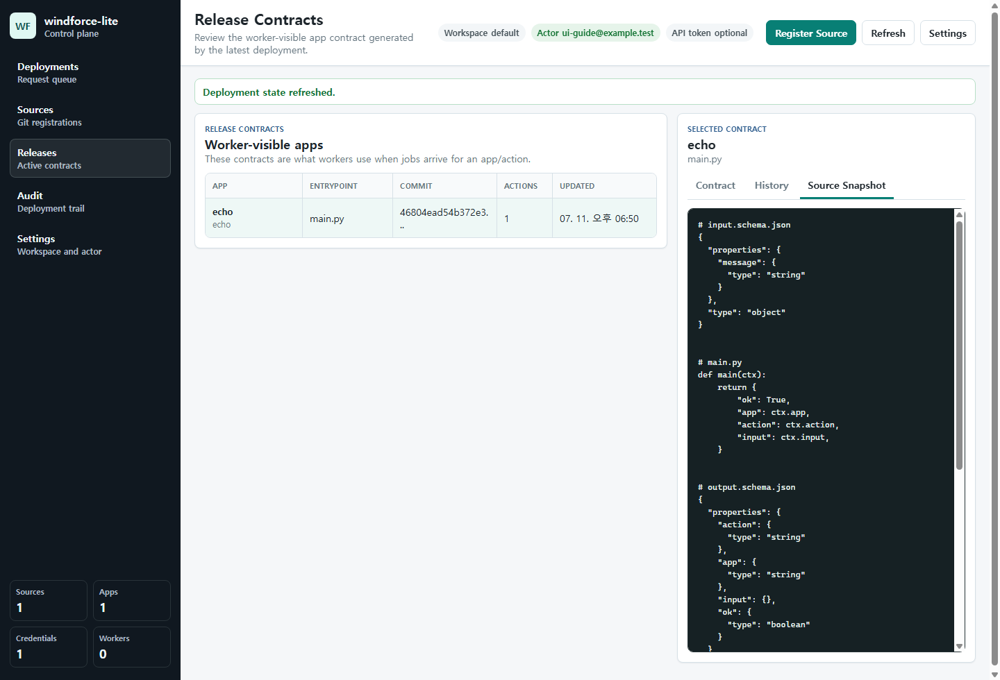

# windforce-lite Web UI User Guide

<!-- Generated by `node tools/ui-guide/capture.mjs`. Edit `docs/ui-scenarios/*.mjs` instead. -->

This guide is generated from executable UI scenarios. Screenshots are captured from the local windforce-lite devstack.

## Set control plane context

Use Settings to select the workspace, API token, and actor used by Web UI control-plane requests.

1. Open Settings from the command bar or sidebar.
2. Set the workspace and optional API token when the control plane requires one.
3. Set Actor before creating or reviewing deployment requests so audit history has a subject.

## Review deployment requests

Use the deployment console to review pending FCode deployment requests, registered sources, and selected release readiness.

1. Open the deployment management console.
2. Use the sidebar to move between deployment, source, release, and audit work areas.
3. Use the deployment request queue to identify pending operator work.
4. Use the release candidate table to compare registered FCodes.
5. Select a row to inspect the release brief, readiness checks, and latest audit entries.

## Approve a deployment request

Use the Deployments view to review a developer request and publish the pinned Windforce manifest commit.

1. Open the deployment management console.
2. Select a pending deployment request.
3. Confirm requester, target commit, current commit, branch, and subpath.
4. Type the FCode name and add an operator note.
5. Approve and deploy the request to publish the active app contract.

## Inspect active deployment contracts

Use the selected FCode detail tabs to inspect the deployed app contract, history, and source snapshot.

1. Open the deployment management console.
2. Select a registered FCode.
3. Use Contract to review the worker-visible action list and route tag.
4. Use History to inspect deployment audit entries.
5. Use Source Snapshot to inspect the materialized files used by the release.
