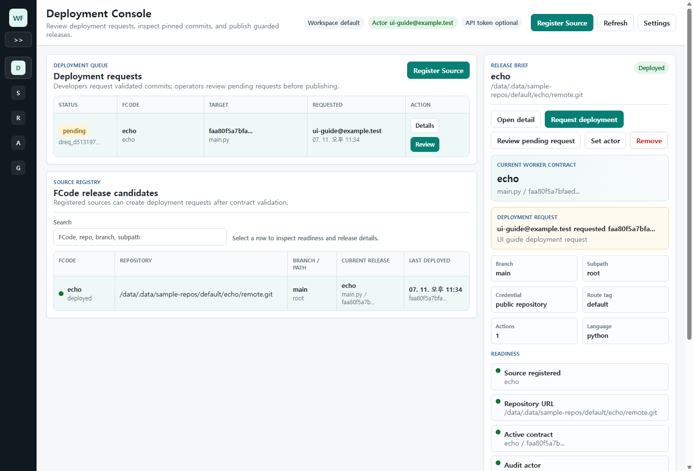
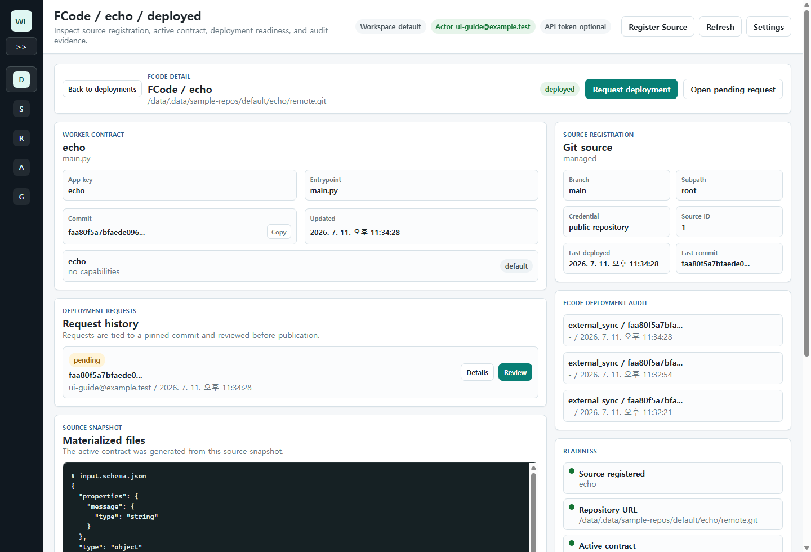
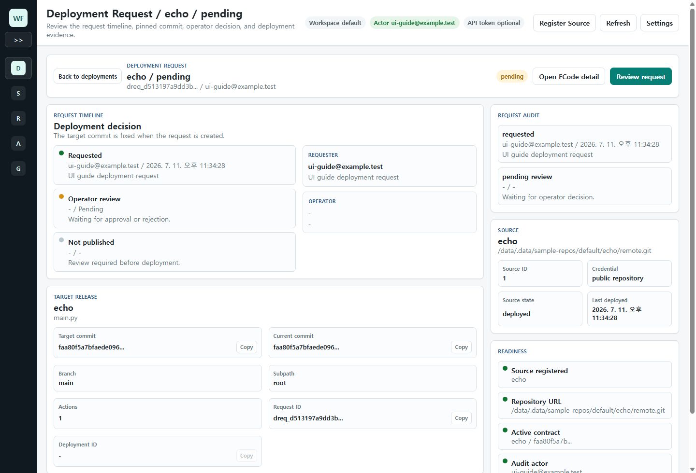
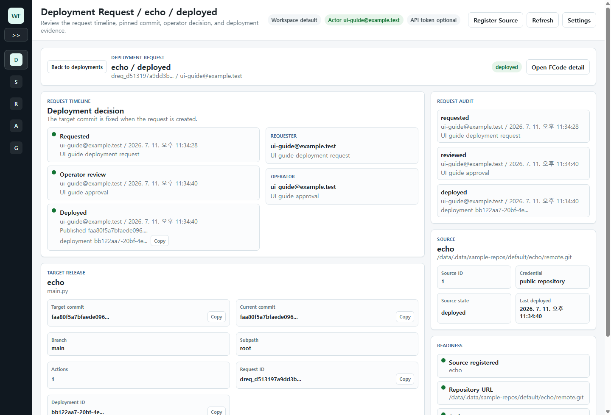
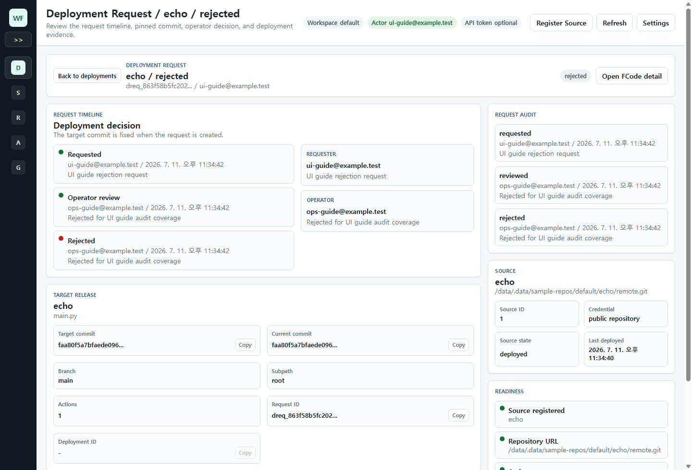

# windforce-lite Web UI User Guide

<!-- Generated by `node tools/ui-guide/capture.mjs`. Edit `docs/ui-scenarios/*.mjs` instead. -->

This guide is generated from executable UI scenarios. Screenshots are captured from the local windforce-lite devstack.

## Set control plane context

Use the Settings page to select the workspace, API token, and actor used by Web UI control-plane requests.

1. Open Settings from the command bar or sidebar.
2. Set the workspace and optional API token when the control plane requires one.
3. Set Actor before creating or reviewing deployment requests so audit history has a subject.

## Collapse navigation

Collapse the sidebar while keeping the deployment queue visible.

1. Click the sidebar collapse control.
2. Use the compact navigation rail to keep deployment work visible.

## Review deployment requests

Use the deployment console to review pending FCode deployment requests, registered sources, and drill into deployable detail pages.

1. Open the deployment management console.
2. Use the sidebar to move between deployment, source, release, and audit work areas.
3. Use the deployment request queue to identify pending operator work.
4. Use the release candidate table to compare registered FCodes.
5. Select a row for quick comparison or open its detail page for deployment evidence.

## Inspect an FCode deployment detail

Open a registered FCode detail page to review source registration, active contract, pending requests, readiness, and audit evidence.

1. Open the deployment management console.
2. Select a registered FCode and open its detail page.
3. Review the worker contract and exposed actions.
4. Check pending deployment requests and readiness signals.
5. Inspect the active source snapshot and latest audit entries.

## Inspect a pending deployment request detail

Open a pending deployment request detail page to review the pinned commit, timeline, requester message, operator decision state, and related FCode.

1. Open the deployment management console.
2. Open a pending deployment request detail page from the queue.
3. Confirm the request timeline and target commit.
4. Review requester and operator notes.
5. Open the related FCode detail when source-level evidence is needed.

## Approve a deployment request

Use the Deployments view to review a developer request and publish the pinned Windforce manifest commit.

1. Open the deployment management console.
2. Select a pending deployment request.
3. Confirm requester, target commit, current commit, branch, and subpath.
4. Type the FCode name and add an operator note.
5. Approve and deploy the request to publish the active app contract.

## Inspect a deployed request detail

Open a deployed request detail page to verify the operator decision, deployment id, published commit, and audit evidence.

1. Open the deployment management console after a request has been approved.
2. Open the deployed request detail page.
3. Confirm the deployed state, deployment id, target commit, and operator note.
4. Use copy actions when tracing the request through logs or release history.

## Inspect a rejected request detail

Open a rejected request detail page to verify rejection state, operator note, pinned commit, and source evidence.

1. Create a deployment request that should not be published.
2. Reject the request with an operator note.
3. Open the rejected request detail page.
4. Confirm the rejection state, requester note, operator note, and pinned target commit.

## Inspect active deployment contracts

Use the selected FCode detail tabs to inspect the deployed app contract, history, and source snapshot.

1. Open the deployment management console.
2. Select a registered FCode.
3. Use Contract to review the worker-visible action list and route tag.
4. Use History to inspect deployment audit entries.
5. Use Source Snapshot to inspect the materialized files used by the release.
