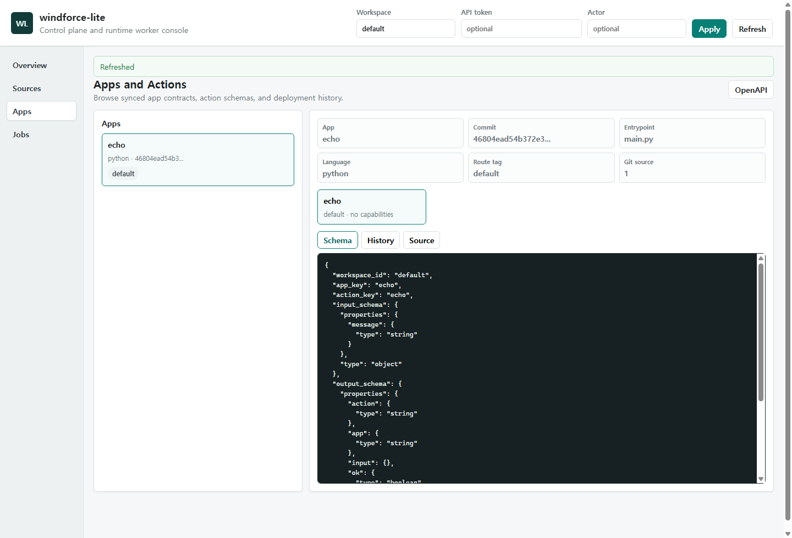
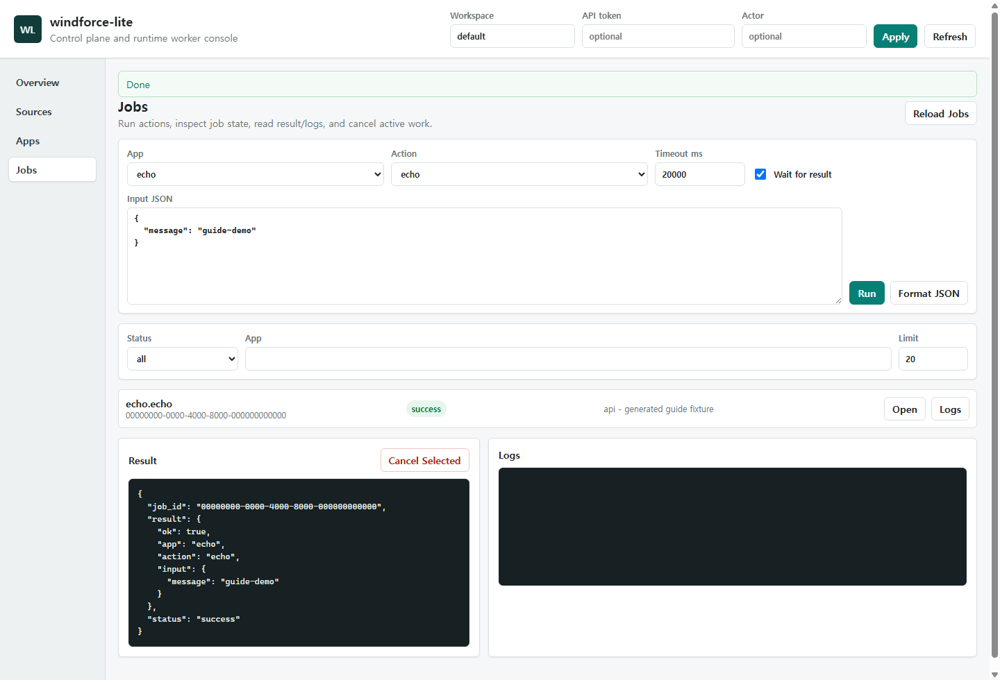
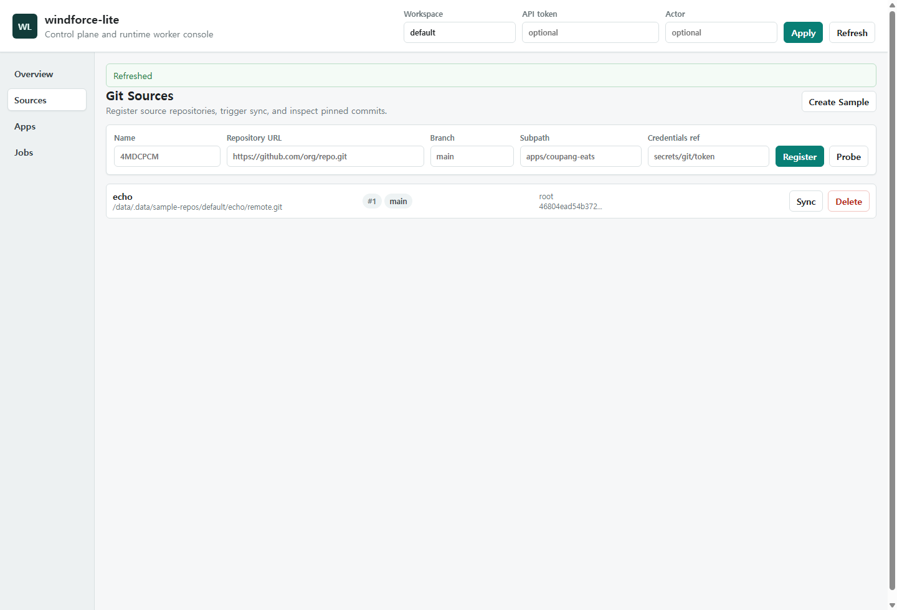

# windforce-lite Web UI User Guide

<!-- Generated by `node tools/ui-guide/capture.mjs`. Edit `docs/ui-scenarios/*.mjs` instead. -->

This guide is generated from executable UI scenarios. Screenshots are captured from the local windforce-lite devstack.

## Browse app action schemas

Use the Apps view to inspect synced action contracts and rendered JSON schemas.

1. Open the Apps view.
2. Select a synced app.
3. Select an action to load input and output schemas.
4. Use the Schema, History, and Source tabs to inspect the deployed contract.

## Run an action and inspect the result

Use the Jobs view to submit JSON input, wait for execution, and inspect result/log panels.

1. Open the Jobs view.
2. Choose an app and action.
3. Enter JSON input and keep Wait for result enabled for synchronous feedback.
4. Run the job, then inspect Result and Logs.

## Register and sync a git source

Use the Sources view to inspect a registered source and trigger a sync.

1. Open the Sources view.
2. Register a repository with branch, subpath, and credentials reference when needed.
3. Use Sync to materialize the latest configured commit into the runtime cache.
