# windforce-core Web UI User Guide

<!-- Generated by `node tools/ui-guide/capture.mjs`. Edit `docs/ui-scenarios/*.mjs` instead. -->

This guide is generated from executable UI scenarios. Screenshots are captured from the local windforce-core devstack.

## Review registered apps

The Apps view is the home screen. Every row is one app: its release state, repository source, last release, and effective worker tag.

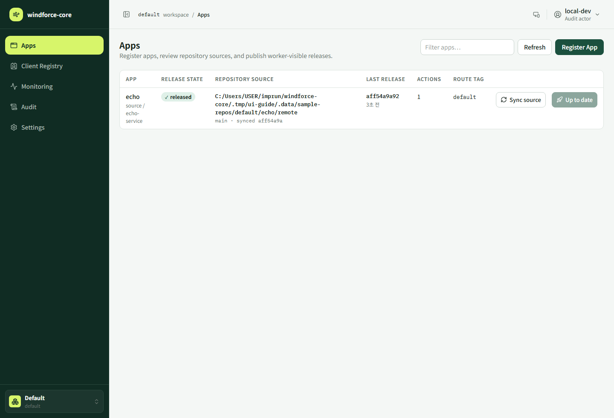

1. Open the Web UI; the Apps view lists every registered app.
2. Check the release state badge: released apps have a worker-visible contract, registered apps do not yet.
3. Compare repository source, last release commit, action count, and worker tag per app.
4. Select an app row or app name to open its full detail view, or publish a release from the row.

## Review the execution workspace in dark mode

Dark mode keeps the green runtime identity while separating the shell, work surface, selection, and status colors by luminance.

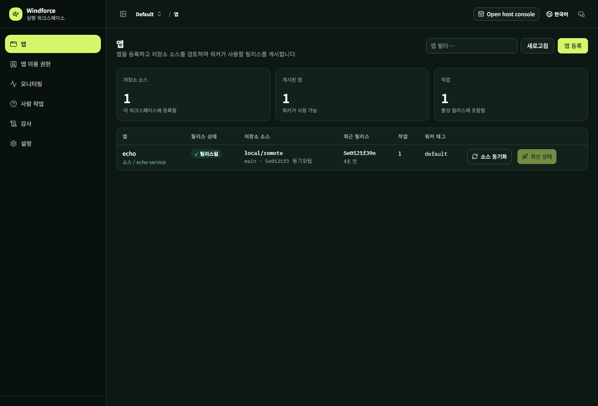

1. Switch the execution workspace to dark mode from the appearance control.
2. Confirm the near-black green shell stays distinct from the dark work surface.
3. Use the mint selection and focus colors to identify the active workspace and navigation item.

## Register an app

Register App validates the configured canonical manifest, previews its App identity and execution-placement defaults, and can store an initial operator policy.

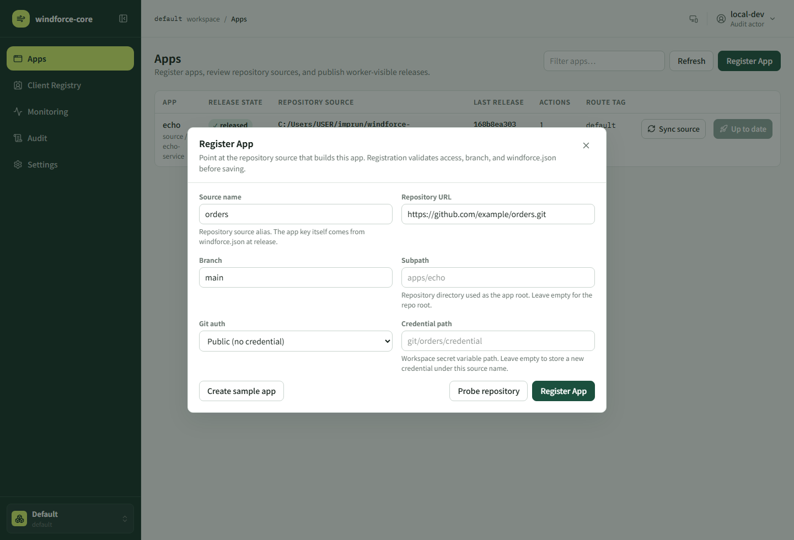

1. Click Register App in the Apps view.
2. Enter the app name, repository URL, branch, and optional subpath.
3. Pick a git auth method or reference an existing credential variable path.
4. Use Probe repository to confirm reachability and preview the configured canonical manifest.
5. Optionally override the release worker tag or required labels. Core stores these values independently from later Releases.

## Use the console in Korean

The embedded console supports Korean across navigation and product screens while preserving API identifiers and user data.

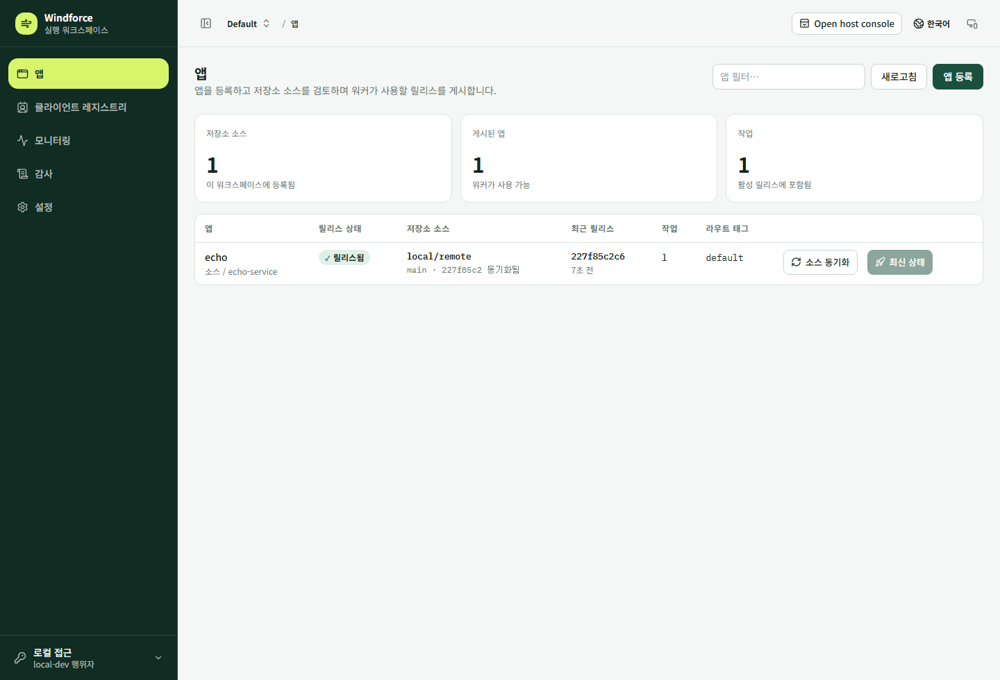

1. Confirm the globe action displays the current language: EN in English and 한국어 in Korean.
2. Select the globe action, then confirm navigation, page headings, status labels, validation, and errors use Korean.
3. Reload the page and confirm the selected language remains active.
4. Keep API paths, app and Action keys, event types, logs, and user-entered values unchanged.

## Inspect an app

The app detail Overview keeps immutable release defaults separate from effective execution placement and worker readiness.

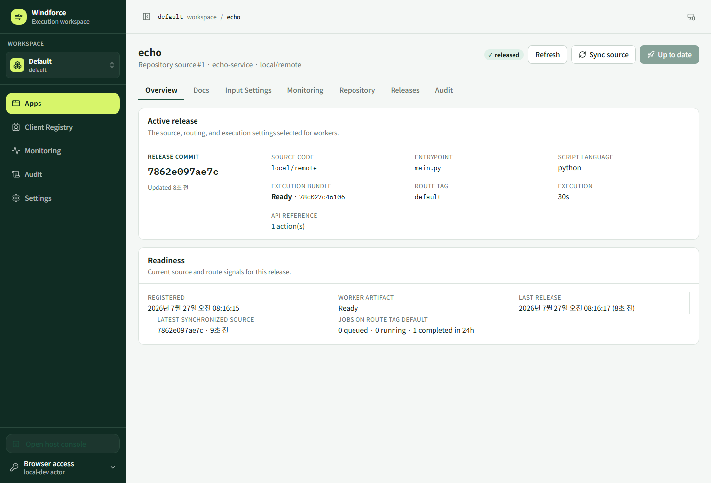

1. Open an app from the Apps view.
2. Review the active release: app key, release commit, entrypoint, and update time.
3. Follow the source code link to browse the repository at the pinned release commit on GitHub/GitLab.
4. Follow the effective worker tag to the separate Placement tab when you need to inspect or edit worker selection.
5. Use the tabs for repository settings, release history, and action schemas.

## Review release execution limits

The Execution limits tab shows immutable App and Action keyed-concurrency policies from the active release.

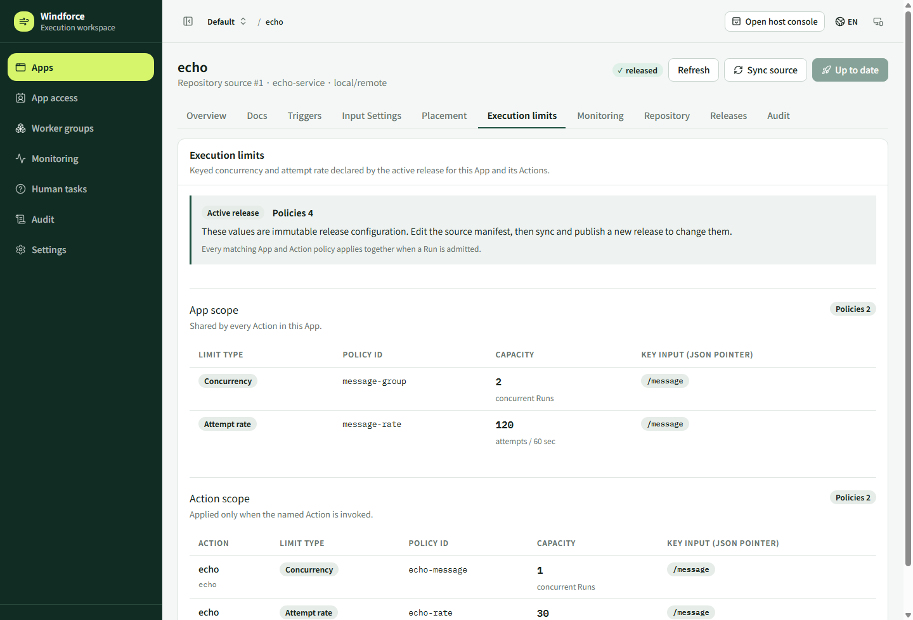

1. Open an App and choose Execution limits.
2. Review App-scoped policies shared by every Action.
3. Review Action-scoped policies, capacities, and JSON Pointer key inputs.
4. Edit the source manifest and publish a new release when the policy must change.

## Review execution limits in dark mode

Dark mode preserves policy hierarchy, identifiers, and diagnostic boundaries without introducing a separate palette.

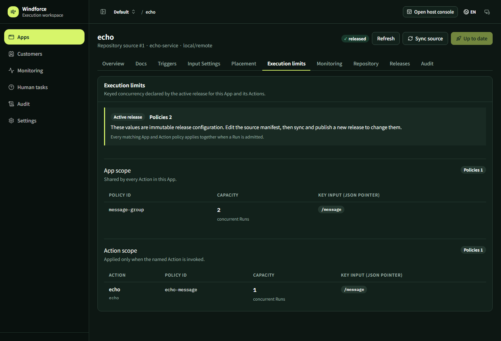

1. Open an App and choose Execution limits.
2. Switch the Core console to dark mode.
3. Confirm policy IDs, capacities, JSON Pointers, and release guidance remain legible.

## Review execution limits on a narrow screen

Policy tables become labelled records on a narrow screen so scope, capacity, and key inputs remain comparable.

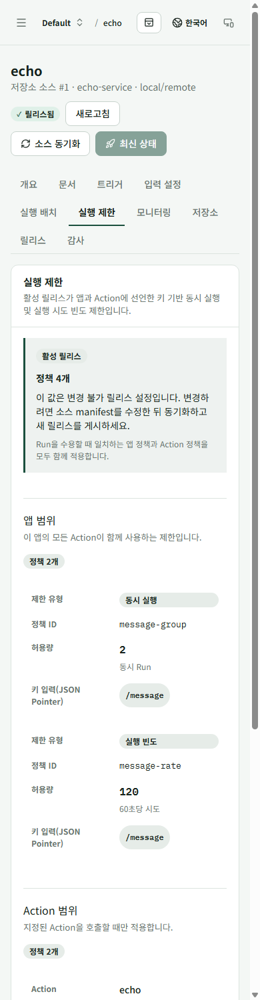

1. Open an App and choose 실행 제한 on a narrow screen.
2. Review the App policy as a labelled record.
3. Continue to Action policies without horizontal table scrolling.

## Configure execution placement

Execution placement is operator-owned configuration that selects eligible workers and survives releases and rollbacks without changing the release manifest.

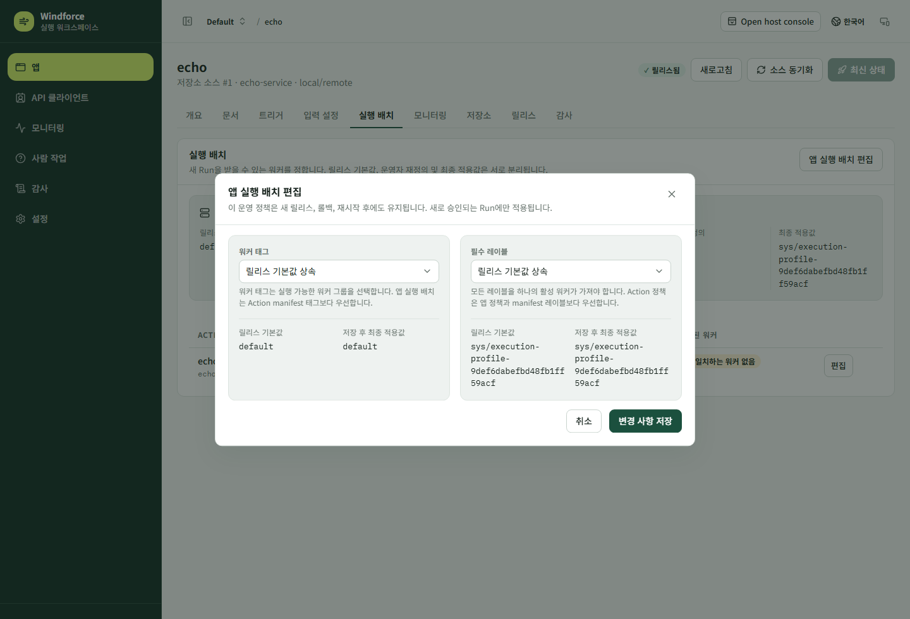

1. Open the app and choose the Placement tab.
2. Choose whether the worker tag and required labels inherit the active release or use an operator override.
3. An empty required-label override explicitly means no labels; Inherit follows the active release.
4. Review the effective-after-save preview. The policy applies only to newly admitted Runs.
5. After saving, review each Action for a matching live worker. Missing workers warn but do not block the change.

## Configure execution placement in dark mode

Dark mode keeps release defaults, operator overrides, and effective worker placement visually distinct.

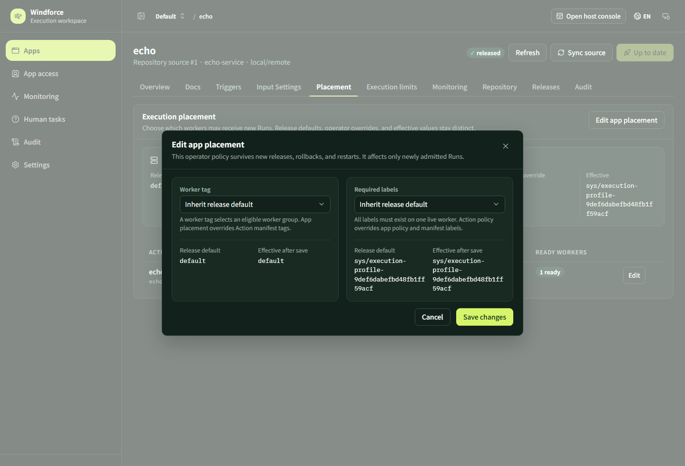

1. Open an App and choose Placement.
2. Switch the console to dark mode and open the App placement editor.
3. Confirm defaults, overrides, previews, and readiness warnings remain legible.

## Configure execution placement on a narrow screen

The App placement summary and editor collapse to one column without hiding worker selection or save controls.

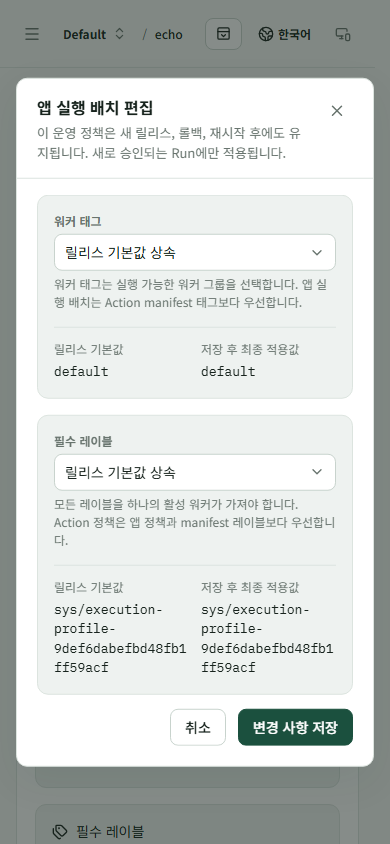

1. Open an App and choose Placement on a narrow screen.
2. Open the App placement editor.
3. Review worker tag and required-label controls in the one-column layout.

## Configure Action execution placement

Each Action inherits App placement by default and can override its worker tag and required labels independently.

1. Open the app and choose the Placement tab.
2. Choose Edit on an Action row.
3. Keep Inherit App placement or select an Action-specific override.
4. The release-label default combines App and Action runsOn values.

## Synchronize source

Sync source fetches the tracked branch, validates the source contract, and stores the exact revision without changing the active release.

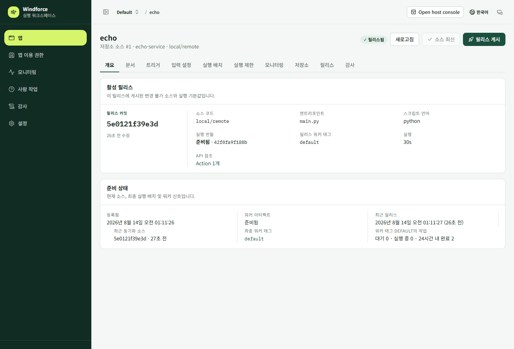

1. Open an app and find Sync source next to Publish Release.
2. Click Sync source.
3. Confirm that Sync source changes to Source current and Publish Release becomes available when the commit changed.

## Publish a release

Publish Release prepares the latest synchronized source and publishes it as the worker-visible contract, recorded with the audit actor.

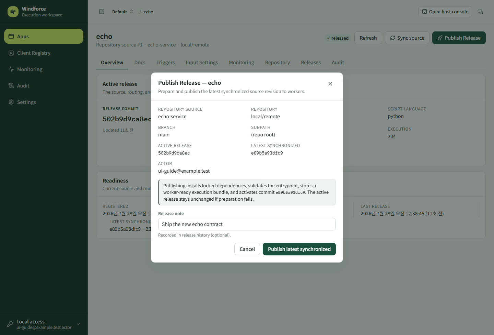

1. Open an app and click Publish Release.
2. Compare Active release with Latest synchronized.
3. Add a release note for the audit trail.
4. Publish the latest synchronized revision; the release history records the actor, commit, and note.

## Review release history

The Releases tab is the publish history of the worker-visible contract: who published which commit, from which source, and why. Configuration changes live on the Audit tab.

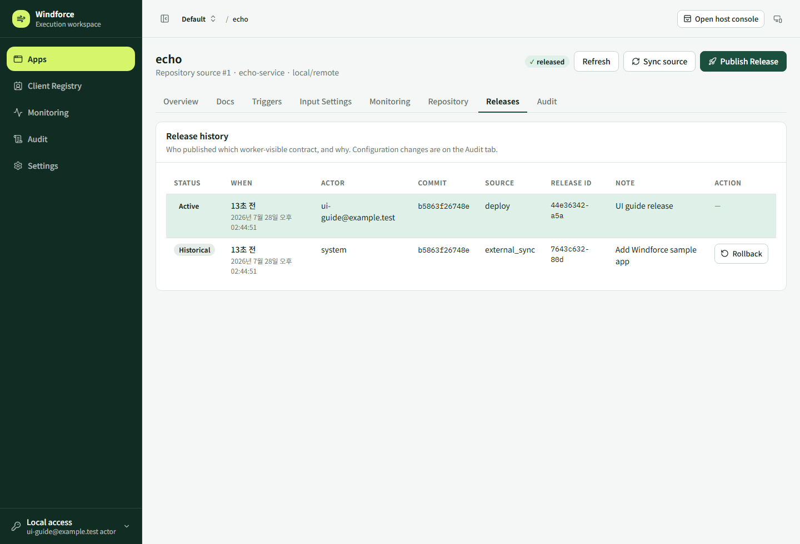

1. Open an app and switch to the Releases tab.
2. Each release record shows the actor, commit, source, release id, and note.
3. Use it to answer who published which contract, and when; configuration changes are on the Audit tab.

## Review action schemas

The Docs tab shows each action's release-pinned input and output JSON Schemas.

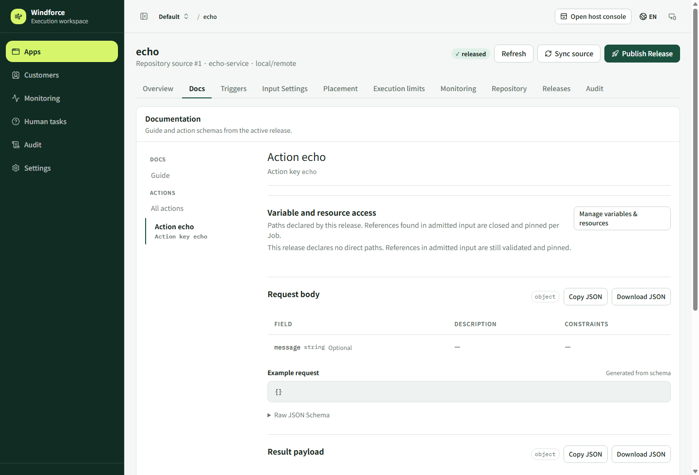

1. Open an app and switch to the Docs tab.
2. Choose an action from the API reference.
3. Review its request and result fields or download the source JSON Schema.

## Monitor one app

The app detail Monitoring tab narrows the workspace job aggregates to a single app: queued and running now, plus completed, failed, canceled, and the failure rate in the selected window.

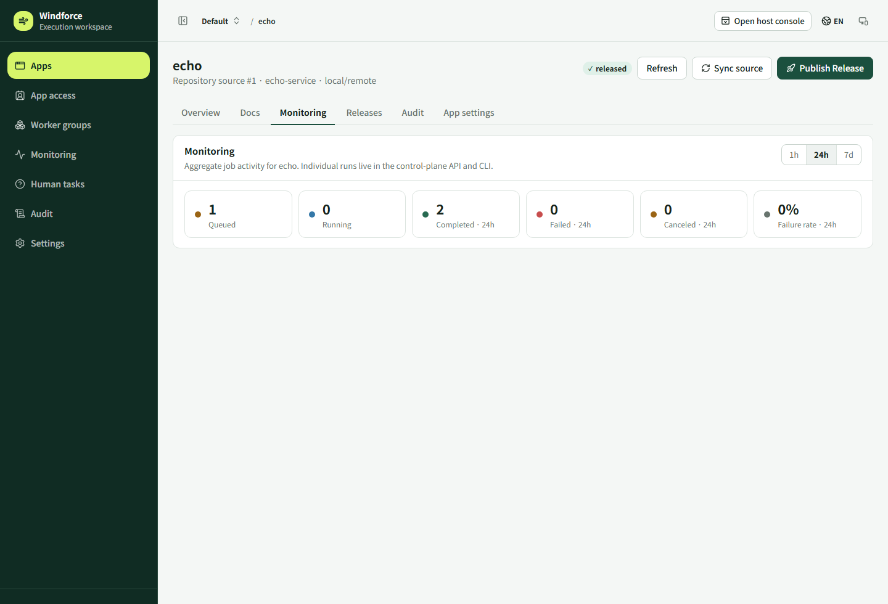

1. Open an app and switch to the Monitoring tab.
2. Read the tiles for this app's queued, running, and windowed completed/failed/canceled counts.
3. Switch the window between 1h, 24h, and 7d.
4. Watch the failure rate; the workspace-wide picture lives on the Monitoring page.

## Manage customers

The customer registry keeps credential state and the latest change compact while preserving direct access to each customer.

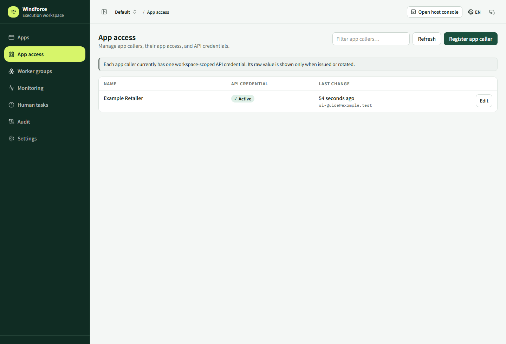

1. Open Customers.
2. Scan the customer name, API credential state, and latest change.
3. Open a customer name for app access and input settings, or choose Edit for credential management.

## Review customers on a narrow screen

The compact customer table keeps its information hierarchy and remains horizontally scrollable on narrow screens.

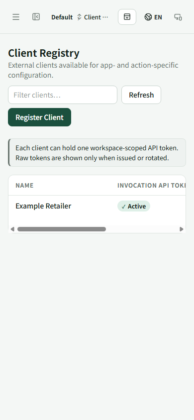

1. Open Customers on a narrow screen.
2. Review the customer identity and credential status first.
3. Scroll the table horizontally when the latest change or edit action is needed.

## Register a customer with app access

Customer registration commits the initial app access and API credential together.

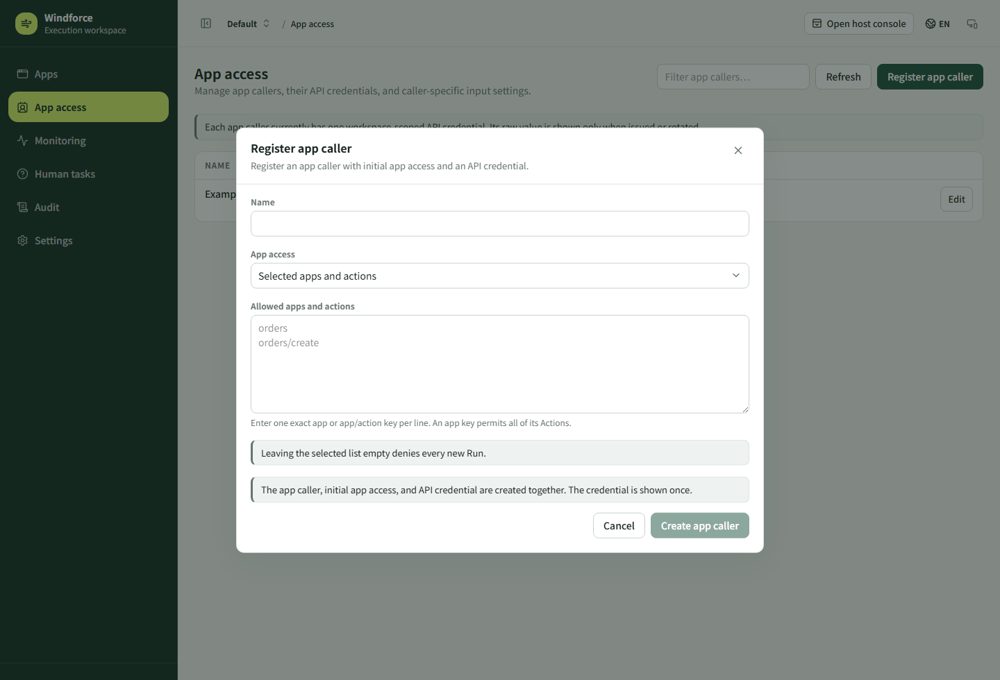

1. Open Customers and choose Register Customer.
2. Enter the customer name and choose initial app access.
3. Create the customer to receive its one-time API credential.

## Edit a customer and its API credential

Customer identity, API credential lifecycle, and deletion are separated into clear sections with one primary save action.

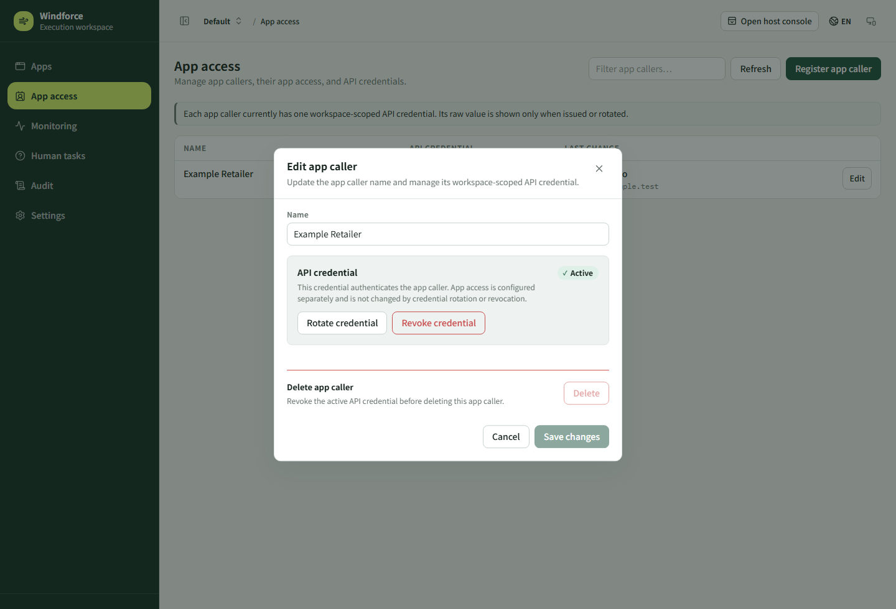

1. Open Customers and choose Edit.
2. Update the customer name or manage its API credential.
3. Revoke the active credential before deleting the customer.

## Edit a customer in Korean

Customer identity, API credential lifecycle, and the danger zone preserve their hierarchy with Korean labels.

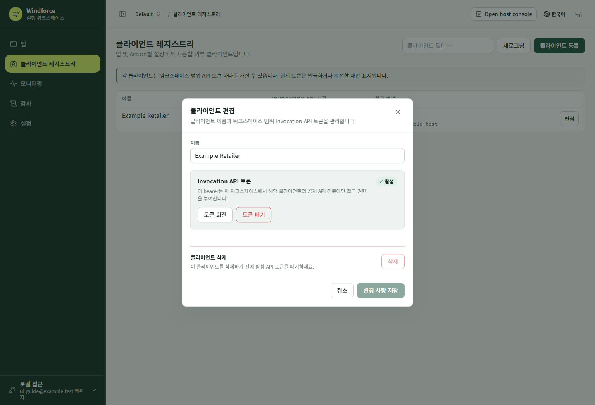

1. Switch the console to Korean and open Customers.
2. Choose Edit for a customer.
3. Confirm the credential status, actions, and deletion guidance remain readable without crowding.

## Confirm an irreversible credential action

API credential rotation uses the shared in-product confirmation dialog instead of a browser-native prompt.

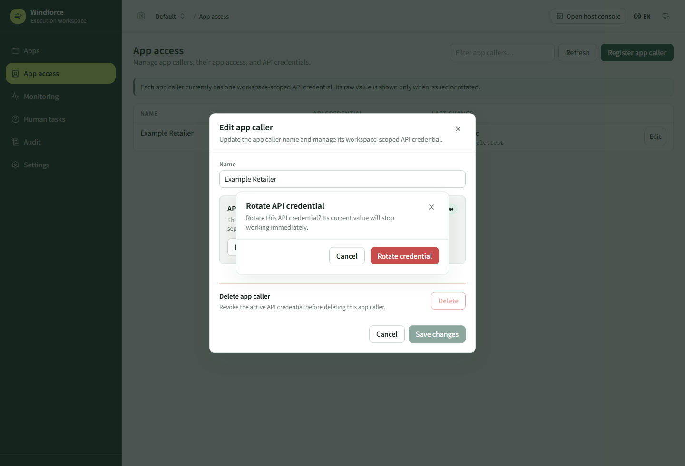

1. Open a customer for editing.
2. Choose Rotate credential.
3. Review the immediate invalidation warning before confirming or canceling.

## Copy a newly issued customer API credential

The one-time credential stays in a stable copy row and the copy button itself confirms success.

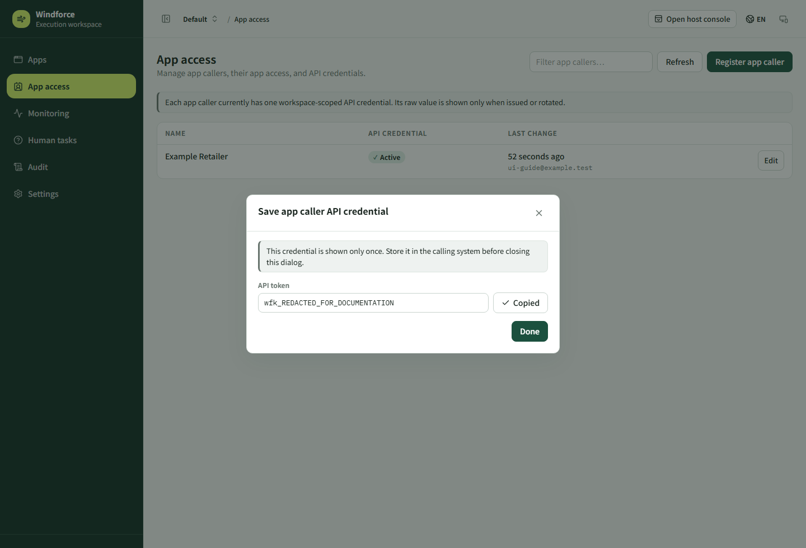

1. Register a customer to issue its one-time API credential.
2. Copy the credential into the calling system.
3. Confirm the button changes to Copied before closing the dialog.

## Manage App Triggers

The App Triggers tab keeps inbound Webhook, Schedule, and RabbitMQ sources beside the Action contract they invoke.

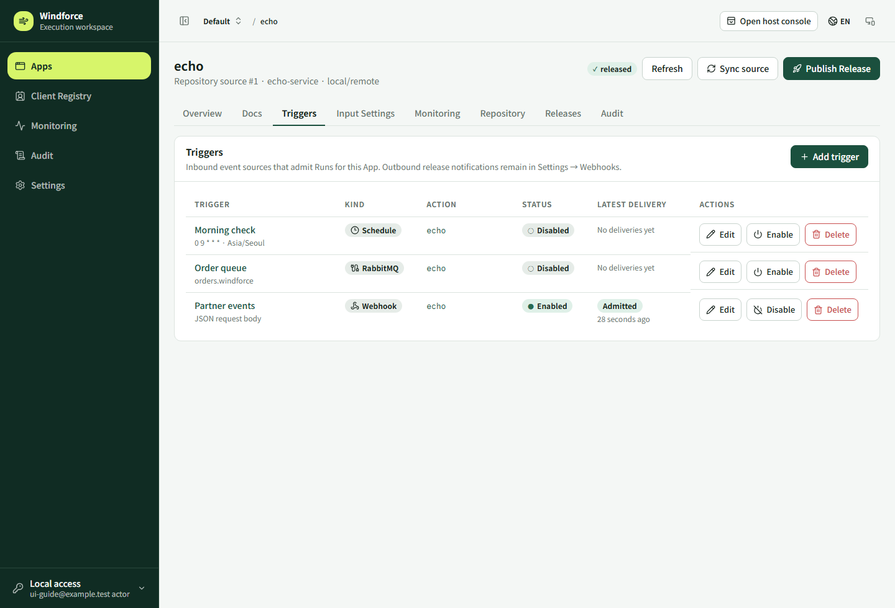

1. Open an App and choose Triggers.
2. Review each source kind, target Action, enablement state, and latest delivery outcome.
3. Enable or disable a source without changing its configuration.
4. Keep outbound release notifications in Settings → Webhooks.

## Audit configuration changes

The Audit tab records who changed the app's configuration: repository settings edits, source deletion, and execution-placement overrides. Releases have their own history on the Releases tab.

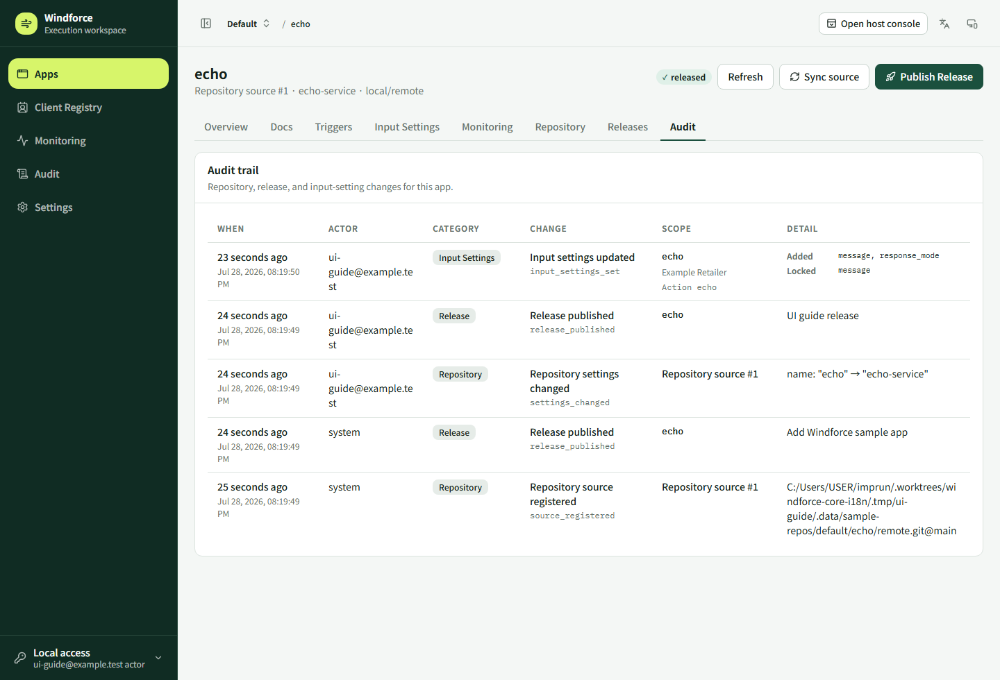

1. Open an app and switch to the Audit tab.
2. Each record shows the actor, the kind of change, and the changed fields.
3. Use it together with the Releases tab to answer who changed what, and when.

## Monitor job activity

The Monitoring view aggregates job activity for the whole workspace: totals, per-app and per-route-tag breakdowns, and failure rates. Targeted live logs remain available when you know a Job ID.

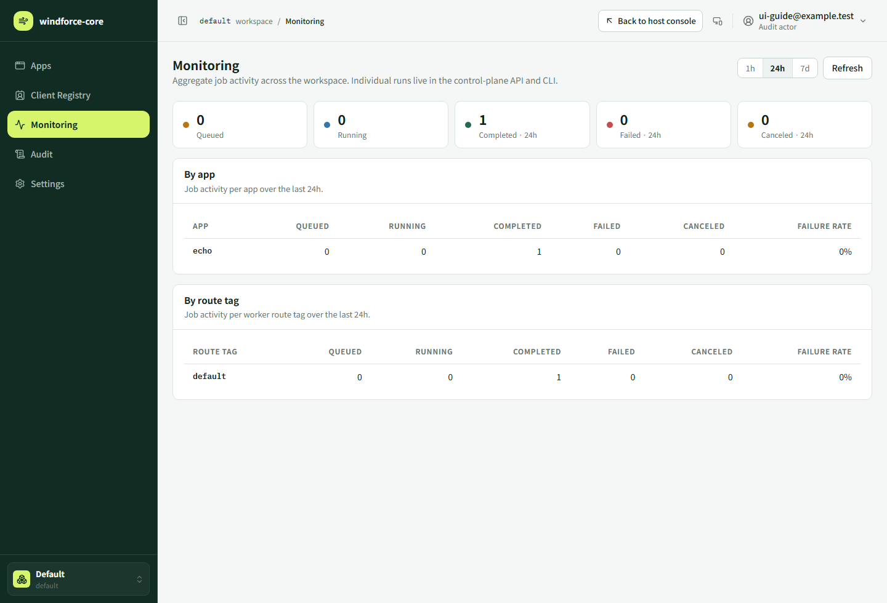

1. Open Monitoring from the sidebar.
2. Read the tiles: queued and running now, plus completed, failed, and canceled runs in the selected window.
3. Switch the window between 1h, 24h, and 7d.
4. Use the by-app and by-route-tag tables to find where the failure rate is moving; app names link to the app detail.
5. Open Inspect job logs only for a known Job ID; the page does not become a browsable Job ledger.

## Review App Triggers in dark mode

Dark mode preserves clear separation between Trigger kinds, enablement, delivery outcomes, and destructive actions.

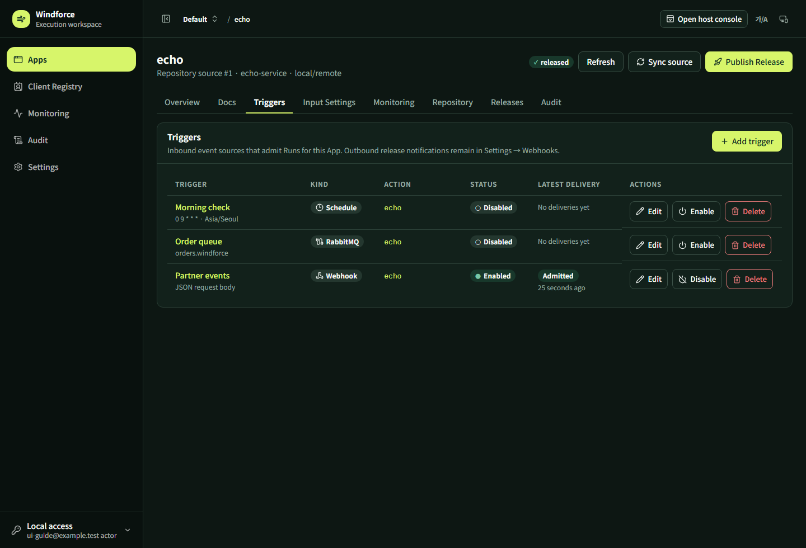

1. Switch the execution workspace to dark mode.
2. Open an App and choose Triggers.
3. Confirm status text and icons remain distinguishable without relying on color alone.

## Resolve a HumanTask hold

The workspace queue shows generic requests that keep their original Action process and browser session alive while waiting for a decision.

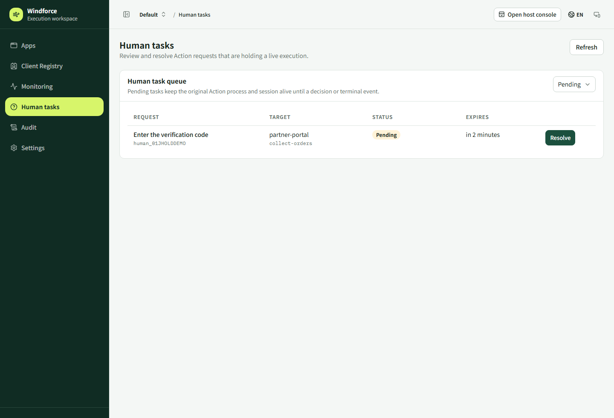

1. Open Human tasks from the workspace sidebar.
2. Review the request, target Action, state, and deadline without exposing private context.
3. Open Resolve, fill the JSON Schema form, and submit one idempotent decision.
4. Use Cancel task only when the waiting Action should receive a canceled HumanTask outcome.

## Submit a HumanTask decision

The generic decision dialog renders supported JSON Schema fields while keeping private context hidden.

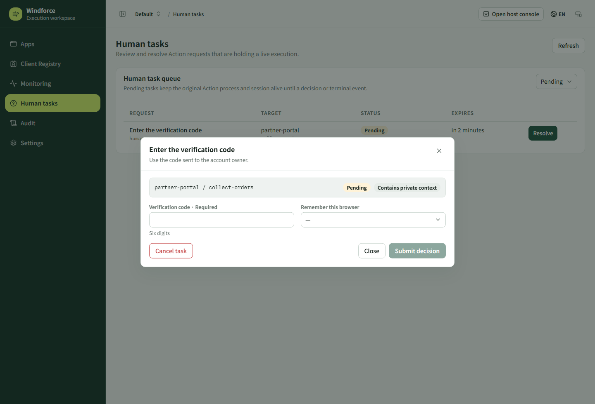

1. Choose Resolve on a pending HumanTask.
2. Confirm the target Action and deadline before entering values.
3. Fill the schema-driven form; private context remains a presence indicator only.
4. Submit the decision or use the separately confirmed Cancel task action.

## Follow one Job's logs

The focused inspector follows masked stdout and stderr for a known Job ID while Monitoring remains aggregate-first.

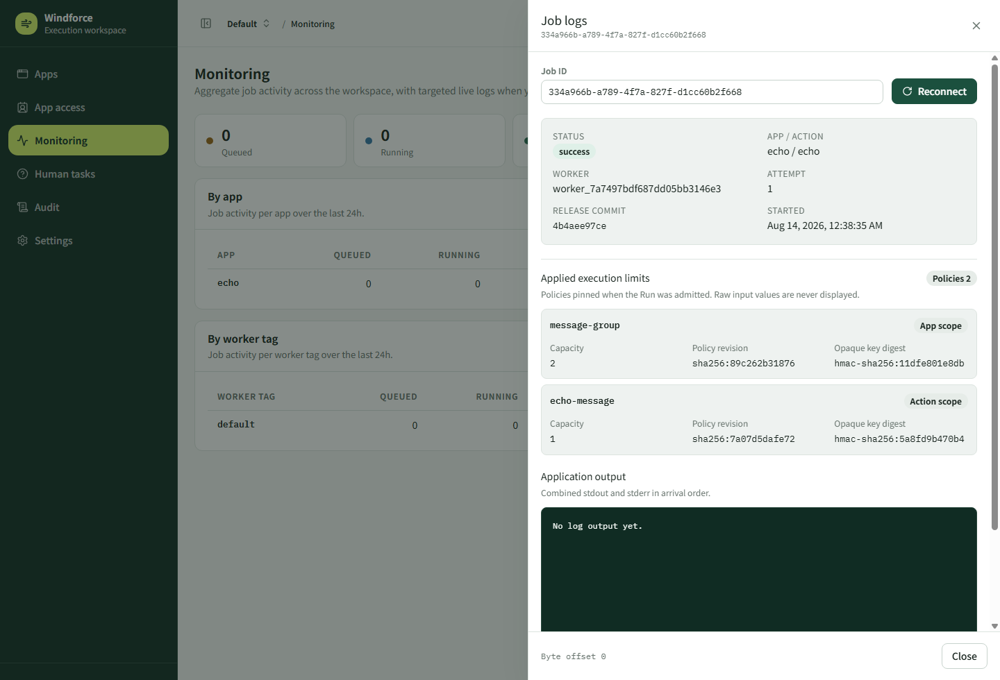

1. Open Monitoring and choose Inspect job logs.
2. Paste the Job ID obtained from an invocation response, alert, or CLI query.
3. Connect to replay retained bytes and continue following from the latest byte offset.
4. Use status, App/Action, Worker, attempt, release commit, and start time to anchor the diagnosis.
5. Review the policy ID, scope, capacity, revision, and opaque key digest pinned at admission.

## Add an inbound Trigger

A kind-aware editor configures the current App target and an explicit completion output while keeping signing secrets and broker credentials write-only.

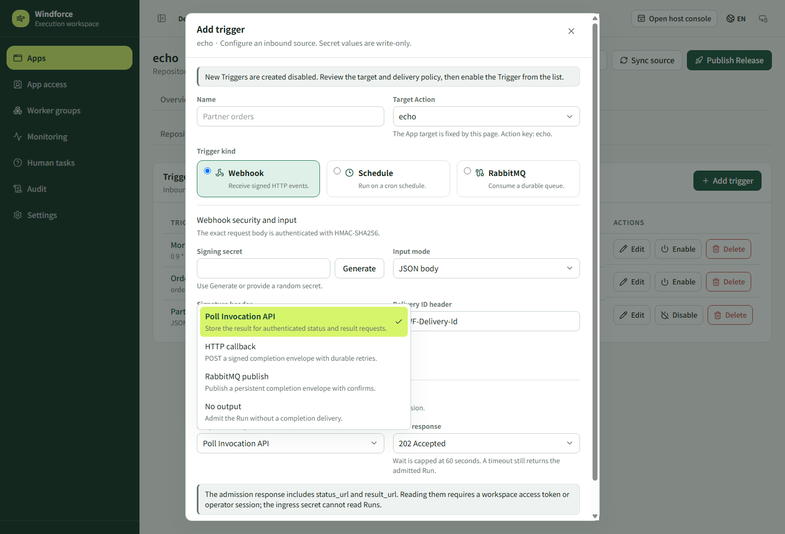

1. Choose Add trigger from the App Triggers tab.
2. Select Webhook, Schedule, or RabbitMQ and a target Action.
3. Choose Poll, signed HTTP callback, RabbitMQ publish, or deliberate No output.
4. Complete the kind-specific delivery and security fields.
5. Create the Trigger disabled, verify it, and enable it from the list.

## Import and export provisioning state

Provisioning exports a redacted workspace snapshot and imports repeatable app, credential, client, input-setting, and webhook resources through dry-run first.

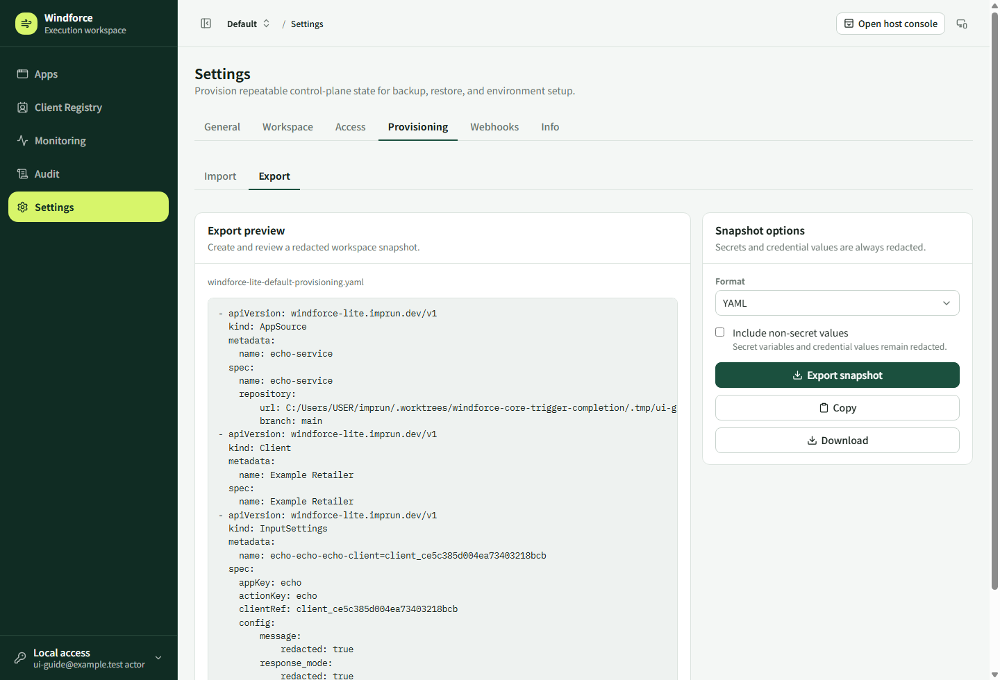

1. Open Settings from the sidebar and choose Provisioning.
2. Export the current workspace as YAML or JSON for review.
3. Paste or load a provisioning document, run Dry-run, then Apply only after validation succeeds.

## Expose a Webhook Trigger through a public route

A configured Router Provider reports the friendly URL and reconciliation state without replacing the canonical Trigger ingress.

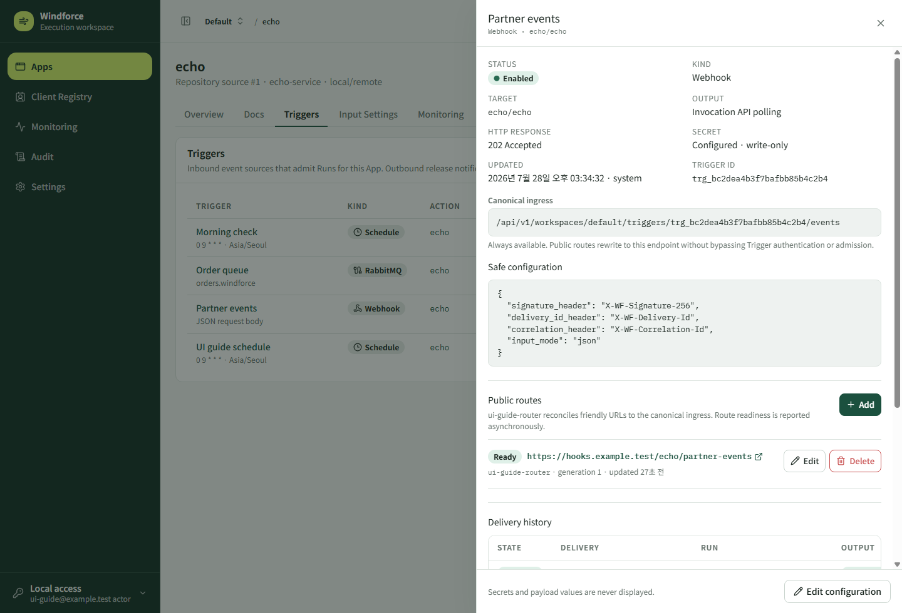

1. Open an App, choose Triggers, and select a Webhook Trigger.
2. Use the canonical ingress for direct integrations in every deployment mode.
3. When a Router Provider is configured, review the friendly public URL and its observed state.
4. Add, edit, or delete the route independently from the Trigger definition.

## Manage the active workspace

Workspace settings keep identity, API access, Core connection details, and lifecycle controls in one place.

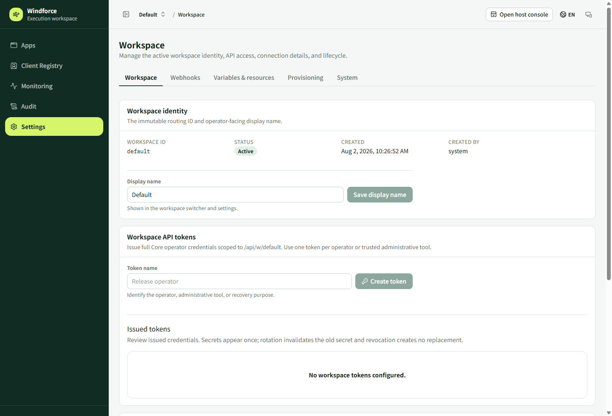

1. Open Settings from the sidebar and choose Workspace.
2. Update the active workspace identity without leaving its settings page.
3. Create and store a named workspace token for an operator or trusted administrative tool.
4. Copy the Core URL or workspace API base into a direct Core integration.
5. Use Client Registry instead when an external app caller only needs the Invocation API.
6. In hosted mode, manage account access and API credentials in the host console.
7. Archive the workspace only from the lifecycle section at the end of the page.

## Inspect a Trigger on a narrow screen

The Trigger detail sheet fills a narrow viewport while configuration, delivery history, and audit information remain scrollable.

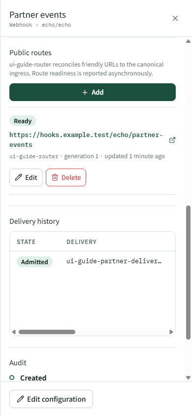

1. Open the App Triggers tab on a narrow screen.
2. Choose a Trigger name to open its operational detail.
3. Review the canonical ingress and provider-managed public route without exposing secret values.
4. Scroll to inspect delivery and audit history.

## Switch workspace context

The top-bar breadcrumb keeps runtime scope visible and provides the entry point to instance workspace administration.

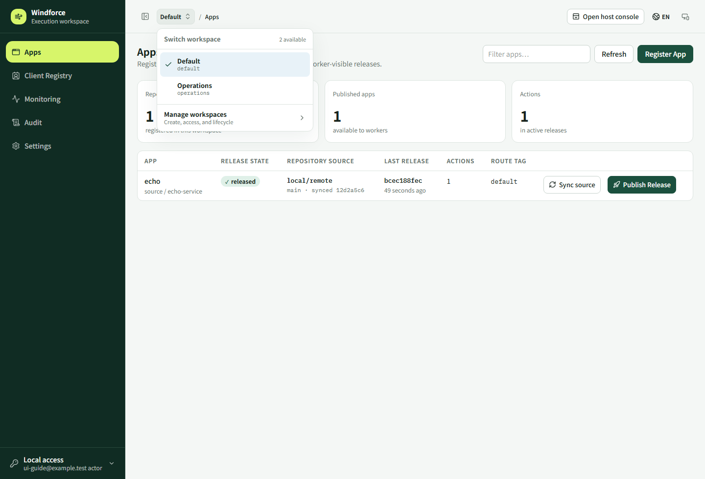

1. Open the workspace control in the top-bar breadcrumb.
2. Select a workspace to change the active application and monitoring scope.
3. Choose Manage workspaces to create or switch workspaces; configure the active workspace from Settings.

## Manage the active workspace on mobile

Workspace identity, API access, Core connection details, and lifecycle controls remain usable on a narrow screen.

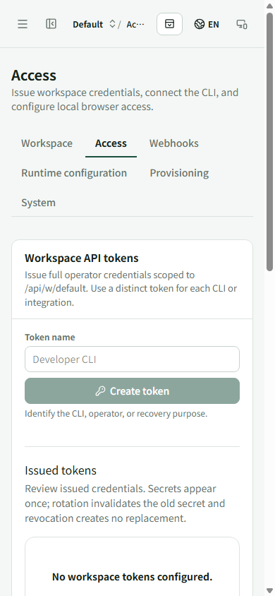

1. Open Settings and choose Workspace.
2. Issue a named workspace token without horizontal page overflow.
3. Continue through Core connection and lifecycle sections on the same workspace page.

## Navigate on a narrow screen

The application shell keeps every primary engine destination available from an accessible mobile drawer.

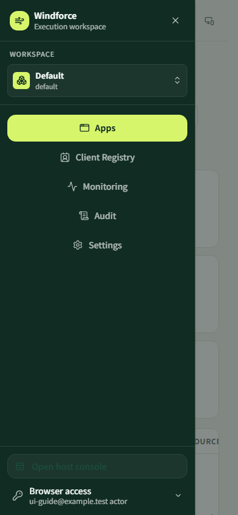

1. Open the navigation menu in the top bar.
2. Choose a workspace-scoped product destination.
3. Use the account control at the bottom for hosted account context or standalone local access.
4. Close the drawer with its close control, the backdrop, or the Escape key.

## Inspect system configuration

System settings presents control-plane readiness, APIs, backends, security configuration, and runtime values without browser-local credential duplication.

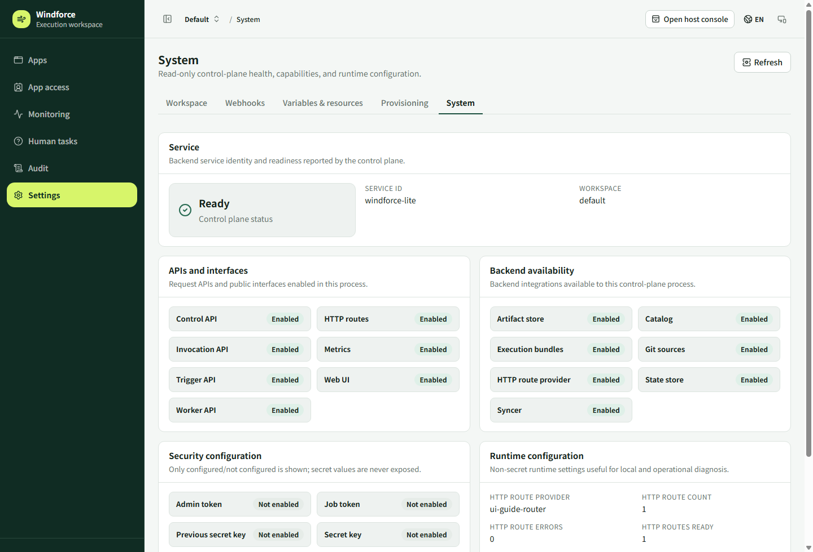

1. Open Settings from the sidebar and choose System.
2. Check control-plane readiness and the active service and workspace.
3. Review enabled APIs, backend integrations, and security configuration.
4. Use runtime configuration for diagnostics; secret values are never shown.

## Switch workspace on a narrow screen

The compact top-bar breadcrumb keeps workspace context visible and opens the same switcher and administration menu.

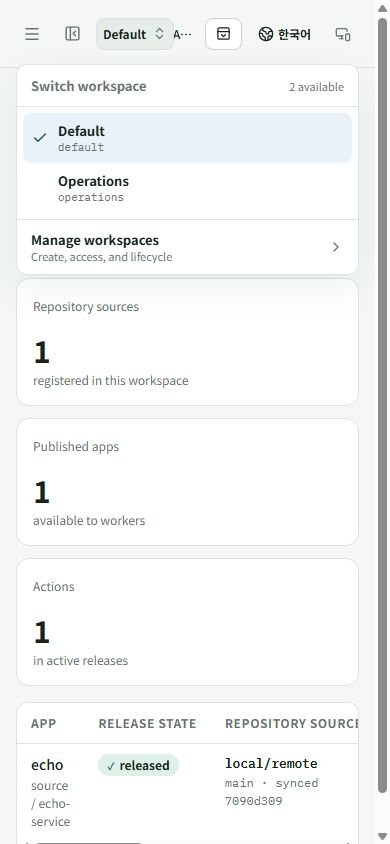

1. Open the workspace control in the top-bar breadcrumb.
2. Choose another workspace or open Manage workspaces without opening the navigation drawer.

## Manage variables and resources

Variables, write-only Secret Variables, typed Resources, and versioned Resource Types share one workspace-scoped console.

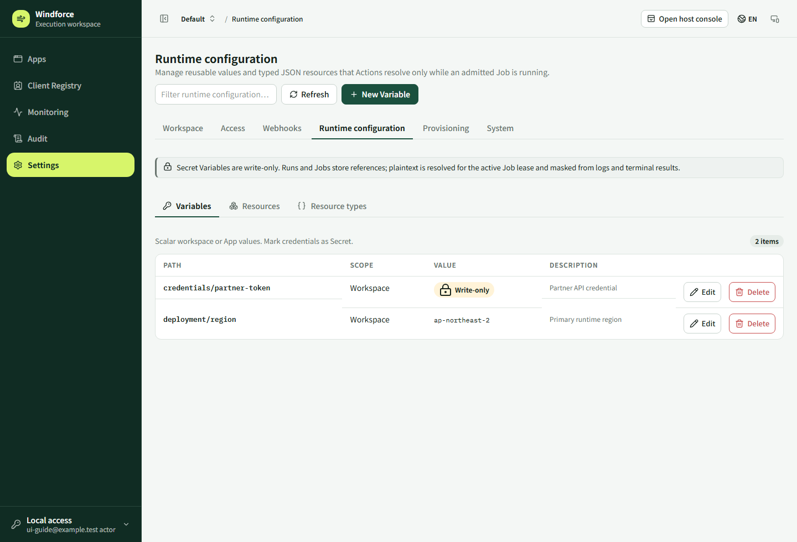

1. Open Settings and choose Variables & resources.
2. Use Variables for scalar values and mark credentials as write-only Secrets.
3. Use Resources for structured JSON that can compose exact $var:path and $res:path references.
4. Register a versioned Resource Type when a Resource needs JSON Schema validation.
5. Declare the required paths in each Action runtimeAccess block before publishing a release.

## Review variables and resources in dark mode

Dark mode preserves the distinction between ordinary values, write-only Secrets, tabs, and destructive actions.

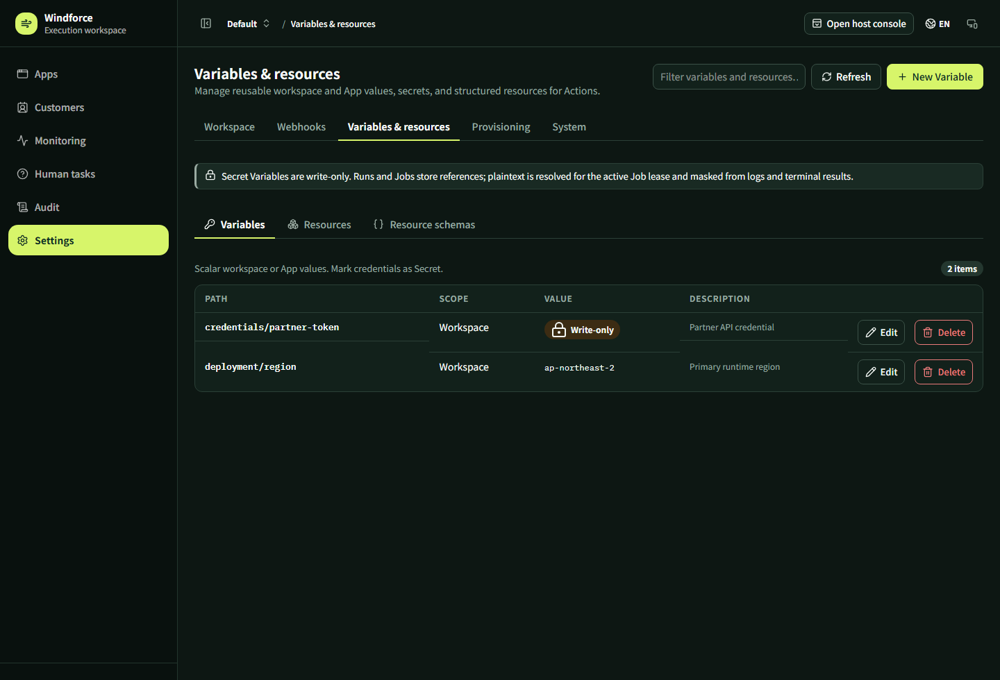

1. Switch the execution workspace to dark mode.
2. Open Settings and choose Variables & resources.
3. Confirm Secret status and destructive actions remain identifiable without relying on color alone.

## Compose a typed Resource

The Resource editor keeps JSON, exact references, and Resource Type selection together without exposing Secret values.

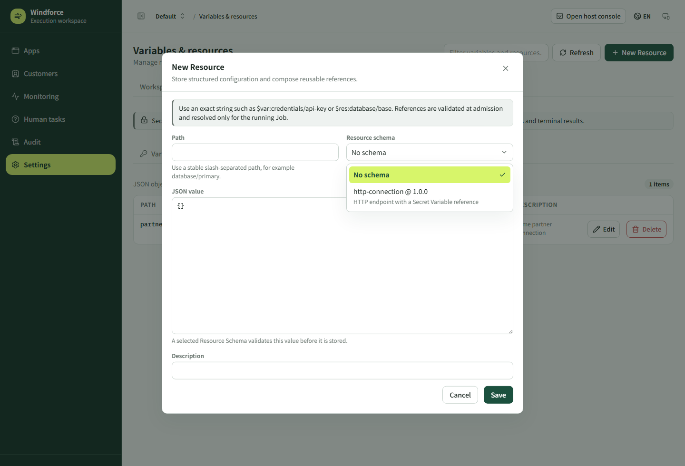

1. Open Variables & resources and choose Resources.
2. Create a Resource and select its versioned Resource Type.
3. Compose the JSON value with exact $var:path or $res:path strings.
4. Save only after the Resource passes its registered JSON Schema.

## Review variables and resources on a narrow screen

The settings navigation and security notice remain readable while dense runtime data stays horizontally scrollable.

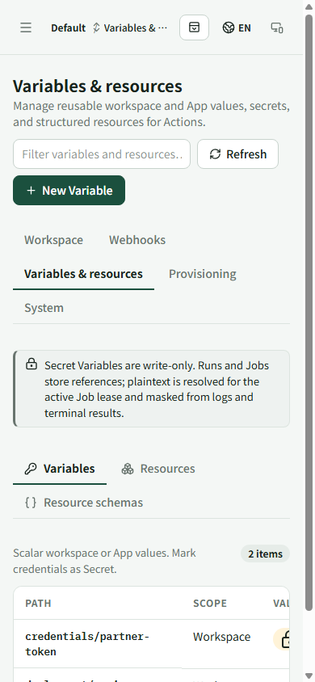

1. Open Variables & resources on a narrow screen.
2. Switch between Variables, Resources, and Resource schemas from the compact tab bar.
3. Scroll a dense table horizontally to reach previews and row actions.

## Collapse the sidebar

The sidebar collapses to an icon rail so wide tables get the full viewport. The choice is remembered in the browser.

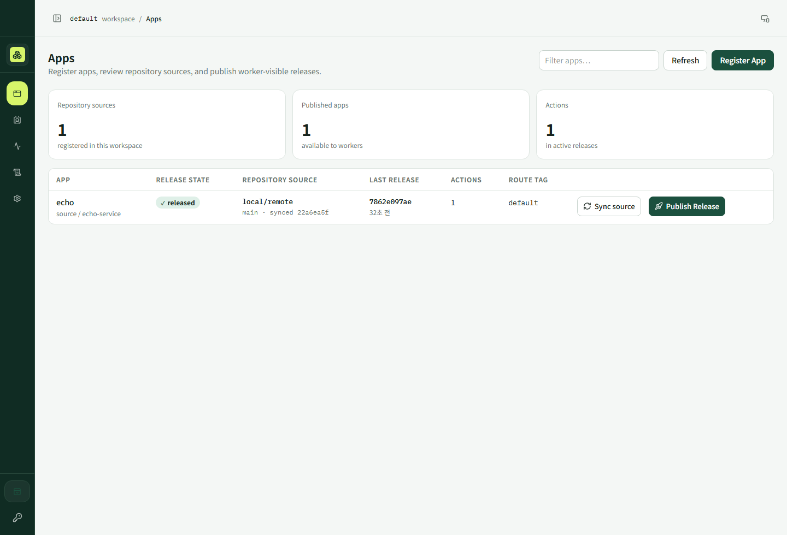

1. Click the collapse control at the start of the top context bar.
2. Navigate with the icon rail; hover shows each destination.
3. Click the control again to expand the sidebar.

## Manage workspaces

The workspace registry is limited to creating and switching workspace context.

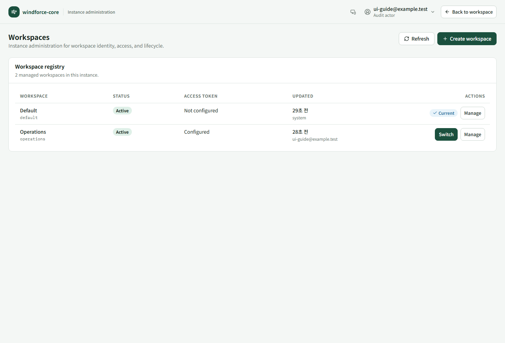

1. Open the workspace switcher in the top-bar breadcrumb.
2. Choose Manage workspaces to review the instance registry.
3. Use Switch to select a workspace for application and monitoring operations; the selected row is marked Current.
4. Use the Windforce breadcrumb root to return to the active workspace console.
5. Create a workspace, then switch to it before configuring its settings.
6. Use an instance-admin token for registry operations; workspace tokens remain scoped to one workspace.

## Manage lifecycle webhooks

The Webhooks settings view shows each signed lifecycle receiver, its app scope, and the latest delivery outcome without exposing endpoint paths or secrets.

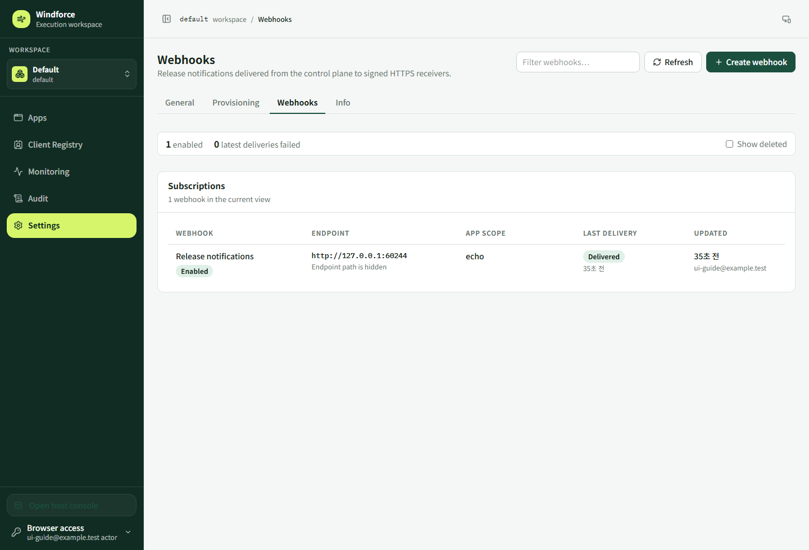

1. Open Settings and choose Webhooks.
2. Review each receiver's status, masked endpoint, app scope, latest delivery, and last operator update.
3. Open a webhook name to manage its configuration and delivery history.

## Configure the active workspace

Identity and lifecycle settings stay with the active workspace instead of creating a second registry detail context.

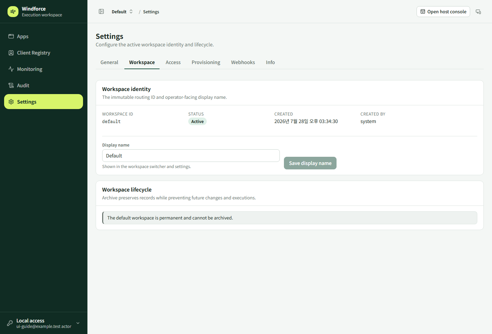

1. Switch to the workspace from Manage workspaces.
2. Open Settings and choose Workspace to change its display name, archive it, or permanently delete it.
3. Choose Access to issue, rotate, or revoke named workspace credentials.
4. Open Audit and select Workspace to review identity, credential, and lifecycle events.
5. Return to Manage workspaces only when creating or switching workspace context.

## Configure a lifecycle webhook

Webhook detail keeps event selection, receiver configuration, app scope, enablement, secret rotation, and deletion controls on a full page.

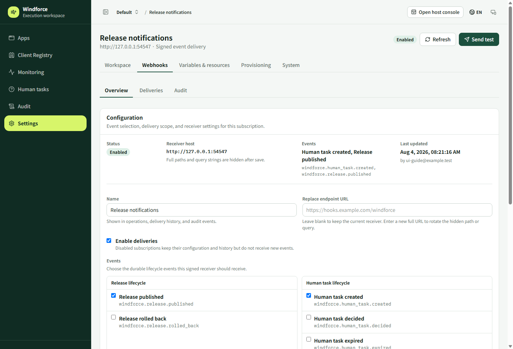

1. Open a webhook from Settings.
2. Review its masked receiver, selected lifecycle events, status, and last operator update.
3. Change its event selection, name, endpoint, enablement, or app scope.
4. Rotate the signing secret only when the receiver can be updated immediately.

## Manage workspace access

Named credentials belong to the active workspace and keep issue, rotation, and revocation separate from workspace creation.

1. Switch to the workspace that will own the credential.
2. Open Settings and choose Workspace.
3. Name each credential for its operator, administrative tool, or recovery purpose.
4. Store the raw secret when it is shown; later views expose metadata only.
5. Rotate or revoke one credential without interrupting the workspace's other callers.

## Inspect a webhook delivery

Delivery history exposes status, response, attempts, immutable event data, and a guarded retry action for failed deliveries.

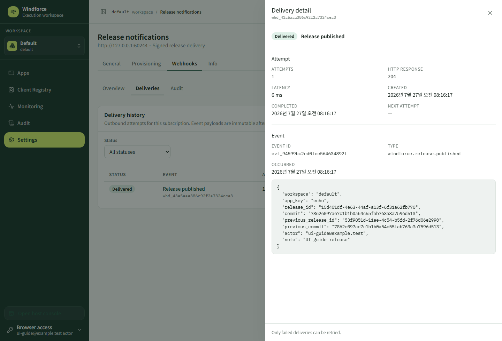

1. Open a webhook and switch to Deliveries.
2. Select an event to inspect the attempt in a sheet without leaving the history table.
3. Review the immutable event data and use Retry only when a delivery has failed.

## Delete a local workspace

Permanent deletion stays in the active workspace lifecycle section and requires the exact workspace name.

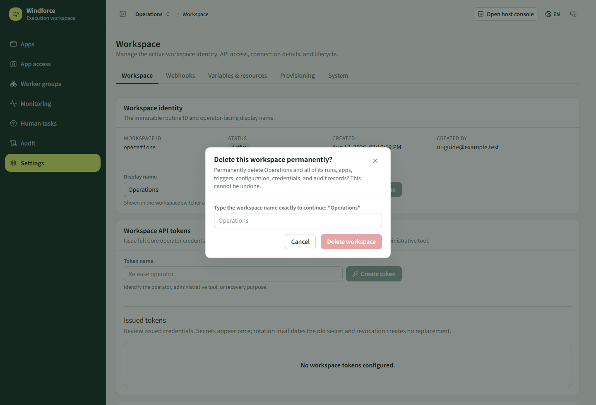

1. Switch to the non-default workspace that should be removed.
2. Open Settings, choose Workspace, and review the lifecycle section.
3. Choose Delete workspace only when all runs, apps, triggers, configuration, credentials, and audit records can be removed.
4. Type the workspace display name exactly; the permanent-delete action remains disabled until it matches.
5. After deletion succeeds, the console switches to the protected default workspace.
6. In hosted mode, use the host console instead of the Core-local lifecycle controls.

## Review webhooks on a narrow screen

The webhook list remains usable on narrow screens through a stable navigation rail and horizontally scrollable operational table.

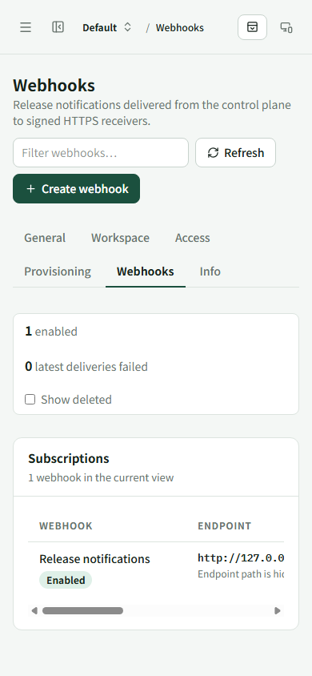

1. Open Settings and choose Webhooks on a narrow screen.
2. Scroll the table horizontally when all operational columns are needed.
3. Open the webhook name to continue into its full detail page.

## Manage customer input settings

Review app- and action-specific values applied for one customer.

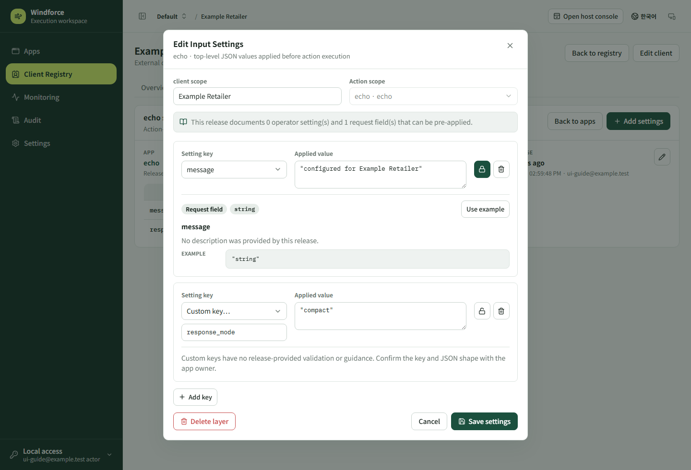

1. Open Customers.
2. Select a customer.
3. Open a settings row to review its JSON values and locked keys.

## Set customer app access

Core operators can grant every app and action or an exact selected list for each customer.

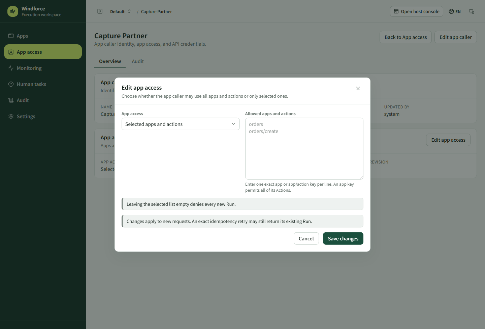

1. Open Customers and select a customer.
2. Review the effective app access, allowed identifiers, and revision.
3. Choose Edit app access to replace the access used for new Runs.

## Open host management

A hosted or self-managed portal can configure one explicit management-plane action in the top bar.

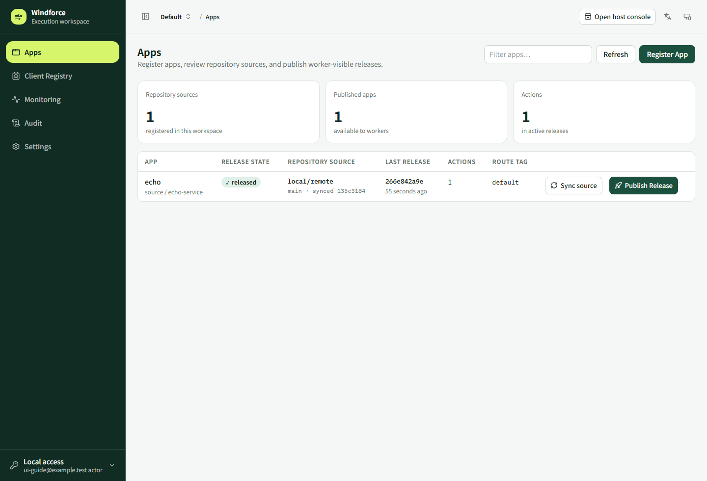

1. Open the embedded Web UI from the configured host portal.
2. Use the configured host action on the right side of the top bar.
3. The destination label makes the management-plane boundary explicit.

## Open host management on mobile

The configured return action remains available as a compact control in the mobile top bar.

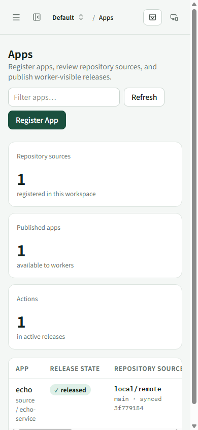

1. Open the embedded Web UI on a narrow screen.
2. Use the labelled host action in the top bar to open the configured management console.
